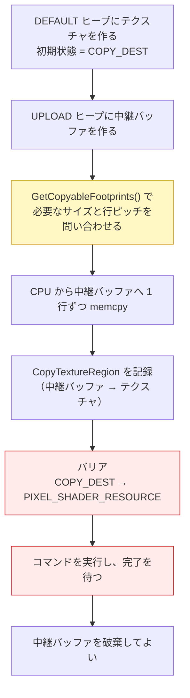

# 09. テクスチャを貼る

面に画像を貼ります。ここで
**「GPU 専用メモリへのデータ転送」**と**「ディスクリプタテーブル」**という、
DirectX 12 の重要なパターンが 2 つ登場します。

対応するコードは [`src/Graphics/Texture2D.h`](../../src/Graphics/Texture2D.h) /
[`.cpp`](../../src/Graphics/Texture2D.cpp)、
[`DescriptorHeap`](../../src/Graphics/DescriptorHeap.h) です。

---

## 1. UV 座標

テクスチャ上の位置を **0.0〜1.0** で表したものです。

```
(0,0) ┌─────────┐ (1,0)
      │  画像   │
(0,1) └─────────┘ (1,1)
```

画像が何ピクセルでも常に 0〜1 なので、
テクスチャを差し替えても頂点データを直さずに済みます。

**★ V は下向きが正です**（画面の Y が上向きなのと逆）。
画像ファイルが上の行から順に並んでいるためで、
取り違えるとテクスチャが上下逆さまに貼られます。

UV も色と同じく、**ラスタライザが頂点間を自動補間**します。
だから 3 頂点に UV を置くだけで、三角形の内側全体に画像が貼られます。

---

## 2. ステージング転送 — DirectX 12 最頻出のパターン

テクスチャは容量が大きく GPU が何万回も読むため、
GPU 専用の高速メモリ（**DEFAULT ヒープ**）に置きたい。
しかし DEFAULT ヒープは **CPU から直接書けません**。




**この手順は、頂点バッファを DEFAULT ヒープに置く場合もまったく同じです。**
[06 章](06_三角形を描く.md)で「後で学ぶ」と言った内容が、ここで回収されます。

### ★ 行ピッチの落とし穴

中継バッファ上では、1 行のバイト数が **256 バイト境界に揃えられます**
（`D3D12_TEXTURE_DATA_PITCH_ALIGNMENT`）。

例えば横 100 ピクセル・RGBA なら実データは 400 バイトですが、
中継バッファでは 512 バイトぶんの場所を取り、余りは詰め物になります。

そのため **画像全体を一度に `memcpy` できず、1 行ずつコピー**します。

```cpp
for (uint32_t row = 0; row < numRows; ++row)
{
    std::memcpy(mapped + row * footprint.Footprint.RowPitch,  // 詰め物込みの行間隔
                source + row * width * 4,                      // 実データの行間隔
                rowSizeInBytes);
}
```

**サイズは自分で計算しないでください。**

```cpp
device->GetCopyableFootprints(&textureDesc, 0, 1, 0,
                              &footprint, &numRows, &rowSizeInBytes, &totalBytes);
```

### ★ 完了を待つ理由

待たずに関数を抜けると、ローカル変数の中継バッファが破棄されます。
**GPU がまだ読んでいる最中のメモリが消える**ので、結果が壊れるかクラッシュします。

起動時の 1 回だけなので、素直に待って構いません。

```cpp
commandQueue.ExecuteCommandList(commandList.Get());
commandQueue.Flush();   // ← ここで待つ
```

---

## 3. ディスクリプタテーブル — 定数バッファとの違い

[07 章](07_動かす_定数バッファと行列.md)では、行列を
**ルートディスクリプタ**（GPU アドレスを直接渡す）で渡しました。

**しかしテクスチャ (SRV) はルートディスクリプタでは渡せません。**
ディスクリプタヒープ上の範囲を指す**ディスクリプタテーブル**が必要です。

```cpp
D3D12_DESCRIPTOR_RANGE srvRange = {};
srvRange.RangeType          = D3D12_DESCRIPTOR_RANGE_TYPE_SRV;
srvRange.NumDescriptors     = 1;
srvRange.BaseShaderRegister = 0;   // ←→ HLSL: register(t0)

rootParameters[1].ParameterType = D3D12_ROOT_PARAMETER_TYPE_DESCRIPTOR_TABLE;
rootParameters[1].DescriptorTable.NumDescriptorRanges = 1;
rootParameters[1].DescriptorTable.pDescriptorRanges   = &srvRange;
rootParameters[1].ShaderVisibility = D3D12_SHADER_VISIBILITY_PIXEL;
```

### テーブルの利点

テクスチャが 1 枚でも 100 枚でも、
**ルートシグネチャのサイズは変わりません**（`NumDescriptors` を増やすだけ）。

ルートシグネチャは GPU の高速な専用領域に置かれるため、小さいほど速くなります。
数が増えるものはテーブルにまとめる、というのが使い分けの基準です。

---

## 4. シェーダー可視ヒープ

SRV は **GPU 自身が読む**ので、`SHADER_VISIBLE` フラグを付けたヒープが必要です。

| ビュー | ヒープの種類 | SHADER_VISIBLE | 誰が読むか |
|--------|------------|----------------|-----------|
| RTV | RTV 用 | 不可 | CPU が描画先を指定するだけ |
| DSV | DSV 用 | 不可 | 同上 |
| **SRV / CBV / UAV** | CBV_SRV_UAV 用 | **必要** | **GPU 自身** |

### 重要な制約

シェーダー可視ヒープは、コマンドリストに**同時 1 本しか設定できません**
（CBV/SRV/UAV 用と Sampler 用で 1 本ずつ）。

そのため実際のエンジンでは
**「巨大なヒープを 1 本作り、切り分けて全リソースで共有する」**
設計になります。本プロジェクトの `DescriptorHeap` も、
先頭から順に切り出していく最も単純な形にしています。

### 描画時に忘れてはいけないこと

```cpp
ID3D12DescriptorHeap* const heaps[] = { m_descriptorHeap.Get() };
commandList->SetDescriptorHeaps(_countof(heaps), heaps);        // ← 先
...
commandList->SetGraphicsRootDescriptorTable(1, srvHandle);      // ← 後
```

GPU は「どのヒープの何番目か」でディスクリプタを解決します。
ヒープを教える前にテーブルを設定しても、ハンドルの意味が決まりません。

**渡すのは GPU ハンドルです。** CPU ハンドルとは値がまったく別物です。

---

## 5. サンプラー — 「どう読むか」

テクスチャ（画像データ）とは別に、**読み方**を決めるものです。

| 設定 | 意味 | 選択肢 |
|------|------|-------|
| Filter | ピクセルとテクセルがずれたときの読み方 | `LINEAR`（なめらか）/ `POINT`（くっきり） |
| AddressU/V/W | UV が 0〜1 の外に出たときの扱い | `WRAP`（繰り返す）/ `CLAMP`（端を伸ばす）/ `MIRROR` |

データと読み方が分離されているので、同じ画像を
「ぼかして読む」「くっきり読む」と使い分けられます。

> ドット絵を拡大表示したいときは `POINT` が正解です。
> `LINEAR` だとぼやけます。

### 静的サンプラー

実行中に変わらないサンプラーは、ヒープに置かず
**ルートシグネチャに直接埋め込めます**。
サンプラー用ヒープを作らずに済むため、設定が固定なら常にこちらが有利です。

```cpp
D3D12_STATIC_SAMPLER_DESC staticSampler = {};
staticSampler.Filter         = D3D12_FILTER_MIN_MAG_MIP_LINEAR;
staticSampler.AddressU       = D3D12_TEXTURE_ADDRESS_MODE_WRAP;
staticSampler.ShaderRegister = 0;   // ←→ HLSL: register(s0)
```

---

## 6. シェーダー側

```hlsl
Texture2D    g_texture : register(t0);
SamplerState g_sampler : register(s0);

float4 PSMain(VSOutput input) : SV_TARGET
{
    float4 textureColor = g_texture.Sample(g_sampler, input.uv);
    return input.color * textureColor;   // モジュレート
}
```

頂点カラーとテクスチャの色を**掛け合わせています**（モジュレート）。

- 白い部分は頂点カラーがそのまま出る（1.0 を掛けても変わらない）
- 暗い部分は頂点カラーも暗くなる

もっとも基本的な合成方法です。
そのため本プロジェクトでは、市松模様を貼っても
三角形ごとの赤・緑・青の色味が残ります。

---

## 7. 画像ファイルを読み込んでいない理由

本プロジェクトでは市松模様を**コードで生成**しています。

PNG や JPEG を読むにはデコーダが必要で、
それだけで学習の主題から外れてしまうためです。
（Windows なら WIC を使いますが、コード量が一気に増えます）

市松模様は **UV のずれや上下反転にすぐ気付ける**ので、
動作確認用のテクスチャとして定番です。

---

## 8. この章のまとめ

- UV は 0〜1。**V は下向きが正**
- DEFAULT ヒープには CPU から書けないので、UPLOAD 経由で転送する（ステージング）
- 中継バッファの行は 256 バイト境界。**1 行ずつコピー**する
- サイズは `GetCopyableFootprints()` に問い合わせる
- 転送後は `COPY_DEST → PIXEL_SHADER_RESOURCE` のバリアが必要
- **完了を待ってから中継バッファを破棄する**
- テクスチャはディスクリプタテーブルで渡す（ルートディスクリプタでは渡せない）
- シェーダー可視ヒープは同時 1 本。`SetDescriptorHeaps` を先に呼ぶ
- サンプラーは「読み方」。固定なら静的サンプラーが有利

---

## 9. ここまでで身についたパターン

9 章を通して、DirectX 12 の中核となる考え方が一通り出そろいました。

| パターン | 初出 | 再登場 |
|---------|------|-------|
| 記録してから投入する | 05 章 | 毎フレーム |
| フェンスで待つ | 05 章 | リサイズ、終了、テクスチャ転送 |
| フレームごとに領域を分ける | 05 章（アロケータ） | 07 章（定数バッファ） |
| ディスクリプタとヒープ | 04 章（RTV） | 08 章（DSV）、09 章（SRV） |
| リソースバリアで用途を切り替える | 04 章 | 09 章（転送後） |
| UPLOAD → DEFAULT の転送 | 09 章 | 頂点バッファの改善（今後） |

新しい機能を追加するときも、この組み合わせで説明がつくはずです。

---

## この章で参照した資料

- [テクスチャのアップロード | Microsoft Learn](https://learn.microsoft.com/windows/win32/direct3d12/uploading-resources)
- [ID3D12Device::GetCopyableFootprints | Microsoft Learn](https://learn.microsoft.com/windows/win32/api/d3d12/nf-d3d12-id3d12device-getcopyablefootprints)
- [ID3D12GraphicsCommandList::CopyTextureRegion | Microsoft Learn](https://learn.microsoft.com/windows/win32/api/d3d12/nf-d3d12-id3d12graphicscommandlist-copytextureregion)
- [リソースバインディング（ディスクリプタテーブル） | Microsoft Learn](https://learn.microsoft.com/windows/win32/direct3d12/resource-binding)
- [D3D12_STATIC_SAMPLER_DESC | Microsoft Learn](https://learn.microsoft.com/windows/win32/api/d3d12/ns-d3d12-d3d12_static_sampler_desc)
- [D3D12_SHADER_RESOURCE_VIEW_DESC | Microsoft Learn](https://learn.microsoft.com/windows/win32/api/d3d12/ns-d3d12-d3d12_shader_resource_view_desc)
- [D3D12HelloTexture（公式サンプル）](https://github.com/microsoft/DirectX-Graphics-Samples/tree/master/Samples/Desktop/D3D12HelloTexture)
- Real-Time Rendering (4th Edition) — テクスチャフィルタリングの理論

図はすべて本リポジトリで作成したものです（[../assets/](../assets/)）。
