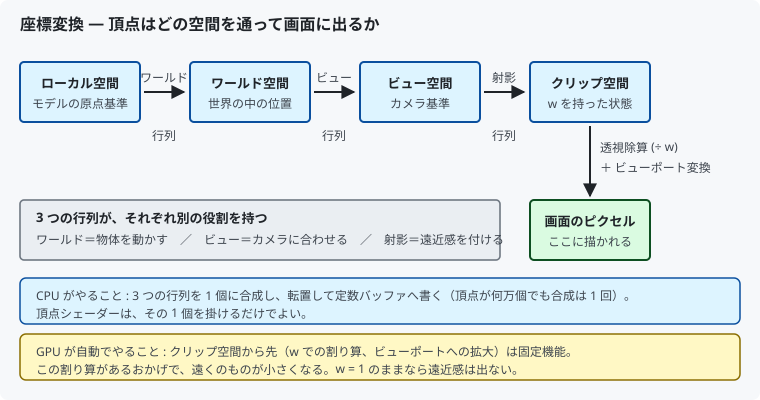
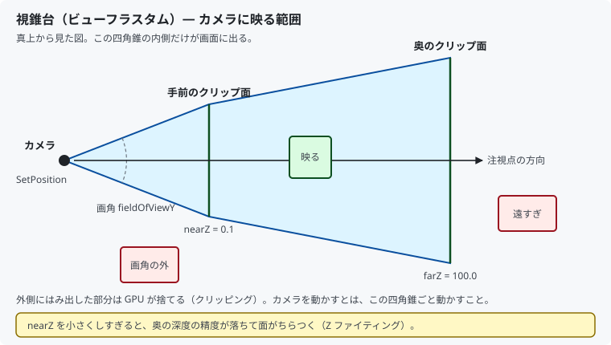

# 10. 3D にする：カメラと透視投影

ここまでは平面（2D）でした。カメラの概念を入れて、
**奥行きのある 3D** にします。

対応するコードは [`src/App/Camera.h`](../../src/App/Camera.h) /
[`.cpp`](../../src/App/Camera.cpp)、
[`src/Graphics/MeshPipeline.cpp`](../../src/Graphics/MeshPipeline.cpp) です。

---

## 1. これまでとの違い

[07 章](07_動かす_定数バッファと行列.md)では、頂点を NDC（-1〜+1）に
直接書き、Z 軸回転とアスペクト比の補正だけを掛けていました。

3D にするには、次の 2 つが増えます。

| 追加するもの | 役割 |
|------------|------|
| **ビュー行列** | どこから、どちらを向いて見るか（カメラ） |
| **射影行列** | 遠くのものを小さく見せる（遠近感） |

**アスペクト比の補正は不要になります。** 射影行列がその役目も担うためです。

---

## 2. 座標変換の全体像



Unity で `Transform` を設定するとオブジェクトが動き、
`Camera` を動かすと見え方が変わりました。
その内訳がこの 3 つの行列です。

| 行列 | Unity で言うと |
|------|--------------|
| ワールド | オブジェクトの `Transform` |
| ビュー | `Camera` の `Transform` |
| 射影 | `Camera` の Field of View / Clipping Planes |

### 大事なのは「GPU にカメラという概念は無い」こと

GPU は**原点から決まった方向を見ている状態**しか扱えません。
そこで「カメラを動かす」代わりに、**世界の側をカメラの逆向きに動かします**。
それがビュー行列です。

```cpp
XMMATRIX Camera::ViewMatrix() const
{
    return XMMatrixLookAtLH(eye, target, up);
}
```

`LookAt` に渡すのは 3 つだけです。

- `eye` … カメラの位置
- `target` … 見たい点
- `up` … カメラの上方向（傾きを決める）

---

## 3. 視錐台と射影行列



```cpp
XMMATRIX Camera::ProjectionMatrix() const
{
    return XMMatrixPerspectiveFovLH(m_fieldOfViewY, m_aspectRatio, m_nearZ, m_farZ);
}
```

| 引数 | 意味 | 本プロジェクトの値 |
|------|------|------------------|
| `fieldOfViewY` | 垂直方向の画角（ラジアン） | 45 度 (`XM_PIDIV4`) |
| `aspectRatio` | 幅 ÷ 高さ | ウィンドウから毎フレーム取得 |
| `nearZ` | 手前のクリップ面 | 0.1 |
| `farZ` | 奥のクリップ面 | 100.0 |

### 遠近感はどこで生まれるのか

射影行列は「遠くのものほど **w が大きくなる**」ように値を仕込みます。
そして GPU がラスタライズ前に `x, y, z` を `w` で割ります（**透視除算**）。

```
w が大きい（遠い） → 割った結果が小さくなる → 画面上で小さく見える
```

[06 章](06_三角形を描く.md)で「今は透視投影をしないので `w = 1.0`」
と書いたのは、この割り算を無効にしていた、という意味でした。
ここでようやく `w` が本来の仕事をします。

### nearZ を小さくしすぎない

深度バッファの精度は `nearZ` に強く影響されます。
`0.001` のような極端に小さい値にすると、遠くの深度差が表現できなくなり、
重なった面がチラチラと入れ替わる **Z ファイティング**が起きます。

「必要な範囲でできるだけ大きく」が原則です。

---

## 4. 行列を掛ける順序

```cpp
const XMMATRIX world = XMMatrixRotationY(angle) * XMMatrixRotationX(angle * 0.45f);
const XMMATRIX worldViewProjection = world * viewProjection;
```

DirectXMath は**行ベクトル規約**（頂点 × 行列）なので、
**先に適用したい変換を左に書きます**。

```
頂点 × ワールド × ビュー × 射影
```

順序を間違えると、モデルが原点の周りを公転したり、
カメラの位置が無視されたりします。
**掛け算の順序が意味を持つ**（交換法則が成り立たない）ことに注意してください。

転置と `mul()` の順序については [07 章](07_動かす_定数バッファと行列.md#3--行列の転置--必ず一度は嵌まる罠)
のとおりで、変更はありません。

---

## 5. 立方体を作る

3D を確認するには、平面ではなく立体が必要です。

### なぜ頂点が 24 個なのか

立方体の角は 8 個ですが、頂点データは **24 個**（6 面 × 4 頂点）です。

理由は **UV が面ごとに違う**からです。
角の 1 点は 3 つの面に属しますが、面ごとに別の UV を持たせたいので、
同じ座標の頂点を面の数だけ用意します。

> 法線（ライティング用）を入れるときも同じ理由で頂点を分けます。
> 「頂点＝座標」ではなく「頂点＝座標とその周辺情報の組」だと考えてください。

### 面の向き（ワインディング）

各面は**外から見て時計回り**に並べます。
逆にすると裏面と判定され、背面カリングで消えます。

立方体では、内側の面が自動的に「裏」になるので、
**カリングによって見えない面のピクセルシェーダーが実行されなくなります**。
処理量がおよそ半分になる、実利のある仕組みです。

---

## 6. インデックスバッファ

四角形 1 枚は三角形 2 枚で作ります。
そのまま頂点を並べると 6 個必要ですが、2 個は重複しています。

**インデックスバッファ**を使うと、頂点は 4 個のままで
「どの順に引くか」だけを別に持てます。

```cpp
constexpr uint16_t kCubeIndices[] = {
     0,  1,  2,   0,  2,  3,   // 手前の面
     ...
};
```

| | 頂点数 | インデックス数 |
|--|-------|--------------|
| インデックスなし | 36 | — |
| インデックスあり | 24 | 36 |

頂点 1 個は 36 バイト、インデックスは 2 バイトなので、
`36×36 = 1296` バイト → `24×36 + 36×2 = 936` バイトに減ります。
モデルが大きくなるほど差が開きます。

### 使い方

```cpp
m_indexBufferView.BufferLocation = m_indexBuffer->GetGPUVirtualAddress();
m_indexBufferView.Format         = DXGI_FORMAT_R16_UINT;   // 頂点 65536 未満なら 16bit
m_indexBufferView.SizeInBytes    = indexBufferSize;
```

```cpp
commandList->IASetIndexBuffer(&m_indexBufferView);   // 1 本だけ設定できる
commandList->DrawIndexedInstanced(m_indexCount, 1, 0, 0, 0);
```

- 頂点バッファは複数スロットに設定できますが、**インデックスバッファは 1 本だけ**です
- 描画命令が `DrawInstanced` から **`DrawIndexedInstanced`** に変わります

インデックスバッファも DEFAULT ヒープに置きます。
転送は [09 章](09_テクスチャを貼る.md) と同じ `UploadHelper` を使い、
最終状態を `D3D12_RESOURCE_STATE_INDEX_BUFFER` にするだけです。

---

## 7. ここで深度バッファが本領を発揮する

[08 章](08_奥行きを正しくする.md)では、平面を 3 枚重ねて
深度テストを確認しました。立方体では**必然的に必要**になります。

回転すると、手前の面と奥の面が常に入れ替わります。
深度テストが無ければ、後ろの面が手前に描かれて立体に見えません。

背面カリングと深度テストは役割が違います。

| 仕組み | 何を捨てるか |
|--------|------------|
| 背面カリング | **裏を向いている面**（立方体の内側） |
| 深度テスト | **手前に何か描かれているピクセル** |

両方あって初めて正しく見えます。

---

## 8. Renderer 側の変更

```cpp
// 縦横比は毎フレーム渡す。ウィンドウをリサイズしても歪まないようにするため。
m_camera.SetAspectRatio(
    static_cast<float>(m_swapChain.Width()) / static_cast<float>(m_swapChain.Height()));

m_meshPipeline.Update(frameIndex,
                      m_camera.ViewProjectionMatrix(),
                      static_cast<float>(m_frameTimer.TotalSeconds()));
```

`Camera` は DirectXMath だけで作られており DirectX の API を使わないため、
[`src/App/`](../../src/App/) に置いています。
「描画方法を差し替えてもカメラの計算は変わらない」という切り分けです。

---

## 9. この章のまとめ

- 3D にするには**ビュー行列**（カメラ）と**射影行列**（遠近感）を足す
- GPU にカメラの概念は無い。**世界をカメラの逆向きに動かす**のがビュー行列
- 遠近感は「w を大きくして、GPU が割る」ことで生まれる
- `nearZ` を小さくしすぎると Z ファイティングが起きる
- 行列は**先に適用したい変換を左**に書く（行ベクトル規約）
- 立方体の頂点が 24 個なのは、**UV が面ごとに違う**から
- インデックスバッファで頂点の重複を省ける。描画は `DrawIndexedInstanced`
- 背面カリングと深度テストは別の仕組み。両方必要

---

## 10. ここから先へ

解説はここまでです。次に進むなら、次のような方向があります。

| やりたいこと | 必要になるもの |
|------------|--------------|
| 陰影を付ける | 法線、ライトの定数バッファ |
| 複数のモデルを出す | メッシュごとの定数バッファ、描画のループ |
| モデルを読み込む | glTF / OBJ のパーサ |
| 画像ファイルを貼る | WIC などのデコーダ |
| 影を落とす | シャドウマップ（深度バッファをテクスチャとして読む） |
| キーで動かす | 入力処理、カメラの操作 |

どれも、ここまでに出た
「リソースを作る → ディスクリプタで結ぶ → コマンドを記録する → 同期する」
の組み合わせで説明がつきます。

---

## この章で参照した資料

- [XMMatrixLookAtLH | Microsoft Learn](https://learn.microsoft.com/windows/win32/api/directxmath/nf-directxmath-xmmatrixlookatlh)
- [XMMatrixPerspectiveFovLH | Microsoft Learn](https://learn.microsoft.com/windows/win32/api/directxmath/nf-directxmath-xmmatrixperspectivefovlh)
- [座標系と変換 | Microsoft Learn](https://learn.microsoft.com/windows/win32/direct3d9/transforms)
- [IASetIndexBuffer | Microsoft Learn](https://learn.microsoft.com/windows/win32/api/d3d12/nf-d3d12-id3d12graphicscommandlist-iasetindexbuffer)
- [DrawIndexedInstanced | Microsoft Learn](https://learn.microsoft.com/windows/win32/api/d3d12/nf-d3d12-id3d12graphicscommandlist-drawindexedinstanced)
- [D3D12_INDEX_BUFFER_VIEW | Microsoft Learn](https://learn.microsoft.com/windows/win32/api/d3d12/ns-d3d12-d3d12_index_buffer_view)
- Frank D. Luna『Introduction to 3D Game Programming with DirectX 12』— 変換行列と視錐台
- Real-Time Rendering (4th Edition) — 透視投影と深度精度

図はすべて本リポジトリで作成したものです（[../assets/](../assets/)）。
