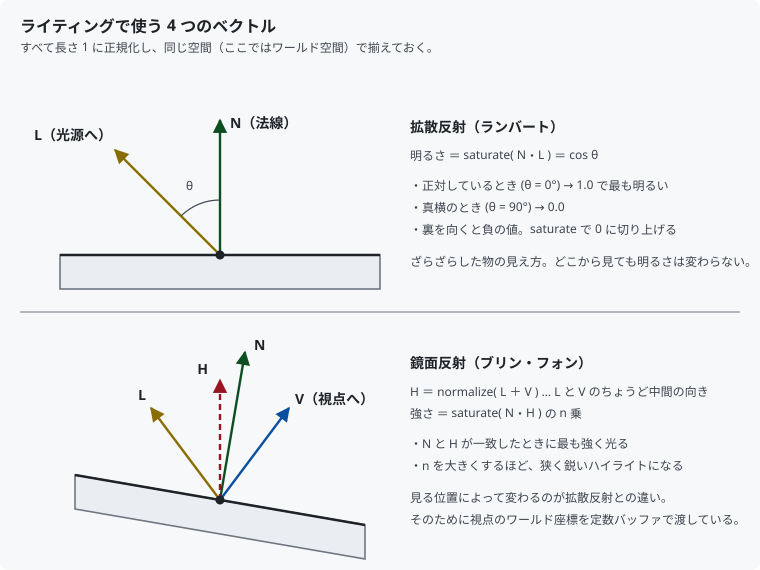
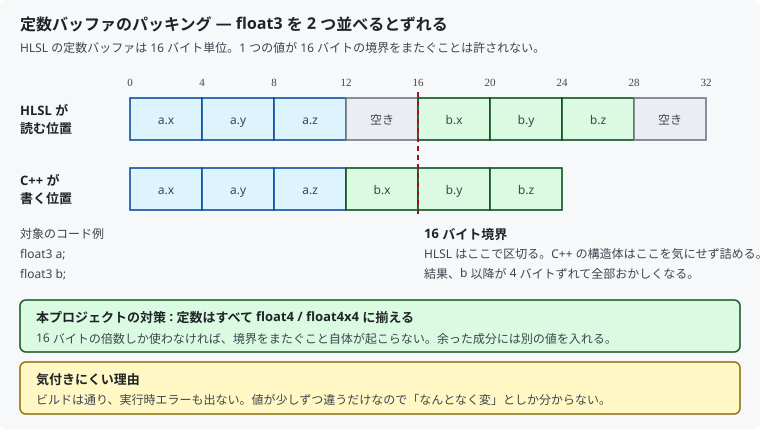

# 11. 陰影を付ける：法線とライティング

[10 章](10_3Dにする_カメラと透視投影.md)で立方体は 3D になりましたが、
面の明るさは常に一定でした。ここでは**光**を導入して、
向きに応じて面が明るくなったり暗くなったりするようにします。

対応するコードは [`shaders/Mesh.hlsl`](../../shaders/Mesh.hlsl) と
[`src/Graphics/MeshPipeline.cpp`](../../src/Graphics/MeshPipeline.cpp) です。

---

## 1. これまでとの違い

10 章までは、面を見分けやすくするために頂点カラーへ上下のグラデーションを
入れていました。あれは**濃淡があるように見せていただけ**で、
立方体をどう回しても明るさは変わりません。

この章で入れるのは本物の陰影です。そのため頂点カラーのグラデーションは
削除し、各面を一様な色にしました。**濃淡はライティングが作ります。**

| | 10 章まで | この章 |
|--|---------|--------|
| 明るさの決まり方 | 頂点に書いた固定値 | 面の向きと光の向きから毎フレーム計算 |
| 回転させると | 明るさは変わらない | 光に正対した面が明るくなる |

---

## 2. 法線 — 面がどちらを向いているか

光の当たり具合は、**面がどちらを向いているか**だけで決まります。
その向きを表すのが**法線 (normal)** です。面に垂直で、長さ 1 のベクトルです。

頂点構造体に 1 つ増やします。

```cpp
struct Vertex
{
    float position[3];
    float normal[3];    // ← 追加
    float color[4];
    float uv[2];
};
```

### 立方体の頂点が 24 個である理由が、もう 1 つ増えた

10 章では「UV が面ごとに違うから」と説明しました。
法線も同じです。立方体の角の 1 点は 3 つの面に属しますが、
その 3 面は**別々の方向を向いています**。

```cpp
// 手前の面 (-Z) に属する頂点
{ { -0.5f,  0.5f, -0.5f }, {  0.0f,  0.0f, -1.0f }, ... }

// 同じ座標だが、左の面 (-X) に属する頂点
{ { -0.5f,  0.5f, -0.5f }, { -1.0f,  0.0f,  0.0f }, ... }
```

座標は同じでも法線が違うので、別の頂点として持つ必要があります。

> 逆に、球のようななめらかな形では、角の頂点を共有して
> 法線を平均化します。そうすると面の境目が滑らかにつながって見えます。
> **頂点を分けるか共有するかで、角ばって見えるか丸く見えるかが変わります。**

---

## 3. 使うベクトルは 4 つだけ



| 記号 | 意味 |
|------|------|
| **N** | 法線。面が向いている方向 |
| **L** | 面から光源へ向かう方向 |
| **V** | 面から視点へ向かう方向 |
| **H** | L と V のちょうど中間の方向（ハーフベクトル） |

すべて**長さ 1 に正規化**し、**同じ空間で揃える**のが鉄則です。
片方がワールド空間、もう片方がローカル空間、では答えが出ません。

### 光の向きの符号に注意

本プロジェクトが定数バッファで渡しているのは
「**光が飛んでいく向き**」です。

```cpp
constexpr float kLightDirection[3] = { 0.55f, -0.75f, 0.35f };  // 左上手前から差す
```

面から光源へ向かう **L はこの逆向き**なので、シェーダーで符号を反転します。

```hlsl
float3 toLight = -g_lightDirection.xyz;
```

ここを間違えると明暗がそっくり裏返ります。
**光源の方向**なのか**光の進行方向**なのかは、資料によって流儀が違うので、
自分のコードでどちらに決めたかをコメントに書いておくと後で助かります。

---

## 4. 拡散反射（ランバート）

ざらざらした物の見え方です。**どこから見ても明るさは同じ**で、
面が光に正対しているほど明るくなります。

```hlsl
float diffuse = saturate(dot(normal, toLight));
```

内積は 2 つのベクトルが長さ 1 なら `cos θ` そのものです。

| 状態 | `N・L` |
|------|-------|
| 光に正対 (θ = 0°) | 1.0（最も明るい） |
| 真横 (θ = 90°) | 0.0 |
| 裏を向いている | 負の値 |

`saturate()` は 0〜1 に丸める関数です。負の値をそのまま使うと、
光に背を向けた面が「マイナスの明るさ」になって計算が壊れます。

---

## 5. 鏡面反射（ブリン・フォン）

つるつるした物に乗る**ハイライト**です。拡散反射と違い、
**見る位置によって位置が変わります**。だから視点の座標が必要になります。

```hlsl
float3 halfVector = normalize(toLight + toEye);
float  specular   = pow(saturate(dot(normal, halfVector)), kSpecularPower);
```

L と V の中間 **H** に面が正対したとき、光が最も強く目に返ってきます。

- `kSpecularPower` を大きくするほど、**狭く鋭い**ハイライトになる
- 反射ベクトルを求める古典的なフォンの式より計算が軽く、見た目はほぼ同じ

> **立方体では面全体が同時に光ります。**
> 1 つの面の中で法線が一定だからです。球のような曲面にすると、
> ようやく点状のハイライトになります。

光が当たっていない面にハイライトだけ乗ると不自然なので、
拡散反射の強さで打ち消しています。

```hlsl
specular *= diffuse;
```

---

## 6. 環境光

拡散反射と鏡面反射だけだと、光の当たらない面が**真っ黒**になります。
現実には壁や床からの照り返しがあるので、そこまで暗くはなりません。

その照り返しを 1 つの定数で近似したものが**環境光 (ambient)** です。

```cpp
constexpr float kAmbientIntensity = 0.25f;
```

最終的な色は次のように組み立てます。

```hlsl
float3 lit = baseColor.rgb * (ambient + g_lightColor.rgb * diffuse)
           + g_lightColor.rgb * specular * kSpecularIntensity;
```

- 環境光と拡散反射は**物体の色に掛ける**（赤い物は赤く明るくなる）
- 鏡面反射は**足す**（ハイライトは光源の色。赤い物でも白く光る）

この違いが、金属やプラスチックの質感の差になります。

---

## 7. どの空間で計算するか

ライティングは**ワールド空間**で計算します。
ライトの向きをワールド空間で決めているので、そこに合わせるのが素直です。

頂点シェーダーで、位置と法線をワールド空間に移して渡します。

```hlsl
output.worldPosition = mul(float4(input.position, 1.0f), g_world).xyz;
output.worldNormal   = mul(float4(input.normal,   0.0f), g_world).xyz;
```

### `w` が 1.0 と 0.0 で違う理由

法線は「**向き**」であって「点」ではありません。
物体が右へ 10 動いても、面の向きは変わらないはずです。

同次座標の `w` は、**平行移動を効かせるかどうかのスイッチ**です。

| `w` | 意味 | 平行移動 |
|-----|------|---------|
| 1.0 | 点（位置） | 効く |
| 0.0 | ベクトル（向き） | 効かない |

`w = 0` にすると行列の 4 行目（平行移動成分）が掛からず、
回転だけが適用されます。ここを 1.0 にすると、物体を動かすたびに
法線まで動いて陰影がめちゃくちゃになります。

> **拡大縮小をするなら注意が必要です。**
> 縦横で違う比率に拡大（非一様スケール）すると、
> ワールド行列をそのまま掛けた法線は面に垂直でなくなります。
> 正しくは**ワールド行列の逆行列の転置**を使います。
> 本プロジェクトは回転しかしていないので、ワールド行列のままで正しい結果になります。

### 補間で長さが崩れる

法線は頂点ごとに持っていて、ラスタライザが頂点間を補間します。
補間された結果は**長さが 1 ではなくなっています**。

```hlsl
float3 normal = normalize(input.worldNormal);   // 使う直前に必ず正規化
```

これを忘れると、面の中央あたりだけ妙に暗くなります。

### 頂点で計算するか、ピクセルで計算するか

本プロジェクトは**ピクセルシェーダー**で明るさを計算しています（フォンシェーディング）。
頂点シェーダーで計算して結果を補間する方法（グーローシェーディング）もあり、
そちらは軽い代わりに、ハイライトが頂点に引っかかって歪みます。

---

## 8. 定数バッファのパッキング — 必ず一度は嵌まる罠

シェーダーへ渡す値が増えました。ここに落とし穴があります。



HLSL の定数バッファは **16 バイト単位**で区切られ、
**1 つの値が 16 バイトの境界をまたぐことは許されません**。

```hlsl
float3 a;    // 0〜11 バイト
float3 b;    // 12 バイト目からでは 16 の境界をまたぐ → 16 バイト目へ送られる
```

一方 C++ の構造体は境界を気にせず詰めるので、`b` は 12 バイト目に置かれます。
**4 バイトずれた状態で読み書きされます。**

厄介なのは、これが**エラーにならない**ことです。
ビルドは通り、実行時のデバッグレイヤーも何も言いません。
値が少しずつおかしいだけなので、「なんとなく変」としか分かりません。

本プロジェクトの対策は単純です。

```cpp
struct SceneConstants
{
    DirectX::XMFLOAT4X4 worldViewProjection;
    DirectX::XMFLOAT4X4 world;
    DirectX::XMFLOAT4   lightDirection;   // xyz を使い、w は未使用
    DirectX::XMFLOAT4   lightColor;       // rgb が光の色、a に環境光の強さを同居させた
    DirectX::XMFLOAT4   cameraPosition;   // xyz を使い、w は未使用
};
```

**すべて 16 バイトの倍数に揃える**ので、境界をまたぐこと自体が起こりません。
余った成分を捨てるのがもったいなければ、`lightColor.a` のように
関係のある値を同居させます。

---

## 9. ShaderVisibility を広げる

10 章まで、定数バッファは頂点シェーダーからしか読んでいませんでした。
今回はピクセルシェーダーもライト情報を読むので、可視性を広げます。

```cpp
rootParameters[0].ShaderVisibility = D3D12_SHADER_VISIBILITY_ALL;   // VERTEX から変更
```

`VERTEX` のままでも**ビルドは通ります**。
実行時にピクセルシェーダー側の値が 0 になり、画面が真っ黒になるだけです。

> 可視性は「狭いほど速い」ので、本来は必要な段だけに絞ります。
> 今回は両方の段が読むため `ALL` が正解です。

---

## 10. 3 か所一致に項目が増えた

[06 章](06_三角形を描く.md)で説明した「頂点データの 3 か所一致」に、
`NORMAL` が加わりました。

| 場所 | 記述 |
|------|------|
| C++ の `Vertex` | `float normal[3];` |
| 入力レイアウト | `{ "NORMAL", 0, DXGI_FORMAT_R32G32B32_FLOAT, 0, 12, ... }` |
| HLSL の `VSInput` | `float3 normal : NORMAL;` |

とくに危ないのが**バイトオフセット**です。`normal` を足したことで
`COLOR` は 12 → 24、`TEXCOORD` は 28 → 40 にずれました。
手で数えた値なので、間違えても気付けません。

そこでコンパイル時に検算しています。

```cpp
static_assert(sizeof(Vertex) == 48, "Vertex のサイズが入力レイアウトの前提と違います");
static_assert(offsetof(Vertex, normal) == 12, "NORMAL のオフセットが違います");
static_assert(offsetof(Vertex, color)  == 24, "COLOR のオフセットが違います");
static_assert(offsetof(Vertex, uv)     == 40, "TEXCOORD のオフセットが違います");
```

構造体をいじった瞬間に**ビルドが赤くなる**ので、画面を見る前に気付けます。

---

## 11. 測って確かめる

「それらしく見える」で終わらせず、
実際に描かれたピクセルが計算式どおりかを確認しました。

画面を撮り、面の明るい市松マス 1 つの色を読み取って、
赤チャンネルから拡散反射の強さを逆算し、緑と青を予測して比べます。

| フレーム | 面 | 逆算した拡散反射 | 予測 → 実測 | 最大誤差 |
|---------|----|--------------|------------|---------|
| A | 黄 (+X) | 0.529 | (174, 143, 50) → (174, 142, 50) | 1 |
| A | 青 (-Z) | 0.723 | (80, 122, 198) → (80, 123, 199) | 1 |
| B | 緑 (+Z) | 0.905 | (95, 223, 111) → (95, 223, 111) | 0 |
| B | 紫 (-Y) | 0.376 | (103, 72, 130) → (103, 72, 129) | 1 |

誤差は最大でも **1 / 255**（四捨五入の分）でした。
シェーダーが式どおりに動いていることと、
**同じ瞬間でも面ごとに明るさが 0.376〜0.905 と大きく違う**こと、
つまり向きに応じた陰影が実際に付いていることが確認できます。

### 白飛びについて

光に正対した明るい面では、赤チャンネルが 255 で頭打ちになります。
明るさの合計が 1.0 を超えているのに、
表示できる上限が 1.0 だからです（**クリッピング**）。

実際のゲームでは、明るさを浮動小数のまま保持しておき、
最後に表示できる範囲へ圧縮します（HDR レンダリングと**トーンマッピング**）。
本プロジェクトはそこまではやっていません。

---

## 12. この章のまとめ

- 光の当たり具合は**法線**だけで決まる。頂点に法線を足す
- 法線が面ごとに違うので、立方体の頂点はやはり 24 個必要
- 使うベクトルは **N / L / V / H** の 4 つ。長さ 1・同じ空間に揃える
- **拡散反射** = `saturate(N・L)`。どこから見ても同じ
- **鏡面反射** = `saturate(N・H)^n`。見る位置で変わるので視点座標が要る
- **環境光**は真っ黒を防ぐための近似。物体の色に掛ける
- 法線を変換するときは `w = 0`。平行移動を効かせないため
- 補間後の法線は**使う直前に正規化**する
- 定数バッファは **16 バイト単位**。`float4` に揃えれば事故らない
- ピクセルシェーダーが定数を読むなら `ShaderVisibility` を `ALL` に

---

## 13. ここから先へ

| やりたいこと | 必要になるもの |
|------------|--------------|
| 光源を増やす | ライト配列の定数バッファ、シェーダーでのループ |
| 点光源・スポットライト | 距離による減衰、光源の位置（向きではなく） |
| 影を落とす | シャドウマップ（光源から見た深度を描いてテクスチャとして読む） |
| 質感を作り分ける | 法線マップ、金属度・粗さ（PBR） |
| 白飛びをなくす | HDR レンダーターゲット、トーンマッピング |

いずれも、この章で出た「向きと向きの内積で明るさを決める」土台の上に乗ります。

---

## この章で参照した資料

- [HLSL の定数バッファのパッキング規則 | Microsoft Learn](https://learn.microsoft.com/windows/win32/direct3dhlsl/dx-graphics-hlsl-packing-rules)
- [dot | Microsoft Learn](https://learn.microsoft.com/windows/win32/direct3dhlsl/dx-graphics-hlsl-dot)
- [saturate | Microsoft Learn](https://learn.microsoft.com/windows/win32/direct3dhlsl/saturate)
- [normalize | Microsoft Learn](https://learn.microsoft.com/windows/win32/direct3dhlsl/normalize)
- [D3D12_ROOT_PARAMETER | Microsoft Learn](https://learn.microsoft.com/windows/win32/api/d3d12/ns-d3d12-d3d12_root_parameter)
- [Semantics | Microsoft Learn](https://learn.microsoft.com/windows/win32/direct3dhlsl/dx-graphics-hlsl-semantics)
- James F. Blinn, "Models of Light Reflection for Computer Synthesized Pictures", SIGGRAPH '77
  — ハーフベクトルを使う鏡面反射の原典
- Frank D. Luna『Introduction to 3D Game Programming with DirectX 12』— ライティングの章
- Real-Time Rendering (4th Edition) — 反射モデルと法線の変換

図はすべて本リポジトリで作成したものです（[../assets/](../assets/)）。
