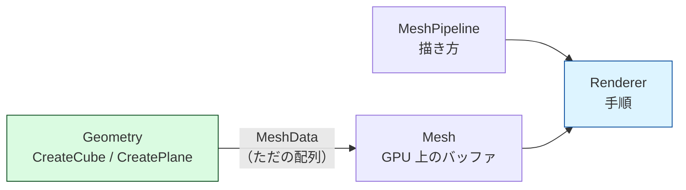
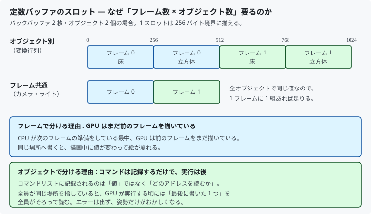
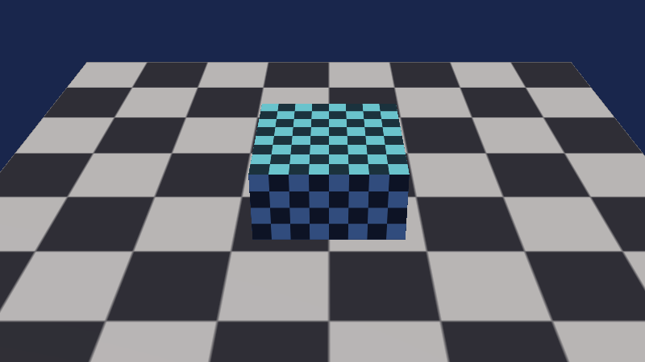

# 12. 複数のモデルを描く

ここまでは画面にオブジェクトが 1 個だけでした。
**床**を追加して 2 個にします。

見た目の変化は地味ですが、**1 個を描く**と**複数を描く**のあいだには
はっきりした段差があります。この章はその段差を越える回です。

対応するコードは [`src/Graphics/Mesh.h`](../../src/Graphics/Mesh.h) /
[`Geometry.h`](../../src/Graphics/Geometry.h) /
[`MeshPipeline.h`](../../src/Graphics/MeshPipeline.h) です。

---

## 1. まずクラスを分ける

11 章までの `MeshPipeline` は、**描き方**と**描く対象**の両方を持っていました。
立方体の頂点配列が、PSO やルートシグネチャと同じファイルに書かれていたのです。

オブジェクトが 2 個になった途端、これでは行き詰まります。
そこで 3 つに分けました。

| クラス | 持つもの | DirectX を使うか |
|--------|---------|----------------|
| `Geometry` | 頂点とインデックスの配列を組み立てる関数 | **使わない** |
| `Mesh` | GPU 上の頂点／インデックスバッファ | 使う |
| `MeshPipeline` | ルートシグネチャ・PSO・定数バッファ・テクスチャ | 使う |



`Geometry` が DirectX を知らないのがポイントです。
形状を作るのはただの計算なので、GPU の都合と混ぜる理由がありません。

```cpp
MeshData CreateCube(float halfExtent);
MeshData CreatePlane(float halfExtent, float height, float uvTiling);
```

`Mesh` はそれを受け取って GPU に載せるだけです。

---

## 2. 定数バッファを 2 段に分ける

これまで定数は 1 つの構造体にまとめていました。
複数オブジェクトになると、**書き換わる頻度が違う**ものが混ざります。

| 内容 | いつ変わるか |
|------|------------|
| カメラ、ライト | 1 フレームに 1 回 |
| ワールド行列 | **オブジェクトごと** |

そこで 2 つに分けます。

```hlsl
cbuffer FrameConstants  : register(b0) { ... }   // 1 フレームに 1 回
cbuffer ObjectConstants : register(b1) { ... }   // オブジェクトごと
```

ルートシグネチャにも 2 つぶんのルートパラメータを用意します。
分けることで、オブジェクトを切り替えるときに**行列だけ**を差し替えられます。

### 可視性を絞る

`ObjectConstants` を読むのは頂点シェーダーだけです（ピクセルシェーダーは
頂点シェーダーから渡された座標を使い、行列そのものは見ません）。

```cpp
rootParameters[1].ShaderVisibility = D3D12_SHADER_VISIBILITY_VERTEX;
```

可視性は狭いほど GPU の負担が軽くなります。
11 章で `FrameConstants` を `ALL` にしたのは
「両方の段が読むから」であって、広ければよいわけではありません。

---

## 3. スロットが「フレーム数 × オブジェクト数」要る理由



`ConstantBuffer` はもともと「フレームごとに 1 領域」でした。
オブジェクト別の定数では足りません。

```cpp
m_objectConstantBuffer.Initialize(
    device, sizeof(ObjectConstants), frameCount * maxObjectCount);
```

理由は 2 つあり、**別々の理由**です。

### フレームで分ける理由

[05 章](05_GPUへの命令と同期.md)でやった話です。
CPU が次のフレームを準備している最中、GPU はまだ前のフレームを描いています。
同じ場所へ書くと、描画の途中で値が変わります。

### オブジェクトで分ける理由

これは新しい話で、しかも**間違えやすい**ところです。

コマンドリストに記録されるのは、**値ではなくアドレス**です。

```cpp
commandList->SetGraphicsRootConstantBufferView(1, address);   // アドレスを記録
```

つまり `Close()` して `ExecuteCommandList()` するまで、GPU は何も読んでいません。
全オブジェクトが同じ場所を指していると、GPU が実行する頃には
**そのフレームで最後に書いた値**を、全員がそろって読みます。

### 実際に壊してみた

床と立方体で同じスロットを使うように変えて実行しました。



立方体が**回転を止め、床にめり込んでいます**。
このコードでは定数を「立方体 → 床」の順に書いているため、
最後に書いた**床の単位行列**が立方体にも適用された、という結果です。

```cpp
// 立方体の行列を書く
UpdateObjectConstants(frameIndex, slot, cubeWorld, viewProjection);

// 同じスロットに床の行列を書く → 立方体のぶんが消える
UpdateObjectConstants(frameIndex, slot, XMMatrixIdentity(), viewProjection);
```

> 症状は**書いた順番によって変わります**。順序を逆にすれば、
> 今度は床が立方体と同じように回ります。
> どちらにせよ「最後に書いた 1 つが全員に適用される」のが本質です。
>
> **エラーは一切出ません。** デバッグレイヤーから見れば、
> 有効なアドレスに有効な行列が入っているだけだからです。

---

## 4. 描画ループ

共通の設定は 1 回だけ、オブジェクトごとの設定は最小限にします。

```cpp
m_meshPipeline.Bind(commandList, frameIndex);          // PSO・ルートシグネチャ・カメラ・テクスチャ

m_meshPipeline.BindObject(commandList, frameIndex, kFloorObjectIndex);
m_floor.RecordDrawCommands(commandList);               // 頂点バッファ ＋ DrawIndexedInstanced

m_meshPipeline.BindObject(commandList, frameIndex, kCubeObjectIndex);
m_cube.RecordDrawCommands(commandList);
```

オブジェクトごとに変えているのは
**定数バッファのアドレスと頂点バッファ**だけです。

### 切り替えの重さは同じではない

| 切り替えるもの | 重さ |
|--------------|------|
| ルート定数・ルートディスクリプタ | 軽い |
| ディスクリプタテーブル | 中くらい |
| **PSO（シェーダーや描画設定）** | **重い** |

だから実際のゲームでは、描画対象を**マテリアル（PSO）ごとに並べ替えて**
から描きます。ここではオブジェクトが 2 個なので気にしていませんが、
「オブジェクト順に描く」のが当たり前ではない、という点は覚えておいてください。

---

## 5. 床を作る

床は四角形 1 枚、頂点 4 個です。

```cpp
MeshData CreatePlane(float halfExtent, float height, float uvTiling);
```

### UV を 1 より大きくする

床にテクスチャを 1 枚だけ貼ると、模様がびろーんと引き伸ばされます。
UV を `0〜1` ではなく `0〜N` にすると、模様が **N × N 回**繰り返されます。

これが効くのは、サンプラーの `AddressU/V` が `WRAP` だからです。
[09 章](09_テクスチャを貼る.md)で設定したものが、ここで初めて仕事をします。

| 設定 | UV が 1 を超えたとき |
|------|-------------------|
| `WRAP` | 繰り返す（今回使っているもの） |
| `CLAMP` | 端の色が引き伸ばされる |
| `BORDER` | 指定した色で塗る |

### 面の向き

床は上（+Y）を向いた 1 枚の面なので、**下から見ると消えます**。
背面カリングが効いているためです。

床下にカメラを潜らせる必要があるなら、
面を 2 枚重ねるか、`CullMode` を `NONE` にします。

---

## 6. 形状をコードで組み立てる

立方体の頂点を 24 行べた書きするのはやめ、面の定義から組み立てるようにしました。

```cpp
struct FaceDefinition
{
    float normal[3];
    float color[4];
    float corners[4][3];   // 外から見て時計回り
};
```

6 面ぶんの定義を書けば、頂点 24 個とインデックス 36 個は自動で並びます。
`halfExtent` を引数にしたので、大きさも呼び出し側で決められます。

> **なぜ最初からこうしなかったのか**
> 10 章の時点では「立方体の頂点が 24 個になる理由」が主題でした。
> ベタ書きのほうが、24 個が並んでいることを目で確かめられます。
> **説明したいことに合わせて書き方を変える**のは、学習用コードでは
> 妥当な判断です。実務なら最初から組み立てる形にします。

---

## 7. この章のまとめ

- 「描き方（`MeshPipeline`）」と「描く対象（`Mesh`）」を分けると複数描ける
- 形状を作る計算（`Geometry`）は DirectX を知らなくてよい
- 定数バッファは**書き換わる頻度**で分ける（フレーム共通／オブジェクト別）
- オブジェクト別の定数は **フレーム数 × オブジェクト数**ぶん要る
  - フレームで分ける : GPU がまだ前のフレームを読んでいる
  - オブジェクトで分ける : **コマンドは記録するだけで、実行は後**
- ルートパラメータの可視性は、読む段だけに絞る
- UV を 1 より大きくすると、`WRAP` 設定によって模様が繰り返される
- 切り替えの重さは PSO が飛び抜けて重い。実務では PSO ごとに並べ替える

---

## この章で参照した資料

- [ルートシグネチャの制限 | Microsoft Learn](https://learn.microsoft.com/windows/win32/direct3d12/root-signature-limits)
- [SetGraphicsRootConstantBufferView | Microsoft Learn](https://learn.microsoft.com/windows/win32/api/d3d12/nf-d3d12-id3d12graphicscommandlist-setgraphicsrootconstantbufferview)
- [D3D12_SHADER_VISIBILITY | Microsoft Learn](https://learn.microsoft.com/windows/win32/api/d3d12/ne-d3d12-d3d12_shader_visibility)
- [D3D12_TEXTURE_ADDRESS_MODE | Microsoft Learn](https://learn.microsoft.com/windows/win32/api/d3d12/ne-d3d12-d3d12_texture_address_mode)
- [D3D12_STATIC_SAMPLER_DESC | Microsoft Learn](https://learn.microsoft.com/windows/win32/api/d3d12/ns-d3d12-d3d12_static_sampler_desc)
- Frank D. Luna『Introduction to 3D Game Programming with DirectX 12』— 描画アイテムとフレームリソース

図はすべて本リポジトリで作成したものです（[../assets/](../assets/)）。
