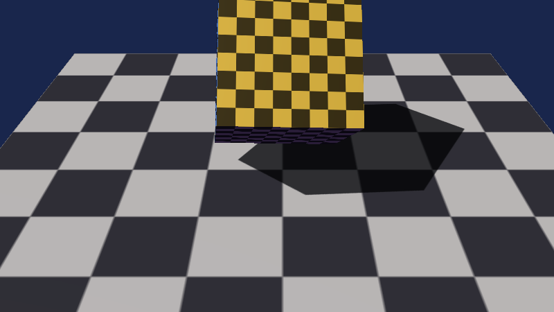
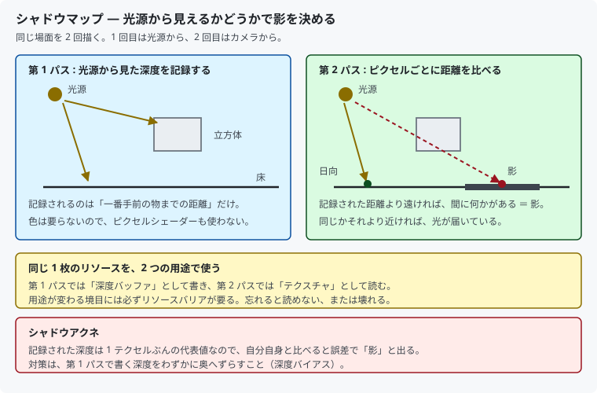
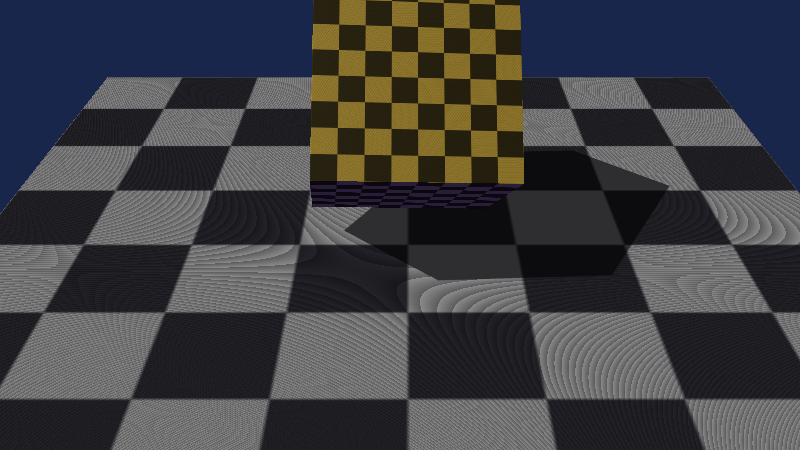

# 13. 影を落とす：シャドウマップ

[11 章](11_陰影を付ける_法線とライティング.md)で面の向きによる陰影は付きましたが、
**立方体は床に影を落としていませんでした**。
面の向きだけを見ていて、「間に何かあるか」を調べていなかったからです。

この章ではそれを調べます。



対応するコードは [`src/Graphics/ShadowMap.h`](../../src/Graphics/ShadowMap.h) と
[`shaders/Mesh.hlsl`](../../shaders/Mesh.hlsl) です。

---

## 1. 考え方

**光源から見て、その点が見えているかどうか**で決まります。
見えていれば日向、他の物に隠れていれば影です。



やることは 2 回の描画（**2 パス**）です。

| | 視点 | 描くもの | 出力先 |
|--|------|---------|--------|
| 第 1 パス | **光源** | 深度だけ | シャドウマップ |
| 第 2 パス | カメラ | いつも通り | 画面 |

第 2 パスでピクセルを塗るとき、その点を**光源から見た座標に変換**して、
第 1 パスで記録した深度と比べます。

- 記録された値より**遠い** → 間に何かある → **影**
- 同じかそれより**近い** → 光が届いている → **日向**

深度バッファでやっていることと本質は同じです。
違うのは、視点がカメラではなく光源であることだけです。

---

## 2. 1 枚のリソースを 2 通りに見る

シャドウマップは、**深度バッファとして書き**、**テクスチャとして読み**ます。
これは DirectX 12 では素直には作れません。

```cpp
static constexpr DXGI_FORMAT kResourceFormat           = DXGI_FORMAT_R32_TYPELESS;
static constexpr DXGI_FORMAT kDepthStencilViewFormat   = DXGI_FORMAT_D32_FLOAT;
static constexpr DXGI_FORMAT kShaderResourceViewFormat = DXGI_FORMAT_R32_FLOAT;
```

リソース本体は **`TYPELESS`**（型を決めない）で作ります。
そのうえで、ビューごとに違う解釈を与えます。

| ビュー | 形式 | 意味 |
|--------|------|------|
| DSV | `D32_FLOAT` | 深度バッファとして書く |
| SRV | `R32_FLOAT` | 1 チャンネルのテクスチャとして読む |

`D32_FLOAT` のまま作ると **SRV を作れません**。
深度専用の形式は、シェーダーから読める形式ではないためです。

> `TYPELESS` は「32 ビットの箱」とだけ決めて、
> 中身の意味はビューに任せる、という考え方です。

---

## 3. リソースバリア

用途が変わる境目には、必ずリソースバリアが要ります。

```cpp
// 第 1 パスの前
PIXEL_SHADER_RESOURCE → DEPTH_WRITE

// 第 1 パスの後
DEPTH_WRITE → PIXEL_SHADER_RESOURCE
```

[08 章](08_奥行きを正しくする.md)では、画面用の深度バッファは
**ずっと `DEPTH_WRITE` のまま**なのでバリアが要らないと書きました。
シャドウマップは用途が毎フレーム切り替わるので、そうはいきません。

書き込み中のリソースを読もうとすると、デバッグレイヤーがエラーを出します。
**エラーが出るぶん、まだ親切な部類の間違い**です。

---

## 4. 光源をカメラに見立てる

平行光源には**位置がありません**。向きしかありません。
そこで、影を落としたい範囲が収まる位置に仮の視点を置きます。

```cpp
const XMVECTOR eye = XMVectorSubtract(center, XMVectorScale(direction, sceneRadius * 2.0f));
```

### 正射影を使う

```cpp
const XMMATRIX projection = XMMatrixOrthographicLH(extent, extent, 0.1f, sceneRadius * 4.0f);
```

[10 章](10_3Dにする_カメラと透視投影.md)の透視投影（`PerspectiveFovLH`）ではなく
**正射影**（`OrthographicLH`）です。

平行光源の光線は**平行**なので、遠近感を付けてはいけません。
透視投影にすると、光源に近い物ほど影が大きく広がってしまいます。

| 光源の種類 | 射影 |
|-----------|------|
| 平行光源（太陽） | 正射影 |
| 点光源・スポットライト | 透視投影 |

### 範囲は狭いほどよい

シャドウマップの解像度は決まっているので、
**カバーする範囲を広げるほど 1 テクセルが粗くなります**。
影の輪郭がガタガタになったら、まず `sceneRadius` を見直してください。

> 広い屋外を扱うときは、カメラの近くほど細かいシャドウマップを使う
> **カスケードシャドウマップ**という手法を使います。
> 考え方はここでやることの延長線上です。

---

## 5. 第 1 パス — 深度だけを描く

色は要らないので、**ピクセルシェーダーを持たない PSO** を作ります。

```cpp
psoDesc.NumRenderTargets = 0;              // 色の出力先は無し
psoDesc.DSVFormat        = shadowMapFormat;
// psoDesc.PS は設定しない
```

頂点シェーダーも、カメラの代わりに光源の行列を掛けるだけです。

```hlsl
float4 VSShadow(VSInput input) : SV_POSITION
{
    return mul(mul(float4(input.position, 1.0f), g_world), g_lightViewProjection);
}
```

### ルートシグネチャも狭くする

影の形を作るのに、テクスチャもライトも要りません。
専用のルートシグネチャを用意し、使わない段を**明示的に閉じます**。

```cpp
rootSignatureDesc.Flags =
    D3D12_ROOT_SIGNATURE_FLAG_ALLOW_INPUT_ASSEMBLER_INPUT_LAYOUT |
    D3D12_ROOT_SIGNATURE_FLAG_DENY_PIXEL_SHADER_ROOT_ACCESS |
    ...
```

`DENY_*_ROOT_ACCESS` は「その段からは一切見せない」という宣言で、
GPU が扱うデータが減るぶん速くなります。

> ルートパラメータの**番号は画面描画側と揃えてあります**。
> そのおかげで `BindObject()`（オブジェクト別の定数を結び付ける処理）を
> 2 つのパスで共用できます。

### ルートシグネチャを変えると、結び付けは全部消える

```cpp
commandList->SetGraphicsRootSignature(m_shadowRootSignature.Get());
// ここまでに設定した定数バッファやテクスチャは全て無効になる
```

第 2 パスの前に、画面用のルートシグネチャと定数バッファを
**設定し直す**必要があります。忘れると何も描かれません。

いっぽう `SetDescriptorHeaps()` は**ルートシグネチャを変えても残る**ので、
1 フレームに 1 回で足ります。

---

## 6. 第 2 パス — 影かどうかを調べる

ピクセルシェーダーで、その点を光源から見た座標に変換します。

```hlsl
float4 lightSpace = mul(float4(worldPosition, 1.0f), g_lightViewProjection);
float3 projected  = lightSpace.xyz / lightSpace.w;

float2 uv = float2(projected.x * 0.5f + 0.5f, -projected.y * 0.5f + 0.5f);
```

`-1〜+1` のクリップ空間を `0〜1` の UV に直しています。
**Y だけ符号が逆**なのは、UV の V が下向きで、NDC の Y が上向きだからです。

### 比較サンプラー

普通のサンプラーは読んだ値をそのまま返しますが、
**比較サンプラー**は渡した値と比べて「合格した割合」を返します。

```cpp
staticSamplers[1].Filter       = D3D12_FILTER_COMPARISON_MIN_MAG_LINEAR_MIP_POINT;
staticSamplers[1].ComparisonFunc = D3D12_COMPARISON_FUNC_LESS_EQUAL;
```

```hlsl
lit = g_shadowMap.SampleCmpLevelZero(g_shadowSampler, uv, projected.z);
```

周囲 4 テクセルを比較してから補間するので、
`0.0 / 0.25 / 0.5 / 0.75 / 1.0` といった中間値が返ります。
**深度を補間してから比べるのではなく、比べてから補間する**のが要点です。
深度そのものを平均しても意味のある値にはなりません。

`AddressU/V` は `BORDER` ＋ 白にしています。
シャドウマップの外側は「影ではない」ことにするためです。

### PCF でギザギザを減らす

1 点だけ比べると、影の輪郭がテクセル単位でガタつきます。
周囲 3×3 を比べて平均すると、境目がなめらかになります。

```hlsl
for (int y = -1; y <= 1; ++y)
    for (int x = -1; x <= 1; ++x)
        lit += g_shadowMap.SampleCmpLevelZero(g_shadowSampler, uv + offset, projected.z);

return lit / 9.0f;
```

これを **PCF (Percentage Closer Filtering)** と呼びます。
比較サンプラー自体も 2×2 を補間するので、実質 6×6 相当をならしています。

### 影が減らすのは直接光だけ

```hlsl
diffuse  *= shadow;
specular *= shadow;
```

**環境光は掛けません。** 環境光は周囲からの照り返しなので、
太陽が遮られても消えないからです。掛けてしまうと、影が真っ黒になって
物体の形が見えなくなります。

---

## 7. シャドウアクネ — 必ず出る

深度バイアスを 0 にして実行すると、こうなります。



床一面に縞模様が出ています。**バグではなく、原理的に起きる現象**です。

### なぜ起きるのか

シャドウマップに記録されているのは、1 テクセルぶんの**代表値**です。
床は連続していますが、記録は飛び飛びなので、必ず誤差が出ます。

床のあるピクセルが「自分自身」と比べたとき、
誤差の分だけ遠い側に転ぶと、**自分が自分の影**と判定されます。
この判定が場所によって入れ替わるので、縞模様になります。

### 対策

第 1 パスで書く深度を、わずかに奥へずらします。

```cpp
rasterizerDesc.DepthBias            = 3000;
rasterizerDesc.SlopeScaledDepthBias = 2.5f;
```

| 設定 | 効果 |
|------|------|
| `DepthBias` | 一律に下駄を履かせる |
| `SlopeScaledDepthBias` | **面の傾きに比例**して下駄を増やす |

光に対して斜めな面ほど、1 テクセルの中での深度差が大きくなります。
そのため傾きに比例する項が効きます。

ラスタライザが深度を書く時点で加算されるので、
ピクセルシェーダーで足すより正確です。

> **ずらしすぎると影が浮きます。**
> 物体と影の接地点に隙間ができる現象で、**ピーターパン現象**と呼ばれます。
> アクネと浮きはトレードオフなので、実際に見て調整するしかありません。

---

## 8. 測って確かめる

画面のピクセルを読み、シェーダーの式どおりかを確認しました。

床は真上を向いているので、拡散反射は光の向きの Y 成分そのもの（0.7547）です。
影に入ると直接光が消え、環境光（0.25）だけが残ります。

| 条件 | 予測 | 実測 | 誤差 |
|------|------|------|------|
| 明るいマス・日向 | (184, 181, 180) | (184, 181, 180) | 0 |
| 明るいマス・影 | (46, 46, 49) | (46, 46, 49) | 0 |
| 暗いマス・日向 | (47, 46, 54) | (47, 46, 54) | 0 |
| 暗いマス・影 | (12, 12, 15) | (12, 12, 15) | 0 |

**4 条件すべてが 1 の狂いもなく一致**しました。

影に入ると明るさは `(0.25 + 0.7547) / 0.25` ＝ **約 1/4** になります。
真っ黒（1/∞）ではないのは、環境光を残しているからです。

---

## 9. この章のまとめ

- 影は「**光源から見てその点が見えるか**」で決まる
- 同じ場面を 2 回描く。1 回目は光源から深度だけ、2 回目はカメラから画面へ
- 1 枚のリソースを 2 通りに見るため、本体は `TYPELESS` で作る
- 用途が切り替わる境目には**リソースバリア**が要る
- 平行光源には位置が無い。仮の視点を置き、**正射影**を使う
- 第 1 パスは**ピクセルシェーダー無し**。ルートシグネチャも狭くできる
- **ルートシグネチャを変えると結び付けは全て消える**。設定し直すこと
- 比較サンプラーは「比べてから補間」する。深度を平均しても意味がない
- **シャドウアクネは必ず出る**。深度バイアスで対策する
- 影が減らすのは直接光だけ。環境光は残す

---

## 10. ここから先へ

| やりたいこと | 必要になるもの |
|------------|--------------|
| 広い屋外に対応する | カスケードシャドウマップ（距離ごとに解像度を変える） |
| 点光源の影 | キューブマップへの 6 方向レンダリング |
| やわらかい影 | PCSS、バリアンスシャドウマップ |
| 影の品質を上げる | 法線方向へのオフセット、フロントフェースカリング |

どれも、この章の「光源から見た深度を記録して比べる」を土台にしています。

---

## この章で参照した資料

- [Common Techniques to Improve Shadow Depth Maps | Microsoft Learn](https://learn.microsoft.com/windows/win32/dxtecharts/common-techniques-to-improve-shadow-depth-maps)
- [D3D12_RASTERIZER_DESC | Microsoft Learn](https://learn.microsoft.com/windows/win32/api/d3d12/ns-d3d12-d3d12_rasterizer_desc)
- [深度バイアスの計算方法 | Microsoft Learn](https://learn.microsoft.com/windows/win32/direct3d11/d3d10-graphics-programming-guide-output-merger-stage-depth-bias)
- [SampleCmpLevelZero | Microsoft Learn](https://learn.microsoft.com/windows/win32/direct3dhlsl/dx-graphics-hlsl-to-samplecmplevelzero)
- [XMMatrixOrthographicLH | Microsoft Learn](https://learn.microsoft.com/windows/win32/api/directxmath/nf-directxmath-xmmatrixorthographiclh)
- [D3D12_STATIC_SAMPLER_DESC | Microsoft Learn](https://learn.microsoft.com/windows/win32/api/d3d12/ns-d3d12-d3d12_static_sampler_desc)
- Lance Williams, "Casting Curved Shadows on Curved Surfaces", SIGGRAPH '78 — シャドウマップの原典
- Frank D. Luna『Introduction to 3D Game Programming with DirectX 12』— シャドウマッピングの章
- Real-Time Rendering (4th Edition) — 影の生成手法の比較

図は本リポジトリで作成したもの、スクリーンショットは本プログラムの実行結果です
（[../assets/](../assets/)）。
