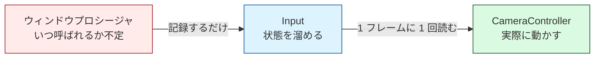
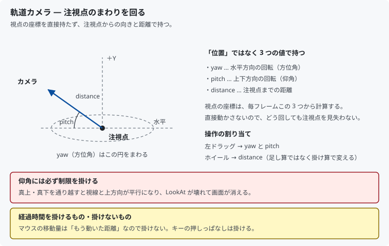

# 14. 操作する：入力とカメラ

ここまでカメラは固定でした。マウスとキーボードで**自由に見回せる**ようにします。

作ったものを好きな角度から確かめられるようになるので、
以降の学習でも役に立ちます。

対応するコードは [`src/App/Input.h`](../../src/App/Input.h) と
[`src/App/CameraController.h`](../../src/App/CameraController.h) です。

---

## 1. ウィンドウプロシージャで処理してはいけない

[02 章](02_ウィンドウを作る.md)で見たとおり、キー入力は `WM_KEYDOWN` として
ウィンドウプロシージャに届きます。ではそこでカメラを動かせばよいかというと、
**それは駄目**です。

理由は 2 つあります。

**1 フレームに何回呼ばれるか分からない。**
マウスを速く動かせば `WM_MOUSEMOVE` は何十回も届きます。
止めていれば 0 回です。ここで処理を書くと、
マウスの動かし方によって処理回数が変わってしまいます。

**メッセージ処理を止めてはいけない。**
ウィンドウプロシージャの中で時間のかかる処理をすると、
その間 OS へ応答が返らず、ウィンドウが「応答なし」になります。

そこで、次のように役割を分けます。



「**記録する場所**」と「**判断する場所**」を分けるのが要点です。

---

## 2. 「今押されている」と「今押された」は別物

同じキー入力でも、欲しい情報は 2 種類あります。

| 種類 | 使う場面 | 本プロジェクトの関数 |
|------|---------|-------------------|
| 状態 | 押しっぱなしで動き続ける（移動、回転） | `IsKeyDown()` |
| イベント | 1 回押すと 1 回だけ起きる（リセット、切り替え） | `WasKeyPressed()` |

イベントは、**前フレームの状態と比べる**ことで作ります。

```cpp
// 今は押されていて、前フレームは離れていた = このフレームで押された
return m_currentKeys.test(index) && !m_previousKeys.test(index);
```

そのために、毎フレームの先頭で現在の状態を退避します。

```cpp
void Input::NewFrame()
{
    m_previousKeys = m_currentKeys;
    m_mouseDeltaX = 0.0f;
    m_mouseDeltaY = 0.0f;
    m_wheelDelta  = 0.0f;
}
```

### 呼ぶ順序が重要

```cpp
while (true)
{
    input.NewFrame();                 // ★ 先に区切る

    if (!window.ProcessMessages()) { break; }

    cameraController.Update(input, camera, deltaSeconds);
    renderer.Render();
}
```

`NewFrame()` は**メッセージを処理する前**に呼びます。
順序を逆にすると、このフレームで届いた移動量を 0 に戻してしまい、
マウスが効かなくなります。

---

## 3. マウス特有の落とし穴

### 届くのは「位置」であって「移動量」ではない

`WM_MOUSEMOVE` に入っているのは現在位置です。移動量は自分で差を取ります。

```cpp
m_mouseDeltaX += static_cast<float>(x - m_lastMouseX);
```

`=` ではなく `+=` なのは、**1 フレームに複数回届くから**です。
上書きすると、最後の 1 回ぶんしか動かなくなります。

### 最初の 1 回で視点が飛ぶ

前回位置の初期値は 0 です。そのまま差を取ると、
最初にマウスを動かした瞬間に「(0,0) からの移動」と誤認して視点が吹き飛びます。

```cpp
if (m_hasMousePosition)   // 2 回目以降だけ差を取る
{
    m_mouseDeltaX += ...;
}
```

### ウィンドウの外へドラッグすると止まる

普通のままだと、マウスがウィンドウの外へ出た時点で `WM_MOUSEMOVE` が
届かなくなり、視点回転が途中で止まります。

**マウスの捕捉**で解決します。

```cpp
case WM_LBUTTONDOWN:
    if (m_pressedMouseButtons == 0) { ::SetCapture(hwnd); }
    ++m_pressedMouseButtons;
```

`SetCapture()` を呼ぶと、以後のマウスメッセージが**必ずこのウィンドウへ届き**ます。
離したら `ReleaseCapture()` で戻します。

> **ボタンごとに解放してはいけません。**
> 2 つ押して 1 つ離した時点で捕捉が切れてしまいます。
> 押されている数を数え、0 になったときだけ解放します。

### Alt+Tab でキーが押されっぱなしになる

キーを押したままウィンドウを切り替えると、`WM_KEYUP` が届きません。
戻ってきたとき、そのキーは「押されたまま」になっています。

```cpp
case WM_KILLFOCUS:
    m_currentKeys.reset();
    m_mouseButtons.fill(false);
```

フォーカスを失ったら全部離す、と決めておけば起きません。

---

## 4. 軌道カメラ



視点の座標を直接動かすと、**すぐに対象を見失います**。
そこで座標ではなく、注視点からの**方位角・仰角・距離**の 3 つで持ちます。

```cpp
float m_yaw      = 0.0f;    // 水平方向の回転
float m_pitch    = 0.42f;   // 上下方向の回転
float m_distance = 5.4f;    // 注視点までの距離
```

位置は毎フレーム、この 3 つから計算します（極座標 → 直交座標）。

```cpp
const float offsetX = m_distance * cosPitch * std::sin(m_yaw);
const float offsetY = m_distance * std::sin(m_pitch);
const float offsetZ = m_distance * cosPitch * std::cos(m_yaw);
```

対象は常に画面の中央にあり、そのまわりを回るだけなので見失いません。
3D モデリングソフトのカメラはたいていこの方式です。

### 仰角には制限が要る

```cpp
m_pitch = std::clamp(m_pitch, -kPitchLimit, kPitchLimit);   // 約 ±87 度
```

真上・真下を通り越すと、視線と「上方向」が平行になります。
そうなると [10 章](10_3Dにする_カメラと透視投影.md)の
`XMMatrixLookAtLH` が計算できず、**画面が消えます**。

### ズームは掛け算で

```cpp
m_distance *= std::pow(1.0f - kZoomPerWheelStep, input.WheelDelta());
```

足し算にすると、遠くでは進みが遅く、近くでは行きすぎます。
**割合で変える**と、どの距離でも同じ操作感になります。
0 以下にならないので、注視点を突き抜ける事故も起きません。

---

## 5. 経過時間を掛けるもの・掛けないもの

これは間違えやすいところです。**両方が混在します。**

```cpp
// マウス : 掛けない
m_yaw += input.MouseDeltaX() * kRadiansPerPixel;

// キー : 掛ける
const float keyRotation = kRadiansPerSecond * deltaSeconds;
if (input.IsKeyDown('A')) { m_yaw -= keyRotation; }
```

| 入力 | 意味 | 経過時間 |
|------|------|---------|
| マウスの移動量 | **もう動いた距離**そのもの | 掛けない |
| キーの押しっぱなし | 「押している間ずっと」 | **掛ける** |

マウスに掛けてしまうと、同じだけ動かしても FPS によって回転量が変わります。
キーに掛け忘れると、FPS が高い環境ほど速く回ってしまいます。

> フレームレートに依存する処理は、**環境が変わって初めて露見する**種類のバグです。
> 開発機では気付かず、他人の PC で「速すぎる」と言われて発覚します。

---

## 6. Window と Input をつなぐ

`Window` はメッセージを横流しするだけです。

```cpp
window.SetMessageCallback([&input](UINT message, WPARAM wParam, LPARAM lParam) {
    return input.ProcessMessage(message, wParam, lParam);
});
```

`Input` は DirectX を知らず、`Window` は入力の意味を知りません。
どちらも `App/` に置いています。

---

## 7. 測って確かめる

「動いた気がする」で終わらせないために、
プログラムへ**合成したメッセージを送り込んで**確認しました。

立方体は勝手に回っているので、画面全体を比べても何も分かりません。
そこで**動かない床の一部**（画面左下）だけを切り出して比べます。
カメラが動けばそこが変わり、動かなければ変わらないはずです。

| 操作 | 床の差 | 期待 | 判定 |
|------|-------|------|------|
| 入力なしで 1.2 秒経過 | 0.00 | 動かない | OK |
| `A` キーを 1 秒押した | 99.48 | 動く | OK |
| `R` キーで初期状態へ戻した | 0.00 | 動かない | OK |
| 左ドラッグで 120px 動かした | 67.45 | 動く | OK |
| ホイールで 6 段寄った | 64.95 | 動く | OK |

数値は 1 チャンネルあたりの平均差（0〜255）です。

**入力なしで 0.00**、つまり 1 ピクセルも違わないことが効いています。
「床は本当に静止していて、立方体の回転に影響されない」ことの裏付けになるので、
他の行の数値が意味を持ちます。

`R` キーの行も 0.00 です。リセットが**元の値へ正確に戻している**ことが分かります。

---

## 8. この章のまとめ

- ウィンドウプロシージャでは**記録するだけ**。判断はメインループで
- 「今押されている」と「今押された」は別物。後者は前フレームとの比較で作る
- `NewFrame()` は**メッセージ処理の前**に呼ぶ
- マウスは位置しか届かない。差は自分で取り、`+=` で溜める
- 最初の 1 回だけ差を取らない（視点が飛ぶのを防ぐ）
- ドラッグを追うには `SetCapture()`。解放はボタンが全部離れてから
- `WM_KILLFOCUS` で全部離す。Alt+Tab 対策
- カメラは座標ではなく**方位角・仰角・距離**で持つと見失わない
- 仰角の制限を忘れると `LookAt` が壊れて画面が消える
- ズームは掛け算。足し算だと操作感が距離で変わる
- **マウスの移動量に経過時間を掛けない。キーの押しっぱなしには掛ける**

---

## 9. ここから先へ

| やりたいこと | 必要になるもの |
|------------|--------------|
| 一人称視点で歩き回る | 位置と向きを直接持つカメラ、WASD での平行移動 |
| ゲームパッドに対応する | XInput（Windows 標準の API） |
| キー割り当てを変えられるようにする | 「操作」と「キー」を分ける層 |
| なめらかに追従させる | 補間（目標値へ毎フレーム少しずつ近づける） |

---

## この章で参照した資料

- [キーボード入力 | Microsoft Learn](https://learn.microsoft.com/windows/win32/inputdev/keyboard-input)
- [マウス入力 | Microsoft Learn](https://learn.microsoft.com/windows/win32/inputdev/mouse-input)
- [SetCapture | Microsoft Learn](https://learn.microsoft.com/windows/win32/api/winuser/nf-winuser-setcapture)
- [WM_MOUSEWHEEL | Microsoft Learn](https://learn.microsoft.com/windows/win32/inputdev/wm-mousewheel)
- [仮想キーコード一覧 | Microsoft Learn](https://learn.microsoft.com/windows/win32/inputdev/virtual-key-codes)
- [XMMatrixLookAtLH | Microsoft Learn](https://learn.microsoft.com/windows/win32/api/directxmath/nf-directxmath-xmmatrixlookatlh)

図は本リポジトリで作成したものです（[../assets/](../assets/)）。
