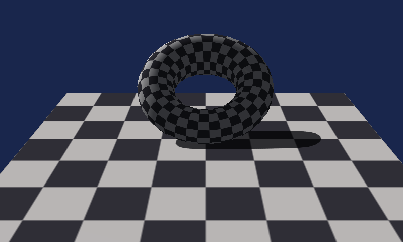
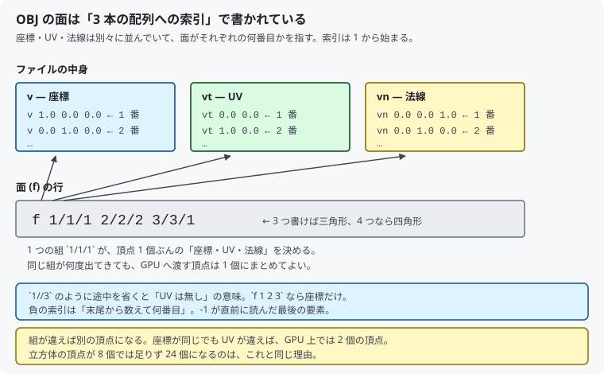
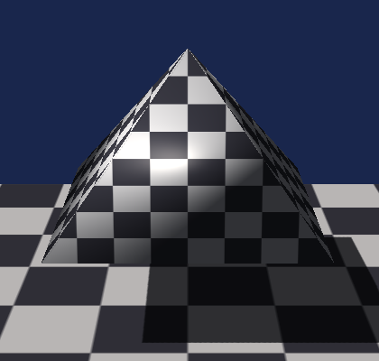
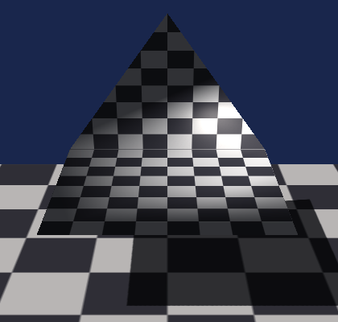

# 15. モデルを読み込む：OBJ

ここまで、画面に出していた形はすべて**コードで作った**ものでした。
立方体も床も、頂点の座標を C++ で並べています。

この章では**ファイルからモデルを読み込み**ます。



対応するコードは [`src/Assets/ObjLoader.h`](../../src/Assets/ObjLoader.h) と
[`src/Assets/ModelLoader.h`](../../src/Assets/ModelLoader.h) です。

---

## 1. なぜ OBJ から始めるのか

3D モデルの形式はたくさんありますが、OBJ には入門に向いた性質があります。

- **テキスト形式**。メモ帳で開いて中身がそのまま読める
- **仕様が小さい**。本当に必要なのは 4 種類の行だけ
- 1980 年代の形式なので**古いが、今でもどのソフトも読み書きできる**

逆に、アニメーション・ボーン・シーン階層は表現できません。
そういうものは [16 章](16_モデルを読み込む_glTF.md) の glTF に任せます。

---

## 2. ファイルの構造



本プロジェクトが扱うのは次の 4 つだけです。

| 行 | 意味 |
|----|------|
| `v x y z` | 座標を 1 つ追加する |
| `vt u v` | UV を 1 つ追加する |
| `vn x y z` | 法線を 1 つ追加する |
| `f …` | 面を 1 つ作る |

要点は、**座標・UV・法線が別々の配列**として並んでいることです。
面はその 3 本への**索引の組**で書かれます。

```
f  1/1/1   2/2/2   3/3/1
```

これは「1 番の座標・1 番の UV・1 番の法線」という頂点、
「2 番・2 番・2 番」という頂点、「3 番・3 番・1 番」という頂点で
三角形を 1 枚作る、という意味です。

### 索引の細かい規則

- **1 から始まる**（0 からではない）
- `1//3` のように途中を省くと「UV は無し」
- `f 1 2 3` なら座標だけ
- **負の値は末尾からの相対**。`-1` はその行までに読んだ最後の要素

負の索引は、モデルを追記していく用途のための仕組みです。
「その行を読んだ時点で何個あるか」が基準なので、
ファイルを最後まで読んでから解決してはいけません。

---

## 3. 3 つ組が違えば別の頂点

GPU は「座標・UV・法線がひとまとめになった頂点」しか扱えません。
OBJ のように 3 本の配列を別々に持つことはできないので、**組み立て直し**ます。

```cpp
struct FaceVertexKey
{
    int position = -1;
    int texCoord = -1;
    int normal   = -1;
};
```

この 3 つ組を鍵にしたハッシュ表を作り、**同じ組が来たら同じ頂点番号を使い回し**ます。
初めて見る組なら新しい頂点を作ります。

```cpp
const auto found = vertexLookup.find(key);
if (found != vertexLookup.end())
{
    faceIndices.push_back(found->second);   // 使い回す
    continue;
}
```

[10 章](10_3Dにする_カメラと透視投影.md)で
「立方体の頂点は 8 個では足りず 24 個必要」と説明したのと同じ話です。
**座標が同じでも UV や法線が違えば、GPU 上では別の頂点**になります。

### 実際に数えてみる

同梱の [`pyramid.obj`](../../assets/models/pyramid.obj) は、
座標 5 個・UV 5 個で、面の行に合計 16 個の組が書かれています。
重複を除くと **11 個**。読み込むとログにこう出ます。

```
OBJ を読み込みました（頂点 11 個 / 三角形 6 枚 / 法線は自動生成）
```

三角形が 6 枚なのは、側面 4 枚＋底面の四角形が 2 枚に割れるためです。

---

## 4. 多角形を三角形に割る

OBJ の面は三角形とは限りません。四角形も、それ以上の多角形も書けます。
GPU は三角形しか描けないので、こちらで割ります。

```cpp
for (size_t i = 1; i + 1 < faceIndices.size(); ++i)
{
    mesh.indices.push_back(faceIndices[0]);
    mesh.indices.push_back(faceIndices[i]);
    mesh.indices.push_back(faceIndices[i + 1]);
}
```

先頭の頂点を軸に扇形へ広げる **ファン分割**です。
`0-1-2`、`0-2-3`、`0-3-4` … と並べます。

> **凸多角形でしか正しくありません。**
> へこんだ形（凹多角形）だと、多角形の外へはみ出す三角形ができます。
> ただし OBJ の面はほぼ凸なので、実用上はこれで足ります。
> 厳密にやるなら耳切り法などの三角形分割アルゴリズムが必要です。

---

## 5. 右手座標系から左手座標系へ

**ここが一番の落とし穴です。**

| | OBJ | 本プロジェクト |
|--|-----|--------------|
| 座標系 | 右手系。**+Z が手前** | 左手系。**+Z が奥** |
| 面の表 | 外から見て反時計回り | 画面上で時計回り |

変換は `Z` の符号を反転するだけです。

```cpp
position[2] = -position[2];
normal[2]   = -normal[2];
```

### 面の並び順は変えなくてよい

直感に反しますが、**インデックスの順序は入れ替えません**。

視線に沿った鏡映は、**画面上の回り順を変えない**からです。
Z を反転しても、画面に投影したときの X と Y は動きません。

そのうえで、OBJ の「外から見て反時計回り」は、
Y が下向きの D3D の画面座標では**時計回り**になります。
これは `FrontCounterClockwise = FALSE`（時計回りが表）という
本プロジェクトの設定にちょうど一致します。

### 変換を忘れるとどうなるか

**モデルが消えるわけでも、裏返るわけでもありません。**
前後が鏡写しになるだけです。だから気付きにくいのです。

同梱の `pyramid.obj` は、頂点を **+Z 側（OBJ では手前）へ傾けて**あります。

| 変換あり（正しい） | 変換なし |
|------------------|---------|
|  |  |

正しい方は頂点が**手前へ**傾き、画面上では低い位置に来ます。
変換を忘れると奥へ傾き、高い位置に来ます。

> **左右対称なモデルでは見分けが付きません。**
> 実際、この検証を最初はドーナツ形で試して失敗しました。
> ドーナツは Z 方向に対称なので、鏡写しにしても**まったく同じ絵**になります。
> 座標系の確認には、**非対称なモデル**を使ってください。

### UV の V も反転する

```cpp
uv[1] = 1.0f - uv[1];
```

OBJ の V は下から上へ増えますが、DirectX の V は上から下です
（[09 章](09_テクスチャを貼る.md)）。忘れるとテクスチャが上下逆に貼られます。

---

## 6. 法線が無いときは作る

`vn` が 1 つも書かれていないファイルは珍しくありません。
その場合は面の向きから作ります。

```cpp
const float faceNormal[3] = { e1[1] * e2[2] - e1[2] * e2[1], ... };   // 2 辺の外積
```

外積の**長さは三角形の面積の 2 倍**になります。
正規化せずにそのまま足し合わせると、
「大きい面ほど強く効く」重み付けが自然に手に入ります。

### 座標が同じ頂点どうしで足す

足し合わせる相手は「同じ頂点」ではなく「**同じ座標**」です。

```cpp
const int positionIndex = vertexPositionIndex[mesh.indices[i + corner]];
accumulated[positionIndex][axis] += faceNormal[axis];
```

UV の継ぎ目で頂点が 2 個に分かれていても、座標が同じなら同じ法線になります。
こうしないと、継ぎ目にだけ陰影の段差が出ます。

### 角が丸くなることに注意

この方法は**必ず滑らかにつながります**（スムーズシェーディング）。
四角錐を読み込むと、角がはっきりしない丸い形に見えます。

角を立てたいなら、**ファイル側で法線を書く**か、面ごとに頂点を分けるしかありません。
「法線が無い ＝ 滑らかにする」は、あくまで妥当な既定値であって正解ではありません。

---

## 7. 大きさを揃える

モデルの単位はファイルによってまちまちです。
メートルのものもセンチのものもインチのものもあります。

そのまま置くと、画面に入りきらないか小さすぎて見えません。
そこで**全頂点を囲む直方体**（バウンディングボックス）を求め、
一番長い辺が決めた長さになるよう拡大縮小します。

```cpp
const float longestEdge = std::max({ extent[0], extent[1], extent[2] });
const float scale = (longestEdge > 1e-8f) ? (targetSize / longestEdge) : 1.0f;
```

3 軸で別々の倍率にすると形が歪むので、**共通の 1 つの値**を使います。

水平方向は中心を原点へ、垂直方向は底面を床の高さへ合わせています。
「中心を原点へ」だと、モデルの半分が床に埋まってしまうためです。

> **法線は触りません。** 法線は「向き」なので、3 軸共通の拡大縮小では変わりません。
> 縦横で違う倍率にする場合は、[11 章](11_陰影を付ける_法線とライティング.md)で触れた
> 逆行列の転置が必要になります。

---

## 8. 読み込みに失敗しても止めない

```cpp
try
{
    modelData = assets::LoadModel(ResolveAssetPath(kModelRelativePath), options);
}
catch (const std::exception& e)
{
    LogError(L"モデルの読み込みに失敗したため、立方体で代用します。");
    modelData = CreateCube(kCubeHalfExtent);
}
```

ファイルが無い、壊れている、といった事情でアプリごと落ちるのは困ります。
**コードで作れる形に切り替えて**動き続けるようにしました。

ログには失敗した旨が残るので、黙って握り潰してはいません。

---

## 9. この章のまとめ

- OBJ はテキスト形式で、必要な行は `v` / `vt` / `vn` / `f` の 4 つだけ
- 面は**3 本の配列への索引の組**で書かれる。索引は 1 始まり、負なら末尾から
- **組が違えば別の頂点**。ハッシュ表で重複をまとめる
- 多角形はファン分割で三角形にする（凸多角形でのみ正しい）
- 右手系 → 左手系は **Z の符号を反転**するだけ。**面の並び順は変えない**
- 変換を忘れても消えも裏返りもしない。**前後が鏡写しになるだけ**
- 対称なモデルでは座標系の誤りを見つけられない
- 法線が無ければ面の外積から作る。ただし必ず滑らかになる
- 単位はファイルごとに違う。バウンディングボックスで大きさを揃える

---

## 10. ここから先へ

| やりたいこと | 必要になるもの |
|------------|--------------|
| 色や質感をファイルから読む | `.mtl` ファイル（`mtllib` / `usemtl`）の解析 |
| 画像テクスチャを貼る | WIC などのデコーダ |
| 頂点が 65536 個を超えるモデル | 32 ビットインデックス（`DXGI_FORMAT_R32_UINT`） |
| アニメーションを扱う | [16 章](16_モデルを読み込む_glTF.md) の glTF |

---

## この章で参照した資料

- [Wavefront .obj file — Wikipedia](https://en.wikipedia.org/wiki/Wavefront_.obj_file)
  — 形式の概要と行の一覧
- [Object Files (.obj) — Paul Bourke](https://paulbourke.net/dataformats/obj/)
  — 各行の仕様。負の索引の扱いを含む
- [座標系と変換 | Microsoft Learn](https://learn.microsoft.com/windows/win32/direct3d9/transforms)
- [D3D12_RASTERIZER_DESC | Microsoft Learn](https://learn.microsoft.com/windows/win32/api/d3d12/ns-d3d12-d3d12_rasterizer_desc)
  — `FrontCounterClockwise` の意味
- Real-Time Rendering (4th Edition) — 頂点の共有と法線の平均化

図は本リポジトリで作成したもの、スクリーンショットは本プログラムの実行結果です
（[../assets/](../assets/)）。同梱のモデルも本リポジトリで作成したものです
（[assets/models/README.md](../../assets/models/README.md)）。
