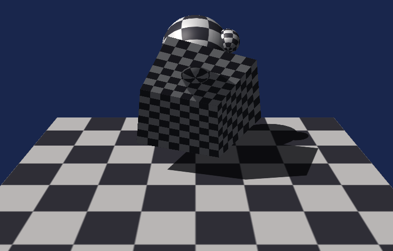
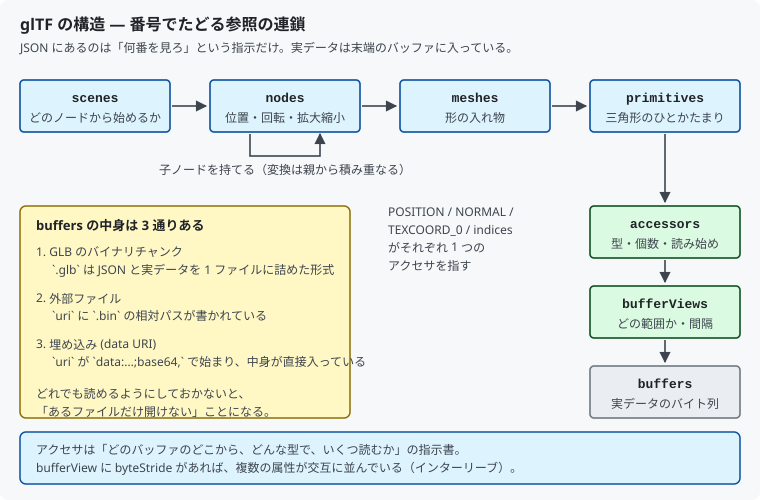

# 16. モデルを読み込む：glTF

[15 章](15_モデルを読み込む_OBJ.md)の OBJ は 1980 年代の形式で、
形しか表現できませんでした。

この章では **glTF 2.0** を読み込みます。
「3D の JPEG」を目指して 2015 年に作られた、現在の標準的な配布形式です。



対応するコードは [`src/Assets/GltfLoader.h`](../../src/Assets/GltfLoader.h) と
[`src/Assets/Json.h`](../../src/Assets/Json.h) です。

---

## 1. OBJ との違い

| | OBJ | glTF 2.0 |
|--|-----|---------|
| 形式 | テキスト | JSON ＋ バイナリ |
| 数値 | 十進数の文字列 | **そのままのバイト列** |
| シーン階層 | 無し | **ノードの入れ子** |
| マテリアル | 別ファイル (`.mtl`) | 同じファイルに含む |
| アニメーション | 無し | あり |
| 読み込みの速さ | 遅い（文字列を数値に変換） | 速い（**そのまま GPU へ渡せる**） |

一番大きな違いは、**数値がバイナリでそのまま入っている**ことです。

OBJ の `v 1.234 5.678 9.012` は、読むたびに文字列を `float` に変換する必要があります。
glTF は最初から `float` のバイト列なので、極端に言えば
**メモリにコピーするだけで頂点バッファになります**。

### 2 つの入れ物

| 拡張子 | 中身 |
|--------|------|
| `.gltf` | JSON テキスト。バイナリは外部の `.bin` か、JSON 内に base64 で埋め込み |
| `.glb` | JSON とバイナリを 1 ファイルに詰めたもの。**配布はこちらが主流** |

本プロジェクトは両方に対応しています。

---

## 2. 構造 — 番号でたどる参照の連鎖



glTF の JSON にあるのは、ほとんどが「**何番を見ろ**」という指示です。

```
scenes → nodes → meshes → primitives → accessors → bufferViews → buffers
```

末端の `buffers` にだけ実データが入っています。

### それぞれの役割

| 名前 | 役割 |
|------|------|
| `scenes` | どのノードから始めるか |
| `nodes` | 位置・回転・拡大縮小。**子ノードを持てる** |
| `meshes` | 形の入れ物 |
| `primitives` | 三角形のひとかたまり。属性とインデックスを持つ |
| `accessors` | どんな型で、いくつ、どこから読むか |
| `bufferViews` | バッファのどの範囲か。飛び飛びの間隔 (`byteStride`) |
| `buffers` | 実データのバイト列 |

一見まわりくどいのですが、この分け方には理由があります。
**同じバッファを複数のアクセサが違う見方で共有できる**からです。
座標と法線と UV が 1 本のバッファに交互に詰まっていても、
アクセサが「何バイト目から、何バイトおきに」を知っていれば取り出せます。

---

## 3. アクセサを読む

これがローダの心臓部です。

```cpp
accessor → bufferView → buffer
```

必要な情報は次のとおりです。

| 項目 | どこにあるか | 意味 |
|------|------------|------|
| `componentType` | accessor | 成分の型（`5126` なら `float`） |
| `type` | accessor | `"VEC3"` なら 3 成分 |
| `count` | accessor | 要素の個数 |
| `byteOffset` | accessor と bufferView の**両方** | 読み始める位置 |
| `byteStride` | bufferView | 次の要素までの間隔 |

`byteOffset` が 2 か所にあるのが引っかかりどころです。**両方足します**。

```cpp
const size_t base = viewOffset + accessorOffset;
```

### componentType の番号

OpenGL 由来の番号がそのまま使われています。

| 番号 | 型 |
|------|-----|
| 5120 | `int8` |
| 5121 | `uint8` |
| 5122 | `int16` |
| 5123 | `uint16` |
| 5125 | `uint32` |
| 5126 | `float` |

インデックスは `uint16` か `uint32`、座標は `float` が普通ですが、
**UV や色は `uint8` / `uint16` に圧縮されていることがあります**。
その場合 `normalized` が `true` になり、
`255` で割って `0.0〜1.0` に戻す約束です。

### byteStride — インターリーブ

`byteStride` があると、要素は連続していません。

```
POSITION の 0 番目 [x y z] NORMAL の 0 番目 [x y z] POSITION の 1 番目 [x y z] …
```

このように複数の属性が交互に並んでいる状態を**インターリーブ**と呼びます。
GPU にとっては 1 つの頂点のデータが近くにあるほうが読みやすいため、
最適化されたファイルではよく使われます。

`byteStride` が無ければ、要素は隙間なく並んでいます。

---

## 4. GLB の中身

`.glb` は単純な入れ物です。

```
[マジック 4][バージョン 4][全体の長さ 4]        ← ヘッダ 12 バイト
[長さ 4][種類 4][中身 …]                        ← チャンク（JSON）
[長さ 4][種類 4][中身 …]                        ← チャンク（バイナリ）
```

マジックは `0x46546C67`。リトルエンディアンで読むと `"glTF"` になります。

```cpp
uint32_t magic = 0;
std::memcpy(&magic, fileBytes.data(), sizeof(magic));
isBinaryContainer = (magic == kGlbMagic);
```

**拡張子ではなく中身で判定する**ほうが確実です。

チャンクは **4 バイト境界に揃えられて**います。読み飛ばすときは切り上げが必要です。

```cpp
offset += (chunkLength + 3) & ~3u;
```

### buffer の実体は 3 通り

| 置き場所 | 見分け方 |
|---------|---------|
| GLB のバイナリチャンク | `uri` が**無い** |
| 埋め込み | `uri` が `data:...;base64,` で始まる |
| 外部ファイル | `uri` が相対パス |

3 つとも扱えるようにしないと、「あるファイルだけ開けない」ことになります。

---

## 5. ノードの変換

OBJ に無かった要素です。**ノードは入れ子にでき、変換は親から積み重なります**。

```cpp
const XMMATRIX transform = LocalTransformOf(node) * parentTransform;
```

ローカル変換の書き方は 2 通りあります。

- `matrix` に 4×4 を直接書く
- `translation` / `rotation` / `scale` に分けて書く

後者の適用順は **拡大縮小 → 回転 → 平行移動** と仕様で決まっています。

```cpp
return XMMatrixScalingFromVector(scale)
     * XMMatrixRotationQuaternion(rotation)
     * XMMatrixTranslationFromVector(translation);
```

`rotation` は**クォータニオン**で、`(x, y, z, w)` の順です。
DirectXMath も同じ順序なので、そのまま渡せます。

### 行列は列優先で書かれている

`matrix` の 16 個の数値は**列優先**で並んでいます。
DirectXMath の `XMMATRIX` は行優先なので、読み替えが要ります。

```cpp
// 列優先の並びを、行優先の XMMATRIX として読む（＝転置して読むのと同じ）
return XMMatrixSet(m[0],  m[1],  m[2],  m[3],
                   m[4],  m[5],  m[6],  m[7],
                   ...);
```

[07 章](07_動かす_定数バッファと行列.md)の転置の話と同じ根っこの問題です。

### 法線には逆行列の転置を使う

```cpp
XMMATRIX normalTransform = XMMatrixTranspose(XMMatrixInverse(nullptr, transform));
```

[11 章](11_陰影を付ける_法線とライティング.md)で「今は回転しかしないので
ワールド行列のままでよい」と書いた話が、ここで効いてきます。

glTF のノードは**軸ごとに違う倍率**で拡大縮小できます。
その場合、位置と同じ行列で法線を変換すると、面に垂直でなくなります。
正しくは**逆行列の転置**です。

---

## 6. 座標系と UV

| | OBJ | glTF | 本プロジェクト |
|--|-----|------|--------------|
| 座標系 | 右手系 | **右手系**（+Y 上、-Z 前方） | 左手系 |
| 面の表 | 外から見て反時計回り | **外から見て反時計回り** | 画面上で時計回り |
| UV の原点 | **左下**（V は上向き） | **左上**（V は下向き） | 左上（V は下向き） |

座標系は OBJ と同じなので、扱いも同じです。Z の符号を反転し、
面の並び順は変えません。

```cpp
vertex.position[2] = -XMVectorGetZ(position);
```

**UV は OBJ と違って反転が不要です。**
glTF の UV は最初から DirectX と同じ「左上が原点」だからです。

> OBJ の癖でつい `1.0 - v` と書いてしまいがちです。
> 形式ごとに約束が違うので、**そのつど仕様を確認する**しかありません。

---

## 7. JSON パーサを自前で書く

外部ライブラリを使わない方針なので、JSON パーサも自前です
（[`Json.h`](../../src/Assets/Json.h)）。

再帰下降パーサという、いちばん素直な作りです。
「先頭の 1 文字を見て、どの種類かを振り分け、その種類の読み方に進む」を繰り返します。

```cpp
switch (reader.Peek())
{
case '{': return ParseObject(reader);
case '[': return ParseArray(reader);
case '"': /* 文字列 */
case 't': case 'f': case 'n': return ParseLiteral(reader);
default:  /* 数値 */
}
```

オブジェクトが自分の中にオブジェクトを含むので、関数も自分自身を呼び出します。
JSON の構造がそのまま関数の呼び出し構造になるのが気持ちのよいところです。

### 実装で気を付けた点

- **数値は全て `double` で持つ。** JSON は整数と小数を区別しません
- **`\uXXXX` のサロゲートペア。** UTF-16 で 1 文字を 2 つに分けて書いた形です。
  つなぎ直してから UTF-8 に変換します
- **オブジェクトはハッシュ表ではなく素直な配列。**
  glTF のオブジェクトは要素数が少なく、順に探しても速度は問題になりません

---

## 8. 対応していないもの

正直に書いておきます。本プロジェクトが読むのは**形だけ**です。

| 項目 | 扱い |
|------|------|
| マテリアル、テクスチャ画像 | 読み飛ばす |
| アニメーション、スキン | 読み飛ばす |
| モーフターゲット | 読み飛ばす |
| カメラ、ライト | 読み飛ばす |
| 疎なアクセサ (sparse) | 未対応（全て 0 として読む） |
| 三角形以外の mode | 読み飛ばす |
| 拡張 (`extensions`) | 読み飛ばす |

シーン中の全メッシュは、ノードの変換を適用したうえで**1 つに結合**しています。
本来はメッシュごとに分けて持ち、マテリアルごとに描き分けるべきところです。

---

## 9. 測って確かめる

サンプルは本リポジトリで生成しました。
生成時に分かっている値と、読み込んだ結果を突き合わせます。

### scene.glb（GLB・ノード変換あり）

球 2 つと箱 1 つを、3 つのノードに置いたシーンです。

| 項目 | 生成時の値 | 読み込み結果 |
|------|----------|------------|
| プリミティブ | 3 | 3 |
| 頂点 | 894 | 894 |
| 三角形 | 1580 | 1580 |

**ノードの変換が効いているか**は、バウンディングボックスで確かめられます。

- 箱は 1 辺 1.0 を `scale [1.4, 1.0, 1.4]` で広げ、Y 軸まわりに 45 度回転
  → 幅は `1.4 × √2 ≒ 1.98`
- 球（半径 0.55）を `translation [0, 1.5, 0]` に置く → 一番上は `1.5 + 0.55 = 2.05`

```
モデルの元の大きさ: 1.980 x 2.050 x 1.980 → 倍率 0.829
```

**手計算とぴったり一致**しました。
平行移動・回転・軸ごとに違う拡大縮小が、すべて正しく適用されています。

### sphere.gltf（JSON テキスト・外部 .bin）

| 項目 | 生成時の値 | 読み込み結果 |
|------|----------|------------|
| プリミティブ | 1 | 1 |
| 頂点 | 561 | 561 |
| 三角形 | 1024 | 1024 |
| バウンディングボックス | 2.0³（半径 1.0 の球） | 2.000 x 2.000 x 2.000 |

外部ファイルを参照する経路も動いています。

> **この検証には弱点があります。**
> サンプルを書き出したのも読み込んだのも本リポジトリなので、
> **仕様の解釈を同じように間違えていれば、一致してしまいます**。
> 本来は Blender などが書き出したファイルでも確かめるべきところです。

---

## 10. この章のまとめ

- glTF は **JSON ＋ バイナリ**。数値がそのまま入っているので読み込みが速い
- 構造は**番号でたどる参照の連鎖**。実データは末端の `buffers` だけ
- `byteOffset` は accessor と bufferView の**両方にあり、足す**
- `byteStride` があれば属性が交互に並んでいる（インターリーブ）
- `.glb` はマジック `"glTF"` で判定する。チャンクは 4 バイト境界
- buffer の実体は **GLB チャンク / 外部ファイル / base64 埋め込み**の 3 通り
- ノードは入れ子。変換は**親から積み重なる**
- TRS の適用順は **拡大縮小 → 回転 → 平行移動**
- `matrix` は**列優先**。DirectXMath は行優先なので読み替える
- 軸ごとに違う拡大縮小があるので、法線は**逆行列の転置**で変換する
- 座標系は OBJ と同じ右手系だが、**UV は反転不要**

---

## 11. ここから先へ

| やりたいこと | 必要になるもの |
|------------|--------------|
| 色や質感を反映する | `materials` の解釈（PBR のパラメータ） |
| テクスチャ画像を貼る | `images` の PNG / JPEG デコード |
| アニメーションさせる | `animations` と `skins`、ボーン行列の定数バッファ |
| メッシュごとに描き分ける | 結合をやめ、マテリアル単位で分けて持つ |
| 大きなモデルを扱う | 32 ビットインデックス、`sparse` アクセサ |

---

## この章で参照した資料

- [glTF 2.0 Specification | Khronos Group](https://registry.khronos.org/glTF/specs/2.0/glTF-2.0.html)
  — 本章の記述はすべてこの仕様に基づく
- [glTF 2.0 — Accessors](https://registry.khronos.org/glTF/specs/2.0/glTF-2.0.html#accessors)
  — `componentType` の番号、`normalized` の扱い
- [glTF 2.0 — GLB File Format Specification](https://registry.khronos.org/glTF/specs/2.0/glTF-2.0.html#glb-file-format-specification)
  — マジック、チャンクの並び、4 バイト境界
- [glTF 2.0 — Transformations](https://registry.khronos.org/glTF/specs/2.0/glTF-2.0.html#transformations)
  — TRS の適用順、行列が列優先であること
- [glTF Tutorials | Khronos Group](https://github.com/KhronosGroup/glTF-Tutorials)
- [RFC 8259 — The JavaScript Object Notation (JSON) Data Interchange Format](https://datatracker.ietf.org/doc/html/rfc8259)
- [XMMatrixInverse | Microsoft Learn](https://learn.microsoft.com/windows/win32/api/directxmath/nf-directxmath-xmmatrixinverse)

図は本リポジトリで作成したもの、スクリーンショットは本プログラムの実行結果です
（[../assets/](../assets/)）。同梱のモデルも本リポジトリで生成したものです
（[assets/models/README.md](../../assets/models/README.md)）。
