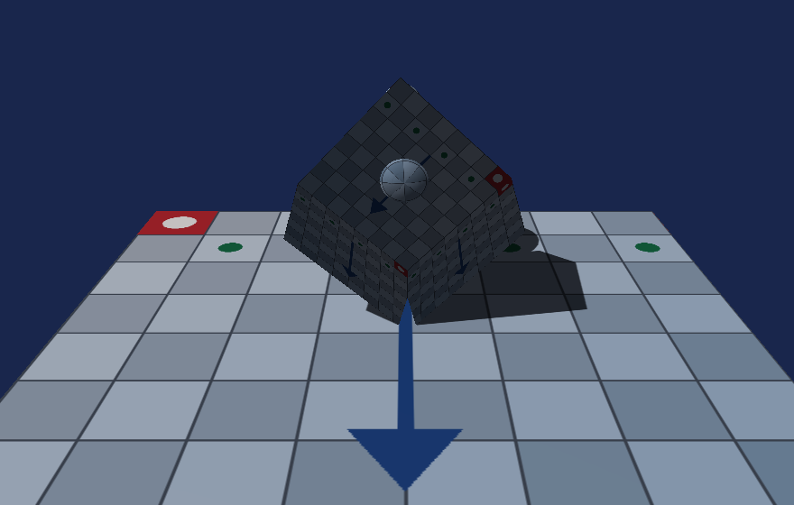
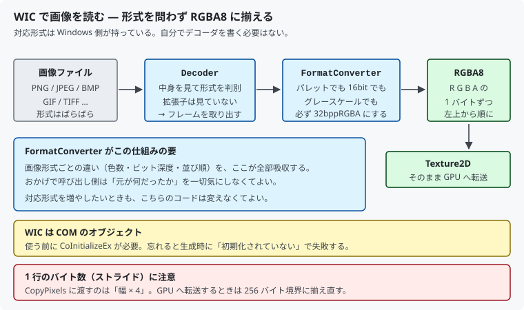

# 17. 画像を読み込む：WIC

[09 章](09_テクスチャを貼る.md)から、テクスチャの中身は**コードで生成した市松模様**でした。
[15 章](15_モデルを読み込む_OBJ.md)・[16 章](16_モデルを読み込む_glTF.md)で
モデルは読めるようになりましたが、模様は相変わらずコード製です。

この章で **PNG や JPEG を読み込め**るようにします。



対応するコードは [`src/Assets/ImageLoader.h`](../../src/Assets/ImageLoader.h) と
[`src/Common/ComInitializer.h`](../../src/Common/ComInitializer.h) です。

---

## 1. デコーダは自分で書かない

PNG を読むには、可逆圧縮（Deflate）の展開と、行ごとのフィルタの復元が要ります。
JPEG なら離散コサイン変換とハフマン符号です。
どちらも**自前で書くと数千行**になります。

Windows には **WIC (Windows Imaging Component)** が標準で入っています。
Windows SDK の一部なので、外部ライブラリを持ち込まない本プロジェクトの方針とも矛盾しません。

> **「生の API を直接呼ぶ」方針との関係**
> 本プロジェクトが避けているのは、**DirectX の使い方を隠すヘルパー**です
> （DirectXTK12、`d3dx12.h` など）。
> 画像形式のデコードは DirectX の学習対象ではないので、
> OS が持っている仕組みに任せます。

---

## 2. 流れ



```
ファクトリ → デコーダ → フレーム → フォーマットコンバータ → RGBA8 のピクセル列
```

### ファクトリは 1 つあれば足りる

```cpp
static ComPtr<IWICImagingFactory> factory;
if (factory == nullptr)
{
    DX_CHECK(::CoCreateInstance(CLSID_WICImagingFactory, ...));
}
```

画像を読むたびに作り直す必要はありません。

### デコーダは中身を見て形式を判別する

```cpp
GetFactory()->CreateDecoderFromFilename(filePath.c_str(), ...);
```

**拡張子は見ていません。** ファイルの先頭にある識別子（マジック）で判断します。
`.png` という名前の JPEG でも正しく読めますし、逆も同じです。

### フレームという概念

```cpp
decoder->GetFrame(0, &frame);
```

GIF のように**複数枚を持つ形式**があるので、「何枚目か」の指定が要ります。
静止画なら 0 番だけです。

---

## 3. フォーマットコンバータがこの仕組みの要

ここがいちばん大事な部分です。

```cpp
converter->Initialize(frame.Get(),
                      GUID_WICPixelFormat32bppRGBA,   // ← 何であってもこの形式にする
                      WICBitmapDitherTypeNone,
                      nullptr, 0.0, WICBitmapPaletteTypeCustom);
```

元の画像は、パレット方式かもしれず、グレースケールかもしれず、
1 チャンネル 16 ビットかもしれません。
**コンバータを通せば、必ず 32bppRGBA になります。**

おかげで呼び出し側は「元が何だったか」を一切気にしなくてよくなります。
対応形式を増やしたいときも、こちらのコードは変えません。

> これを挟まずに `frame->CopyPixels()` を直接呼ぶと、
> 元の形式のまま返ってきます。24bit BMP なら 3 バイト、
> グレースケールなら 1 バイトです。GPU へ渡す前に破綻します。

---

## 4. COM の初期化

WIC は COM のオブジェクトです。使う前に初期化が要ります。

```cpp
const dx12::ComInitializer comInitializer;   // main の先頭で 1 つ
```

DirectX 12 自体は COM の初期化を必要としないので、
これまで一度も出てきませんでした。

忘れると `CoCreateInstance` が
`CO_E_NOTINITIALIZED`（0x800401F0）で失敗します。
**エラーが出るぶん、まだ親切な間違い**です。

初期化と後始末を対にするため、生成時に `CoInitializeEx`、
破棄時に `CoUninitialize` を呼ぶ小さなクラスにしました。

```cpp
ComInitializer()  { /* CoInitializeEx */ }
~ComInitializer() { /* CoUninitialize  */ }
```

> **既に初期化済みの場合**（`S_FALSE` や `RPC_E_CHANGED_MODE`）は、
> 自分では後始末しません。他の誰かが管理している状態を壊さないためです。

---

## 5. ストライド（1 行のバイト数）

```cpp
const uint32_t stride = image.width * 4;
converter->CopyPixels(nullptr, stride, totalBytes, image.pixels.data());
```

RGBA8 なら 1 行は「幅 × 4」バイトぴったりです。

ただし [09 章](09_テクスチャを貼る.md)で見たとおり、
**GPU へ転送するときは 256 バイト境界に揃え直す**必要があります。
この 2 つのストライドは別物なので、混同しないでください。

| どこの話か | 1 行のバイト数 |
|-----------|--------------|
| WIC が返すピクセル列 | 幅 × 4（隙間なし） |
| GPU への中継バッファ | 256 の倍数に切り上げ |

揃え直しは `Texture2D` が既にやっているので、
この章で新しく書くことはありません。

---

## 6. 読めなくても止めない

```cpp
try
{
    return assets::LoadImageFile(ResolveAssetPath(kTextureRelativePath));
}
catch (const std::exception& e)
{
    LogError(L"画像の読み込みに失敗したため、市松模様で代用します。");
    // …コードで市松模様を作って返す
}
```

[15 章](15_モデルを読み込む_OBJ.md)のモデル読み込みと同じ考え方です。
**外部ファイルに依存する処理は、失敗したときの道を用意しておく**と、
アプリごと落ちずに済みます。

この作りは検証にも役立ちました（次節）。

---

## 7. 測って確かめる

「それらしく表示された」で終わらせないために、
**同じ模様をコードでも作り、画素単位で比べました**。

同梱の `assets/textures/checker.png` は、
コードの `CreateCheckerboardPixels()` が作るものと**まったく同じ模様**です
（256×256、32 ピクセル角、明 `(235,235,235)` / 暗 `(60,60,70)`）。

1. テクスチャのパスを `checker.png` にして描画 → **ファイルから読んだ絵**
2. パスを存在しない名前にして描画 → 代用処理が動き、**コードで作った絵**

この 2 枚を比べます。回転は止めて、同じ姿勢で撮りました。

```
画素数 921600   最大差 0   平均差 0.0000
完全一致
```

**92 万画素すべてで差 0** でした。

これで次のすべてが同時に確かめられます。

- PNG の展開が正しい（Deflate の展開、行フィルタの復元）
- フォーマットコンバータが正しい RGBA の並びを返している
- ストライドの扱いが正しい（ずれていれば模様が斜めに流れる）
- 上下の向きが正しい（反転していれば……市松模様では分からない）

### 向きの確認は別の絵でやる

最後の項目だけは、市松模様では確かめられません。
上下反転しても同じ模様になるからです。

そこで、実際に使う `uv-grid.png` には**向きが分かる印**を入れました。

- **UV (0,0) の角に赤い印**
- **V が増える向きに矢印**
- 上端の並びに緑の点（左右反転も分かるように）

冒頭のスクリーンショットで、赤い印が奥の左、矢印が手前を向いていれば正しい配置です。
床の UV は `(0,0)` が奥左、`(1,1)` が手前右になるよう作ってあるためです。

> [15 章](15_モデルを読み込む_OBJ.md)で「対称なモデルでは座標系の誤りを見つけられない」
> と書いたのと同じ話です。**検証用の絵は、わざと非対称にしておく**必要があります。

---

## 8. この章のまとめ

- 画像形式のデコーダは自分で書かない。Windows 標準の **WIC** に任せる
- WIC は Windows SDK の一部なので、外部ライブラリを持ち込むことにはならない
- 流れは **デコーダ → フレーム → フォーマットコンバータ → RGBA8**
- **フォーマットコンバータが要**。元の形式の違いを全部吸収してくれる
- 形式の判別は**拡張子ではなく中身**で行われる
- WIC は COM。使う前に `CoInitializeEx` が必要
- ストライドは 2 種類ある。**WIC は隙間なし、GPU へは 256 バイト境界**
- 読めなくても代用に切り替えて動き続ける。**検証にも使える**
- **検証用の画像は非対称にする**。対称だと向きの誤りを見つけられない

---

## 9. ここから先へ

| やりたいこと | 必要になるもの |
|------------|--------------|
| モデルの色や質感を反映する | glTF の `materials`、OBJ の `.mtl` |
| モデルに含まれる画像を使う | glTF の `images`（`DecodeImageBytes` は用意済み） |
| 遠くの模様のちらつきを抑える | ミップマップの生成と `MipLevels` の設定 |
| 色を正しく扱う | sRGB のガンマ補正（`*_UNORM_SRGB` 形式） |
| 圧縮テクスチャを使う | BC1〜BC7、DDS の読み込み |

いま画像を読む口はできたので、次は
**モデルのマテリアルとこの仕組みをつなぐ**のが自然な流れです。

---

## この章で参照した資料

- [Windows Imaging Component | Microsoft Learn](https://learn.microsoft.com/windows/win32/wic/-wic-lh)
- [IWICImagingFactory | Microsoft Learn](https://learn.microsoft.com/windows/win32/api/wincodec/nn-wincodec-iwicimagingfactory)
- [IWICFormatConverter | Microsoft Learn](https://learn.microsoft.com/windows/win32/api/wincodec/nn-wincodec-iwicformatconverter)
- [WIC のネイティブ対応形式 | Microsoft Learn](https://learn.microsoft.com/windows/win32/wic/native-wic-codecs)
- [CoInitializeEx | Microsoft Learn](https://learn.microsoft.com/windows/win32/api/combaseapi/nf-combaseapi-coinitializeex)
- [COM のスレッドモデル | Microsoft Learn](https://learn.microsoft.com/windows/win32/com/processes--threads--and-apartments)

図は本リポジトリで作成したもの、スクリーンショットは本プログラムの実行結果です
（[../assets/](../assets/)）。同梱のテクスチャも本リポジトリで生成したものです
（[assets/textures/README.md](../../assets/textures/README.md)）。
