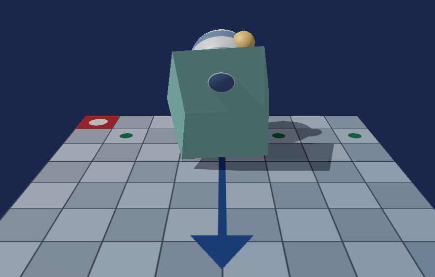

# 19. 色を正しく扱う：sRGB とトーンマッピング

ここまでのライティングには、実は**根本的な誤り**がありました。

[11 章](11_陰影を付ける_法線とライティング.md)で光の計算を書きましたが、
そこで扱っていた数値は**物理的な明るさではなかった**のです。



対応するコードは [`Texture2D.h`](../../src/Graphics/Texture2D.h)、
[`SwapChain.h`](../../src/Graphics/SwapChain.h)、
[`shaders/Mesh.hlsl`](../../shaders/Mesh.hlsl) です。

---

## 1. 画像の中の数値は明るさではない

PNG に `128` と書かれていても、それは
「**最大の明るさの半分**」という意味ではありません。

人間の目は暗い側の変化に敏感なので、
限られた 256 段階を暗い側へ厚く配ることで見た目の階調を稼いでいます。
この配り方の決まりが **sRGB** です。

| 記録された値 | 実際の明るさ（リニア） |
|------------|---------------------|
| 0.0 | 0.000 |
| 0.25 | 0.051 |
| **0.5** | **0.214** |
| 0.75 | 0.522 |
| 1.0 | 1.000 |

`0.5` は明るさで言えば **0.21** です。半分ではありません。

### なぜ問題になるのか

光の計算は**足し算と掛け算**です。
物理的な明るさに対して行わなければ、答えが合いません。

```
sRGB の 0.5 + sRGB の 0.5 ≠ sRGB の 1.0
```

2 つの光源で照らしても、単純に足すと明るくなりすぎます。
影の境目も不自然になります。

**ここまでの実装は、この誤りを抱えたまま動いていました。**

---

## 2. 直し方は 3 か所

```
画像（sRGB） → [変換] → リニアで計算 → [変換] → 画面（sRGB）
```

やることは決まっています。

| どこ | 何をするか |
|------|----------|
| テクスチャを読むとき | sRGB → リニア |
| 計算のあいだ | ずっとリニアのまま |
| 画面へ書くとき | リニア → sRGB |

そして、**両端の変換は GPU がやってくれます**。
自分でシェーダーに式を書く必要はありません。

---

## 3. テクスチャを sRGB として読む

形式に `_SRGB` を付けるだけです。

```cpp
static constexpr DXGI_FORMAT kColorFormat = DXGI_FORMAT_R8G8B8A8_UNORM_SRGB;
```

こうすると、シェーダーが `Sample()` した時点で**すでにリニアに戻って**います。
しかも、フィルタリング（拡大縮小の補間）もリニア空間で行われます。

### 何にでも付けてよいわけではない

```cpp
void Initialize(..., bool isColorTexture = true);
```

**「見た目の色」を表す画像にだけ**付けます。

| 画像の種類 | sRGB にするか |
|-----------|-------------|
| 基本色（ベースカラー） | **する** |
| 法線マップ | **してはいけない** |
| 粗さ・金属度・高さ | **してはいけない** |

法線マップに入っているのは色ではなく**ベクトルの成分**です。
sRGB として読むと、数値が勝手に曲げられて表面がおかしくなります。

---

## 4. 画面へ書くときも GPU に任せる

ここに**フリップモデル特有の引っかかり**があります。

```cpp
// スワップチェーン本体
static constexpr DXGI_FORMAT kBackBufferFormat = DXGI_FORMAT_R8G8B8A8_UNORM;

// 描画先として見るときの形式（RTV）
static constexpr DXGI_FORMAT kRenderTargetViewFormat = DXGI_FORMAT_R8G8B8A8_UNORM_SRGB;
```

**わざと違う形式にしています。**

[04 章](04_画面に出す仕組み.md)で使った `DXGI_SWAP_EFFECT_FLIP_DISCARD` では、
スワップチェーン本体に `_SRGB` 形式を**指定できません**。
指定すると生成に失敗します。

代わりに、**RTV 側で `_SRGB` を指定**します。
「同じメモリを、書き込むときだけ sRGB として見る」という形です。

```cpp
D3D12_RENDER_TARGET_VIEW_DESC rtvDesc = {};
rtvDesc.Format        = kRenderTargetViewFormat;   // nullptr ではなく明示する
rtvDesc.ViewDimension = D3D12_RTV_DIMENSION_TEXTURE2D;

device->CreateRenderTargetView(m_backBuffers[i].Get(), &rtvDesc, rtvHandle);
```

[13 章](13_影を落とす_シャドウマップ.md)のシャドウマップで
「1 枚のリソースを 2 通りに見る」という話をしましたが、それと同じ考え方です。

### PSO にも同じ形式を渡す

```cpp
psoDesc.RTVFormats[0] = SwapChain::kRenderTargetViewFormat;   // _SRGB のほう
```

間違えると、**PSO の生成は通ります**。
実行時にデバッグレイヤーが「形式が合わない」と言うまで気付けません。

### クリア色もリニアになる

```cpp
// 見た目は sRGB の (0.10, 0.15, 0.30)、8bit で (26, 38, 76) 相当
constexpr float kClearColor[4] = { 0.01002f, 0.01960f, 0.07324f, 1.0f };
```

`ClearRenderTargetView` に渡す値も、RTV が sRGB なら**リニアとして解釈**されます。
これまでと同じ値を渡すと、画面がぐっと明るくなります。

---

## 5. トーンマッピング

リニアで計算すると、明るさは **1.0 を超えます**。
[11 章](11_陰影を付ける_法線とライティング.md)で
「鏡面反射で白飛びする」と書いたのがこれです。

そのまま画面へ書くと 1.0 で切り落とされ、**階調が消えます**。

そこで、書き込む直前に 0〜1 へ押し込みます。

```hlsl
float3 ToneMap(float3 color)
{
    const float whiteSquared = kWhitePoint * kWhitePoint;
    return color * (1.0f + color / whiteSquared) / (1.0f + color);
}
```

**拡張版ラインハルト**という式です。

| 明るさ | 振る舞い |
|--------|---------|
| 白点よりずっと暗い | ほとんどそのまま |
| 白点のあたり | ちょうど 1.0 になる |
| 白点より明るい | なだらかに 1.0 へ近づく（超えない） |

単純な `color / (1 + color)` だと全体が暗くなってしまいますが、
白点を決めた形なら暗部の見え方をほぼ保てます。

> 本格的なやり方では、いったん `R16G16B16A16_FLOAT` のような
> **HDR レンダーターゲット**へ描き、後から画面全体をトーンマッピングします。
> 本プロジェクトはピクセルシェーダーの最後で済ませているので、
> 半透明を重ねると結果が変わってしまうという制約があります。

---

## 6. 測って確かめる

### sRGB の変換が効いているか

クリア色はリニアで `(0.01002, 0.01960, 0.07324)` と指定しています。
sRGB の変換式を通せば、画面に出るはずの 8 ビット値を計算できます。

| | 値 |
|--|-----|
| 予測 | (25, 38, 77) |
| 実測 | **(26, 38, 76)** |
| 誤差 | 1 / 255（四捨五入の分） |

**変換が効いていなければ (3, 5, 19)** になるはずです。
桁違いに暗い値なので、「効いているかどうか」は一目で分かります。

### トーンマッピングが効いているか

同じ場面を、トーンマッピングの有無で撮り比べました。

| | 255 に張り付いた画素 | 最も明るい画素 |
|--|-------------------|--------------|
| 無し | **556** / 921600 | (255, 255, 255) |
| 有り | **0** / 921600 | (251, 251, 250) |

白飛びしていた 556 画素が、**1 つ残らず**階調を取り戻しました。

---

## 7. 正直に書いておくこと

### 頂点カラーと Kd はリニア扱いにした

本プロジェクトの頂点カラーや、OBJ の `Kd` は
**リニアの値として扱っています**。

実際には「見た目で選んだ値」＝ sRGB のつもりであることが多く、
厳密には変換すべきです。
glTF の `baseColorFactor` は仕様で**リニア**と定められているので、そちらは正しい扱いです。

統一を優先しましたが、正しくない箇所があると自覚しておくのが大事です。

### 影が明るくなったのは正しい

sRGB 対応の前後で見比べると、**影の中が明るく**なっています。

暗くなったのではなく、これまでが**暗すぎた**のです。
リニアの 0.25 を sRGB へ変換すると 0.54 になります。
今までは 0.25 のまま画面へ書いていたので、必要以上に潰れていました。

---

## 8. この章のまとめ

- 画像に書かれた数値は**明るさそのものではない**（sRGB でエンコードされている）
- 光の計算は**リニア空間**で行わないと、足し算・掛け算の答えが合わない
- 直すのは 3 か所。**入口で戻す・計算はリニア・出口で戻す**
- 両端の変換は **GPU がやってくれる**。形式に `_SRGB` を付けるだけ
- **色の画像にだけ付ける。** 法線マップや粗さに付けてはいけない
- フリップモデルではスワップチェーン本体に `_SRGB` を指定できない。**RTV で指定する**
- PSO の `RTVFormats` も `_SRGB` のほうに合わせる（間違えても生成は通る）
- クリア色もリニアになる
- リニアの明るさは 1.0 を超える。**トーンマッピング**で押し込む
- 頂点カラーや `Kd` の扱いは厳密ではない。自覚しておく

---

## 9. ここから先へ

| やりたいこと | 必要になるもの |
|------------|--------------|
| きちんとした HDR | `R16G16B16A16_FLOAT` の中間ターゲット、画面全体へのトーンマッピング |
| もっと自然な階調 | ACES などのフィルミックなトーンマッピング曲線 |
| 明るさの自動調整 | 露出制御（画面の平均輝度から決める） |
| 明るいところがにじむ | ブルーム |
| 物理的に正しい質感 | PBR（金属度・粗さ）。**リニア空間が前提** |

**PBR に進む前に色空間を直しておくべき**なのは、
PBR の式がリニアの明るさを前提にしているからです。
sRGB のまま計算しても、パラメータをいくら調整しても正しくなりません。

---

## この章で参照した資料

- [sRGB の扱いとガンマ補正 | Microsoft Learn](https://learn.microsoft.com/windows/win32/direct3ddxgi/converting-data-color-space)
- [DXGI_FORMAT | Microsoft Learn](https://learn.microsoft.com/windows/win32/api/dxgiformat/ne-dxgiformat-dxgi_format)
- [フリップモデルのスワップチェーン | Microsoft Learn](https://learn.microsoft.com/windows/win32/direct3ddxgi/dxgi-flip-model)
- [D3D12_RENDER_TARGET_VIEW_DESC | Microsoft Learn](https://learn.microsoft.com/windows/win32/api/d3d12/ns-d3d12-d3d12_render_target_view_desc)
- Erik Reinhard et al., "Photographic Tone Reproduction for Digital Images", SIGGRAPH 2002
  — 本章で使ったトーンマッピングの原典
- Real-Time Rendering (4th Edition) — 色空間とトーンマッピングの章
- [IEC 61966-2-1（sRGB 規格）の変換式](https://www.w3.org/Graphics/Color/srgb)

スクリーンショットは本プログラムの実行結果です（[../assets/](../assets/)）。
