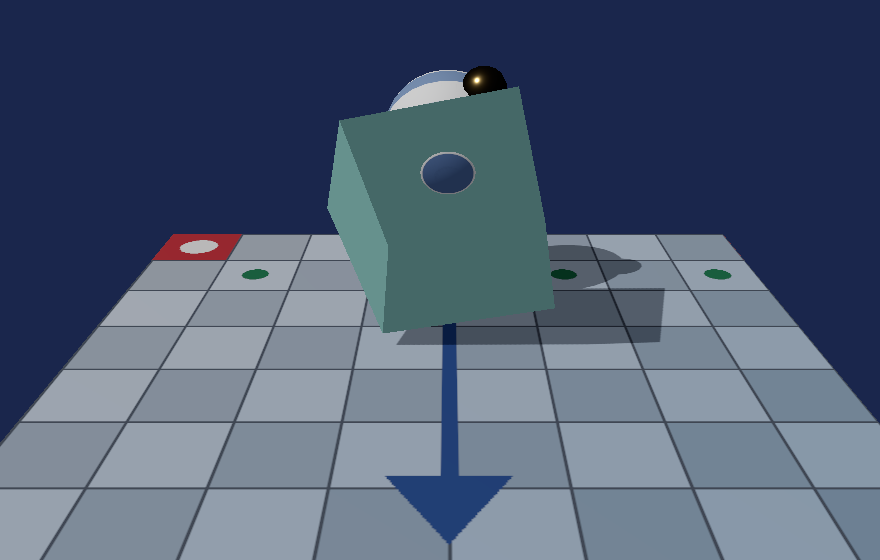

# 20. PBR：金属度と粗さ

[11 章](11_陰影を付ける_法線とライティング.md)のライティングは
**それらしく見せる**ための式でした。鏡面反射の鋭さを表す `kSpecularPower` に
物理的な意味はなく、値は目で見て決めていました。

この章では**物理ベースレンダリング (PBR)** に置き換えます。
[19 章](19_色を正しく扱う_sRGB.md)で色空間を直したので、
ようやく式が意味を持つようになりました。



対応するコードは [`shaders/Mesh.hlsl`](../../shaders/Mesh.hlsl) と
[`MaterialSet.h`](../../src/Graphics/MaterialSet.h) です。

---

## 1. パラメータは 2 つだけ

PBR の中心にあるのは、たった 2 つの値です。

| パラメータ | 意味 |
|-----------|------|
| **金属度 (metallic)** | 0 が非金属、1 が金属 |
| **粗さ (roughness)** | 0 が鏡のよう、1 がざらざら |

「光沢」「反射率」「ハイライトの鋭さ」といった値を個別に持つ代わりに、
**この 2 つから全部を導きます**。

そのおかげで、パラメータをどう組み合わせても
「現実にはあり得ない材質」になりません。
[11 章](11_陰影を付ける_法線とライティング.md)の
`kSpecularPower` と `kSpecularIntensity` は、
好きな値を入れられてしまう点で危うい設計でした。

### 金属度に中間の値はない

現実の物質は、金属か非金属かのどちらかです。
`0.5` に物理的な意味はありません。

にもかかわらず中間値を許すのは、
**塗装の剥げた金属**のように「場所によって違う」ものを
テクスチャで表すためです。境目がぼやけて中間値になります。

---

## 2. 金属と非金属で、色の意味が入れ替わる

ここが PBR でいちばん大事な点です。

| | 非金属（誘電体） | 金属（導体） |
|--|---------------|------------|
| 拡散反射 | **ある**。基本色がその色 | **無い** |
| 反射の色 | ほぼ無色（4% 程度） | **基本色がそのまま反射の色** |

```hlsl
float3 f0     = lerp(kDielectricF0, baseColor.rgb, metallic);
float3 albedo = baseColor.rgb * (1.0f - metallic);
```

同じ `baseColor` が、金属度によって**まったく違う役割**になります。

- 金属度 0 … `albedo` に入り、拡散反射の色になる。反射は無色の 4%
- 金属度 1 … `f0` に入り、反射の色になる。拡散反射は消える

金が金色に見えるのは、**反射する光そのものが金色**だからです。
金の表面に白い拡散光は無く、映り込みだけで見えています。

### なぜ 0.04 なのか

```hlsl
static const float3 kDielectricF0 = float3(0.04f, 0.04f, 0.04f);
```

プラスチック・木・肌・石など、ほとんどの非金属は
**垂直から見たときの反射率が 4% 前後**に収まります。
値の幅が狭いので、定数で済ませるのが一般的です。

---

## 3. マイクロファセット BRDF

表面を「向きの揃っていない**無数の微小な鏡**」の集まりとみなすモデルです。

粗い面は微小な鏡の向きがばらばらなので、光があちこちへ散ります。
滑らかな面は向きが揃っているので、鏡のように返します。

反射の量は 3 つの項の積で表されます。

```hlsl
float3 specular = (distribution * geometry * fresnel)
                / max(4.0f * normalDotView * normalDotLight, 1e-4f);
```

### D — 分布項（GGX）

微小な鏡のうち、**ちょうど光を目に返す向き**のものがどれだけあるか。

```hlsl
float alpha  = roughness * roughness;
float alpha2 = alpha * alpha;
float denominator = normalDotHalf * normalDotHalf * (alpha2 - 1.0f) + 1.0f;
return alpha2 / (kPi * denominator * denominator);
```

**GGX**（トロウブリッジ・ライツ）はハイライトの中心が鋭く、
裾が長く伸びます。実測に近いとされ、いまの標準です。

粗さを 2 乗して使うのが慣例です。
そのほうがスライダーを動かしたときの変化が直感に合います。

### G — 幾何減衰項（スミス）

微小な鏡どうしが**互いに影を作り合う**ぶん、返る光が減ります。

粗い面ほど凸凹が深いので、この効果が強く出ます。
浅い角度から見たときに暗くなるのもこの項の働きです。

視線側と光源側で 1 回ずつ計算して掛け合わせます。

### F — フレネル項（シュリック近似）

**浅い角度から見るほど、どんな材質でもよく反射します。**

水面を思い出してください。真上から見ると底が見えますが、
遠くの水面は空を映して見えなくなります。

```hlsl
return f0 + (1.0f - f0) * pow(saturate(1.0f - cosTheta), 5.0f);
```

5 乗という半端な数は、実測に合わせた近似です。

### 分母の 4

立体角の変換から出てくる定数です。導出は省きますが、
**この 4 が無いと明るさが合いません**。

---

## 4. エネルギー保存

物理ベースを名乗るうえで外せない性質です。
**入ってきた以上の光は出せません。**

```hlsl
float3 diffuseWeight = (1.0f - fresnel);

float3 direct = (diffuseWeight * albedo / kPi + specular)
              * g_lightColor.rgb * normalDotLight * shadow;
```

表面で反射した割合が `fresnel` です。
残り `1 - fresnel` だけが内部へ入り、散乱して拡散反射になります。

そのため「**光っている所ほど下地の色が薄く見える**」という、
現実で見慣れた振る舞いが自然に出てきます。

[11 章](11_陰影を付ける_法線とライティング.md)では
拡散反射と鏡面反射を別々に足していたので、
両方を強くすれば**入力より明るくなり得ました**。

### π で割る

```hlsl
diffuseWeight * albedo / kPi
```

拡散反射を全方向へ積分すると π 倍になるため、割って辻褄を合わせます。

そのままだと全体が 1/3 ほど暗くなるので、
C++ 側で光の強さに π を掛けて明るさを揃えました。

```cpp
constexpr float kLightIntensity = 3.14159265f;
```

本来ここは、光源の物理量（ルクスなど）を入れる場所です。

---

## 5. テクスチャで場所ごとに変える

glTF では、金属度と粗さを 1 枚の画像にまとめます。

| チャンネル | 内容 |
|-----------|------|
| 赤 | （遮蔽。本プロジェクトでは未使用） |
| **緑** | **粗さ** |
| **青** | **金属度** |

```hlsl
float4 materialSample = g_metallicRoughness.Sample(g_sampler, input.uv);

float metallic  = saturate(g_materialParams.x * materialSample.b);
float roughness = clamp(g_materialParams.y * materialSample.g, 0.03f, 1.0f);
```

[18 章](18_マテリアル.md)と同じく、テクスチャを持たない材質には
**白 1 ピクセル**を割り当てます。白を掛けても値は変わらないので分岐が要りません。

### この画像は sRGB にしてはいけない

```cpp
texture->Initialize(..., /* isColorTexture */ false);
```

[19 章](19_色を正しく扱う_sRGB.md)で触れた話が、ここで実際に必要になります。

金属度と粗さは**色ではなく数値**です。
sRGB として読むと勝手に曲げられ、粗さ 0.5 が 0.21 になってしまいます。

### 粗さの下限を切る

```hlsl
clamp(..., 0.03f, 1.0f)
```

粗さ 0 は「完全な鏡」で、GGX の分母が 0 に近づいて数値が破綻します。
点光源ではハイライトが 1 ピクセルにも満たなくなり、ちらつきます。

---

## 6. OBJ の場合

標準の MTL には金属度も粗さもありません。
広く使われている**拡張**を読んでいます。

```
newmtl Bottom
Kd 0.32 0.40 0.62
Pm 1.0        ← 金属度（PBR 拡張）
Pr 0.25       ← 粗さ（PBR 拡張）
```

`Pm` / `Pr` が無い古いファイル向けに、
旧来の鏡面指数 `Ns` からの近似も入れました。

```cpp
const float normalized = std::sqrt(std::max(shininess, 0.0f) / 1000.0f);
current->roughnessFactor = 1.0f - std::min(normalized, 1.0f);
```

指数が大きいほど鋭い＝粗くない、という関係を素朴に写しただけです。
**物理的な根拠はありません。** 無いよりましという程度の措置です。

---

## 7. 測って確かめる

環境光だけが当たっている面を使うと、
**ファイルに書いた値から画面の色を予測**できます。

直接光の項が落ちるので、残るのはこれだけです。

```
lit    = albedo × ambient        （albedo = 基本色 × (1 - 金属度)）
画面   = sRGB( ToneMap(lit) )
```

箱の材質 `BaseTeal` は `baseColorFactor = (0.25, 0.62, 0.60)`、金属度 0 です。

| | 値 |
|--|-----|
| 予測 | (69, 104, 103) |
| 実測 | **(69, 104, 103)** |
| 誤差 | **0 / 255**（35620 画素） |

この 1 つの数値で、次のすべてが同時に確認できます。

- 金属度による**アルベドの分離**が正しい
- **環境光**の掛かり方が正しい
- **トーンマッピング**の曲線が式どおり
- **sRGB エンコード**が効いている

### 金属が暗いのは正しい

同梱の `scene.glb` には、金属度 1.0・粗さ 0.18 の球を置いてあります。
描いてみると、**鋭いハイライト以外はほとんど真っ黒**です。

これは実装の誤りではありません。
金属には拡散反射が無く、**映り込みだけで見えている**からです。

この章の時点では映り込み（環境マップ）が無いので、
光源が直接反射する場所以外は真っ暗になります。

> **PBR を入れただけでは金属は綺麗になりません。**
> 金属を正しく見せるには **IBL（イメージベースドライティング）** が要ります。
> 周囲の景色を写した画像を用意し、それを反射させる仕組みです。
> → [21 章](21_IBL_環境マップ.md)で入れます。

> **この章の測定値は、環境光を定数で近似していたときのものです。**
> 21 章でアンビエント項を IBL に置き換えたため、同じ場所を測っても
> 値は変わります。BRDF そのものの検証結果は 21 章以降も有効です。

---

## 8. この章のまとめ

- PBR のパラメータは**金属度と粗さの 2 つ**だけ
- ありえない材質を作れないのが利点。11 章の式は好きな値を入れられてしまった
- **金属と非金属で基本色の役割が入れ替わる**
  - 非金属 … 拡散反射の色。反射は無色の 4%
  - 金属 … 反射そのものの色。拡散反射は無い
- 反射は **D（分布）× G（幾何減衰）× F（フレネル）** の積
- **エネルギー保存**: 反射した残りだけが拡散反射になる
- 拡散反射は π で割る。そのぶん光の強さで埋め合わせる
- 金属度と粗さのテクスチャは**緑が粗さ、青が金属度**
- **その画像を sRGB にしてはいけない。** 色ではなく数値だから
- 粗さ 0 は数値が破綻する。下限を切る
- **金属が暗いのは正しい。** 映り込みが無いため。IBL が要る

---

## 9. ここから先へ

| やりたいこと | 必要になるもの |
|------------|--------------|
| 金属を綺麗に見せる | IBL（環境マップ、事前フィルタリング、BRDF LUT） |
| 表面の凹凸を出す | 法線マップと接空間（タンジェント） |
| くぼみを暗くする | 遮蔽マップ（金属度テクスチャの赤チャンネル） |
| 光源を増やす | ライト配列、タイル分割やクラスタ分割 |
| 布や肌を表現する | 専用の BRDF（異方性、サブサーフェススキャタリング） |

---

## この章で参照した資料

- [glTF 2.0 — Metallic-Roughness Material | Khronos Group](https://registry.khronos.org/glTF/specs/2.0/glTF-2.0.html#materials-1)
- [glTF 2.0 — Appendix B: BRDF Implementation](https://registry.khronos.org/glTF/specs/2.0/glTF-2.0.html#appendix-b-brdf-implementation)
  — 本章の式はこの付録に沿っている
- Bruce Walter et al., "Microfacet Models for Refraction through Rough Surfaces",
  EGSR 2007 — GGX の原典
- Christophe Schlick, "An Inexpensive BRDF Model for Physically-based Rendering",
  Eurographics 1994 — フレネル近似の原典
- Brian Karis, "Real Shading in Unreal Engine 4", SIGGRAPH 2013 Course
  — 実装で使われている近似のまとめ
- [Physically Based Rendering: From Theory to Implementation](https://pbr-book.org/)
- Real-Time Rendering (4th Edition) — 第 9 章「物理ベースシェーディング」

スクリーンショットは本プログラムの実行結果です（[../assets/](../assets/)）。
