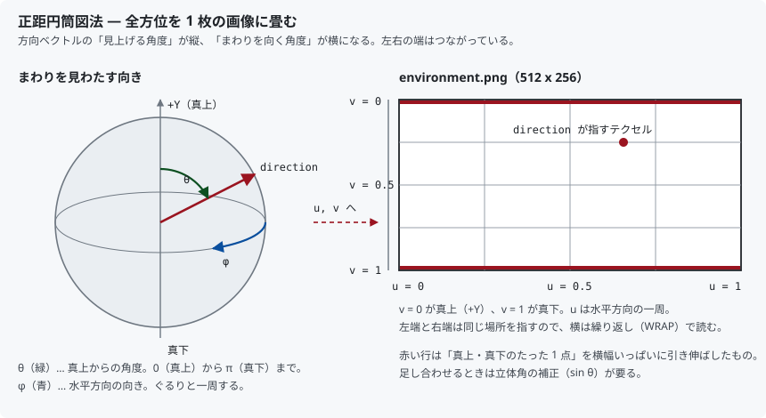
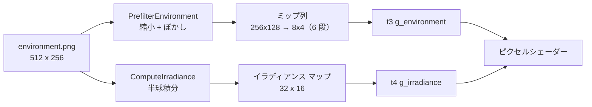
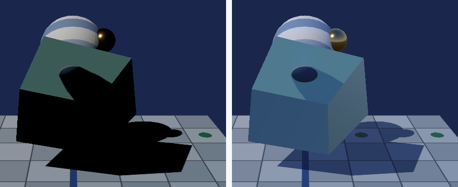

# 21. IBL — 環境マップで金属を映り込ませる

[20 章](20_PBR_金属度と粗さ.md)で PBR を入れたところ、こう書いて終わりました。

> **金属が暗いのは正しい。** 映り込みが無いため、IBL が要る

この章でその続きをやります。**IBL（Image Based Lighting）**は、
周囲の景色を写した 1 枚の画像を光源として扱う手法です。

---

## 1. なぜ金属は真っ黒だったのか

20 章の式を思い出します。金属は

- 拡散反射（アルベド）が **無い**
- 鏡面反射だけがある

つまり金属の見た目は「**まわりの景色が映ったもの**」が全てです。
ところが 20 章までの光源は**平行光 1 本だけ**でした。
まわりの景色が無いので、映るものが太陽しかない。だから
「鋭いハイライト以外は真っ黒」になっていたわけです。

現実の金属が金属らしく見えるのは、空・地面・壁といった
**あらゆる方向から来る光**が映り込んでいるからです。
その「あらゆる方向の光」を 1 枚の画像で与えるのが IBL です。

---

## 2. 環境マップ — 全方位を 1 枚の画像に畳む

周囲 360° の景色を平面の画像に収める方法はいくつかありますが、
本プロジェクトでは**正距円筒図法（equirectangular）**を使います。
世界地図と同じ畳み方です。

- 横（u）… 方位角。ぐるりと一周して左右がつながる
- 縦（v）… 天頂からの角度。`v = 0` が真上（+Y）、`v = 1` が真下



方向ベクトルからテクスチャ座標を求めるのは 2 行で済みます。

```hlsl
float2 DirectionToEquirectUv(float3 direction)
{
    float u = atan2(direction.z, direction.x) / (2.0f * kPi) + 0.5f;
    float v = acos(clamp(direction.y, -1.0f, 1.0f)) / kPi;
    return float2(u, v);
}
```

キューブマップ（6 面の立方体）のほうが歪みは少なく、実務では
そちらが主流です。ここでは**普通の 2D テクスチャ 1 枚で完結し、
座標変換が上の 2 行で読み切れる**ことを優先しました。

> **極付近は横方向に引き伸ばされます。** 真上・真下の 1 行が
> 画像では横幅いっぱいに広がるためです。あとで「立体角の補正」が
> 必要になるのはこれが理由です。

---

## 3. 2 種類の下ごしらえが要る

環境マップをそのまま読むだけでは足りません。反射には性質の違う
2 つの成分があり、**それぞれ別の前処理**が必要です。

| 成分 | 何が要るか | 作るもの |
|------|-----------|---------|
| 拡散反射 | 半球全部から来る光の合計 | **イラディアンス マップ**（1 枚） |
| 鏡面反射 | 粗さに応じてぼけた景色 | **ミップ列**（粗さの段数だけ） |

どちらも「**毎フレーム計算すると重すぎる積分**」を、
起動時に 1 回だけ済ませて画像に焼いておく、という発想です。



この下ごしらえは [`EnvironmentPrefilter.h`](../../src/Assets/EnvironmentPrefilter.h) /
[`.cpp`](../../src/Assets/EnvironmentPrefilter.cpp) にあります。
DirectX を一切使わない、画像を作り替えるだけの層です。

---

## 4. イラディアンス マップ — 拡散反射のための積分

拡散反射は入射方向を区別しません。面の向き `n` に対して、
**半球全体から来る光を余弦で重み付けして足した合計**だけが効きます。

これは面の向きだけで決まるので、「向き → 合計値」の対応表を
作っておけます。それがイラディアンス マップです。

```cpp
// 環境画像の全ピクセルを「光がやってくる方向」とみなして足し込む。
for (uint32_t sy = 0; sy < small.height; ++sy)
{
    const float lightTheta = kPi * (sy + 0.5f) / small.height;

    // 正距円筒図法では、極に近い行ほど狭い立体角しか表していない。
    //   その補正が sin。忘れると上下が過剰に効く。
    const float solidAngle = std::sin(lightTheta);
    ...
            // 面に対して斜めから来る光ほど弱く効く（ランバートの余弦則）。
            const float cosine = dot(normal, direction);
            if (cosine <= 0.0f) { continue; }   // 裏側からは届かない

            const float weight = cosine * solidAngle;
```

**`sin` の補正を忘れると天頂と真下が過剰に効きます。** 2 章で触れた
「極付近は横に引き伸ばされている」の裏返しで、極付近のピクセルは
画像上では横幅いっぱいを占めているのに、実際にはごく狭い方向しか
表していないからです。

出力は 32×16 で十分です。半球全部を平均した値なので、
方向が少し変わっても結果はなだらかにしか変わりません。
入力側も 64×32 まで落としてから積分しています。
それでも `32×16 × 64×32 = 1,048,576` 回のループが回ります。

---

## 5. ミップ列 — 鏡面反射のための「粗さ別のぼけ」

鏡面反射は方向が効きます。粗い表面ほど、反射方向の**まわり**からも
光を拾うので、映り込みがぼやけます。

そこで「ぼかし具合の違う画像」を段階的に用意し、
シェーダー側で**粗さから段を選ぶ**ことにします。

```hlsl
float3 prefiltered = g_environment.SampleLevel(
    g_sampler,
    DirectionToEquirectUv(reflectDirection),
    roughness * (kEnvironmentMipCount - 1.0f)).rgb;
```

`Sample` ではなく `SampleLevel` を使うのがポイントです。
`Sample` は画面上での変化量から自動で段を選びますが、
ここで選びたいのは**粗さに対応した段**なので、明示的に指定します。

段の作り方は「前の段を縮めて、さらにぼかす」の繰り返しです。

```cpp
// 前の段を縮めてから、さらにぼかす。
//   縮小そのものにも平均化の効果があるので、少ない半径で足りる。
ImageData reduced = Resize(mips.back(), width, height);
mips.push_back(Blur(reduced, 2));
```

> **これは物理的に正確ではありません。** 本来は GGX の分布に沿って
> 重要度サンプリングしながら畳み込みます。ここでは「粗いほどぼける」
> という見え方だけを、単純なぼかしで近似しています。

### 縮小・ぼかしは必ずリニアで

平均や畳み込みは、**リニアの明るさ**でやらないと意味を持ちません
（[19 章](19_色を正しく扱う_sRGB.md)）。
`EnvironmentPrefilter.cpp` の読み書きが `SrgbToLinear` /
`LinearToSrgb` を通しているのはこのためです。sRGB のまま平均すると
結果が暗く沈みます。

---

## 6. GPU 側 — 1 枚のテクスチャに複数の段を送る

ミップ列は「1 つのテクスチャリソースの中に、段ごとの
**サブリソース**が並んだもの」です。転送は段の数だけ必要になります。

配置は自分で計算せず、`GetCopyableFootprints` に教えてもらいます。

```cpp
device->GetCopyableFootprints(&textureDesc, 0, mipCount, 0,
                              footprints.data(), numRows.data(),
                              rowSizes.data(), &totalBytes);
```

返ってきた `totalBytes` ぶんの中継バッファを 1 本だけ作り、
全段をそこに詰めてから `CopyTextureRegion` を段の数だけ呼びます。

バリアは 1 回で済みます。`Subresource` に
`D3D12_RESOURCE_BARRIER_ALL_SUBRESOURCES` を渡せば全段まとめて
遷移するためです。

```cpp
barrier.Transition.Subresource = D3D12_RESOURCE_BARRIER_ALL_SUBRESOURCES;
```

SRV では `MipLevels` に段数を入れます。ここを 1 のままにすると、
`SampleLevel` で後ろの段を指定しても 0 段目しか返りません。

---

## 7. シェーダー — 2 つの成分を足す

```hlsl
// 拡散: 面の向きで引いた合計値に、アルベドを掛けるだけ。
float3 irradiance = g_irradiance.Sample(
    g_sampler, DirectionToEquirectUv(normal)).rgb;
float3 diffuseAmbient = irradiance * albedo;

// 鏡面: 反射方向の景色を、粗さに応じた段から読む。
float3 reflectDirection = reflect(-toEye, normal);
float3 prefiltered = g_environment.SampleLevel(...).rgb;

float2 environmentBrdf = EnvironmentBrdfApprox(roughness, normalDotView);
float3 specularAmbient = prefiltered * (f0 * environmentBrdf.x
                                           + environmentBrdf.y);

float3 ambient = (diffuseAmbient + specularAmbient) * g_lightColor.a;
```

`EnvironmentBrdfApprox` は**分割和近似（split-sum approximation）**の
第 2 項です。「粗さと視線角度で、フレネルがどれだけ効くか」を
まとめた値で、本来は 2D の表（BRDF LUT）を事前計算して引きます。
ここでは Karis の多項式近似で置き換え、テクスチャを 1 枚減らしました。

`f0 * x + y` の形になっているのは、この項が
`f0` に比例する成分と、`f0` に依らない成分（かすめ角の反射）の
2 つに分解できるからです。

### 定数アンビエントは消える

20 章まで `kAmbientIntensity = 0.25f` を掛けた一様な環境光がありました。
IBL がそれを置き換えます。定数は残っていますが、意味が
「**IBL 全体の強さ**」に変わり、値は `1.0f` になっています。

---

## 8. 測って確かめる

対照実験です。回転を 2.0 rad で止め、`kAmbientIntensity` を
`1.0f`（IBL あり）と `0.0f`（IBL なし）で切り替えて撮り比べました。
**直接光は両方で同一**なので、差分がそのまま環境光の寄与になります。



### 金属球（metallic = 1.0, 901 px）

| | 平均 RGB | ほぼ黒（最大成分 < 32）|
|---|---------|---------------------|
| IBL なし | (22.6, 18.8, 11.7) | **736 / 901 px（82 %）**|
| IBL あり | (88.4, 86.6, 72.4) | **0 / 901 px（0 %）**|

明るさは **17.7 → 82.5（4.66 倍）**。20 章で「真っ黒」と書いた
状態が数値でも裏付けられ、それが解消したことも確認できました。
色も `R ≈ G > B` になっており、金の `f0` が反射色を決めています。

### 影の中の床

| | 平均 RGB |
|---|---------|
| IBL なし | (0.0, 0.0, 0.0) |
| IBL あり | (44.0, 61.4, 101.5) |

影の中は直接光がゼロなので、**環境光だけが見えている**場所です。
IBL なしでは完全な黒に潰れていました。IBL ありでは
`B − R = +57.5` と青く沈んでおり、**空の色で照らされている**ことが
分かります。20 章までの定数アンビエントはライト色（暖色）でしたから、
色そのものが変わっています。

### 向きによって色が変わっているか

イラディアンス マップが「向きごとの表」として機能しているなら、
空を向いた面と地面を向いた面で**色が違う**はずです。
球の上下で、環境光の寄与だけをリニア空間で取り出しました。

| 面の向き | 環境光の寄与（リニア）| B / R |
|---------|--------------------|------|
| 上（空を向く）| R=0.031 G=0.059 B=0.163 | **5.17** |
| 下（地面を向く）| R=0.048 G=0.073 B=0.142 | **2.97** |

空を向いた面は青が赤の 5.17 倍、地面を向いた面では 2.97 倍。
地面（茶色）を向いた面のほうが赤が強く、**方向依存が出ています**。
定数アンビエントならこの比は一致するはずなので、
イラディアンス マップが効いていると言えます。

画面全体では **412,409 / 921,600 px（44.7 %）**が変化しました。

> **明るさの合計はほぼ同じ（0.084 と 0.088）でした。** 空のほうが
> 明るいのだから上が勝つはずですが、上側はすでに直接光で明るく、
> トーンマッピングの圧縮が効いているためです。この測り方では
> 「色の偏り」は言えても「明るさの大小」は言えません。

---

## 9. 単純化したところ

学習のために落としている点を並べます。

| 項目 | 本実装 | 本来 |
|------|-------|------|
| 環境マップの形式 | 正距円筒図法の 2D | キューブマップ |
| ミップの作り方 | 縮小 + 素朴なぼかし | GGX 重要度サンプリング |
| 前処理の場所 | CPU、起動時 | コンピュートシェーダー |
| BRDF の第 2 項 | 多項式近似 | 2D の事前計算テクスチャ |
| 明るさの範囲 | 8 bit の PNG（0〜1）| HDR（.hdr / .exr）|
| 遮蔽 | 考慮しない | SSAO・遮蔽マップ |

最後の 2 つは見た目に効きます。**HDR でないと太陽が
「白 = 1.0」で頭打ち**になり、映り込みの眩しさが出ません。
また物体のくぼみにも空の光がそのまま入るので、
**環境光が全体に浮いた印象**になります。

---

## 10. この章のまとめ

- 金属が真っ黒だったのは**映り込む景色が無かった**から
- IBL は**周囲の景色 1 枚を光源として扱う**手法
- 正距円筒図法なら、方向 → UV は `atan2` と `acos` の 2 行
- **前処理は 2 種類**要る
  - 拡散 … イラディアンス マップ（半球積分を焼いた表）
  - 鏡面 … 粗さ別にぼかしたミップ列
- 極付近は**立体角の補正（`sin`）**を忘れない
- 縮小・ぼかし・積分は**必ずリニア空間**で
- ミップ列の転送は `GetCopyableFootprints` に配置を聞く。
  SRV の `MipLevels` を段数にしないと 0 段目しか読めない
- 粗さから段を選ぶので `Sample` ではなく **`SampleLevel`**
- 測定: 金属球のほぼ黒が **82 % → 0 %**、影の中が **(0,0,0) → (44,61,102)**

---

## 11. ここから先へ

| やりたいこと | 必要になるもの |
|------------|--------------|
| 眩しさを出す | HDR 環境マップ（.hdr）と浮動小数点テクスチャ |
| 映り込みを正確に | GGX 重要度サンプリング、BRDF LUT |
| 環境光を落ち着かせる | 遮蔽（SSAO、アンビエントオクルージョンマップ）|
| 前処理を速く | コンピュートシェーダーでの畳み込み |
| 背景にも空を出す | スカイボックス（立方体 or フルスクリーン三角形）|

---

## この章で参照した資料

- [Image Based Lighting | Khronos glTF Sample Viewer](https://github.com/KhronosGroup/glTF-Sample-Viewer)
- Brian Karis, "Real Shading in Unreal Engine 4", SIGGRAPH 2013 Course
  — 分割和近似と `EnvironmentBrdfApprox` の多項式の出典
- [ID3D12Device::GetCopyableFootprints | Microsoft Learn](https://learn.microsoft.com/en-us/windows/win32/api/d3d12/nf-d3d12-id3d12device-getcopyablefootprints)
- [D3D12_RESOURCE_BARRIER | Microsoft Learn](https://learn.microsoft.com/en-us/windows/win32/api/d3d12/ns-d3d12-d3d12_resource_barrier)
- [D3D12_TEX2D_SRV | Microsoft Learn](https://learn.microsoft.com/en-us/windows/win32/api/d3d12/ns-d3d12-d3d12_tex2d_srv)
- [SampleLevel (DirectX HLSL Texture Object) | Microsoft Learn](https://learn.microsoft.com/en-us/windows/win32/direct3dhlsl/texture2d-samplelevel)
- Real-Time Rendering (4th Edition) — 第 10 章「画像ベースの効果」、
  および第 9 章「物理ベースシェーディング」の環境照明の節

スクリーンショットは本プログラムの実行結果です（[../assets/](../assets/)）。
