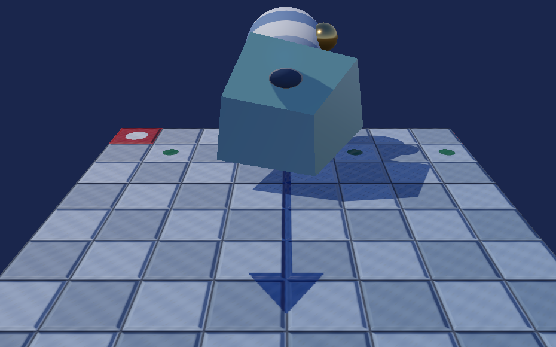
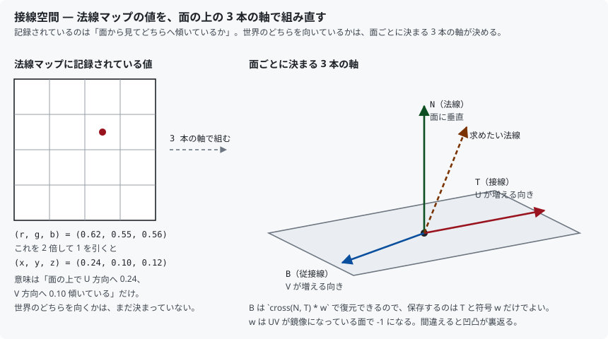
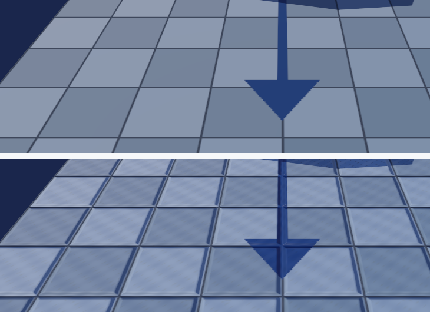

# 22. 法線マップ — 形を増やさずに凹凸を出す

床は三角形 2 枚の、完全に平らな板です。
それでも、この章のあとはタイルの目地がへこんで見えます。



頂点は 1 つも増やしていません。**光の当たり方だけを嘘にしている**からです。

---

## 1. 陰影は法線しか見ていない

[11 章](11_陰影を付ける_法線とライティング.md)から一貫して、
明るさは「面がどちらを向いているか」＝ **法線**だけで決まっています。

```hlsl
float normalDotLight = saturate(dot(normal, toLight));
```

ということは、**法線を差し替えれば形が変わったように見える**わけです。
実際の面は平らなままなので、頂点も三角形も増えません。

その差し替える法線を、ピクセルごとにテクスチャから読むのが**法線マップ**です。

> **輪郭は変わりません。** 面の形そのものは平らなので、
> 横から見れば板だと分かります。これは仕組み上どうにもならない限界です。

---

## 2. 何を記録するのか — 接線空間

法線マップに「ワールド空間の法線」を焼くわけにはいきません。
モデルが回転したら全部やり直しになりますし、
同じ模様を別の面に使い回すこともできなくなります。

そこで記録するのは「**その面から見て、どちらへどれだけ傾いているか**」です。
基準になる 3 本の軸を **接線空間 (tangent space)** と呼びます。



| 軸 | 意味 |
|----|------|
| **N**（法線）| 面に垂直な向き。すでに頂点が持っている |
| **T**（接線）| 面の上で **U が増える向き** |
| **B**（従接線）| 面の上で **V が増える向き** |

傾いていない場所は `(0, 0, 1)`、つまり「N の方向そのまま」になります。
これを 0〜1 に詰め直すと `(0.5, 0.5, 1.0)` — 8 bit なら
**(128, 128, 255)** です。法線マップが一様に青紫に見えるのはこのためです。

### 保存するのは T と符号だけ

B は `cross(N, T)` で計算できるので、わざわざ保存しません。
ただし **UV が鏡像になっている面**では向きが裏返るため、
`+1` か `-1` の符号だけを一緒に持ちます。

```cpp
float tangent[4];   // xyz = 接線、w = 従接線の符号
```

`Vertex` はこれで 48 バイトから **64 バイト**になりました。

---

## 3. 接線をどこから得るか

| 出どころ | 状況 |
|---------|------|
| glTF の `TANGENT` 属性 | 書かれていれば、それが正しい。優先する |
| OBJ | **書く場所が無い**。必ず計算する |
| コードで作る形状 | 計算する |

そこで `ModelLoader` は、読み込んだ結果に接線が無ければ計算します。

```cpp
if (!HasTangents(mesh))
{
    GenerateTangents(mesh);
    Log(L"接線を計算しました（モデルが持っていなかったため）。");
}
```

`Vertex` は 0 初期化されるので、「接線の長さが全部 0」なら
持っていないと判断できます。

### 位置と UV から接線を求める

三角形の 2 辺を、**位置**と **UV** の両方で見ます。
「位置がこれだけ動いたとき UV がこれだけ動いた」という関係を
逆に解くと、「U が 1 増える向き」＝ 接線が出ます。

```cpp
const float determinant = du1 * dv2 - du2 * dv1;
if (std::fabs(determinant) < 1e-12f)
{
    continue;   // UV が潰れている面は解けない
}

const float inverse = 1.0f / determinant;

const float tangent[3] = { (dv2 * e1[0] - dv1 * e2[0]) * inverse, ... };
```

面ごとに求めた結果を、頂点を共有する面ぶんだけ足し合わせてならします。
最後に法線と直交させ（グラム・シュミット）、長さを 1 にします。

```cpp
const float projection = t[0] * n[0] + t[1] * n[1] + t[2] * n[2];
for (int c = 0; c < 3; ++c)
{
    t[c] -= n[c] * projection;
}
```

符号 `w` は、ならした従接線が `cross(N, T)` と同じ向きかどうかで決めます。

> **UV が無い、または潰れている頂点**では接線が求まりません。
> その場合は法線と直交する適当な向きを入れます。
> 法線マップが平らならどの向きでも同じ結果になるので、実害はありません。

---

## 4. GPU へ渡す — 入力レイアウトを 1 バイトもずらさない

頂点の並びが変わったので、3 か所を揃え直します。

```cpp
{
    "TANGENT",
    0,
    DXGI_FORMAT_R32G32B32A32_FLOAT,              // float4（w は従接線の向き）
    0,
    48,                                          // + uv(8) の後ろ
    D3D12_INPUT_CLASSIFICATION_PER_VERTEX_DATA,
    0
},
```

手で足したオフセットが構造体とずれていないことは、
コンパイル時に機械的に確かめます。

```cpp
static_assert(sizeof(Vertex) == 64, "Vertex のサイズが入力レイアウトの前提と違います");
static_assert(offsetof(Vertex, tangent) == 48, "TANGENT のオフセットが違います");
```

**ここがずれても実行はできてしまい、ただ絵が壊れます。**
`static_assert` を置いておくと、間違いがビルドで止まります。

---

## 5. シェーダー — 3 本の軸で組み直す

```hlsl
float3 ApplyNormalMap(float2 uv, float3 worldNormal, float4 worldTangent)
{
    // 0〜1 で記録されている値を -1〜1 へ戻す。
    float3 tangentNormal = g_normalMap.Sample(g_sampler, uv).rgb * 2.0f - 1.0f;

    tangentNormal.xy *= g_materialParams.z;   // 効き具合

    // 補間で接線が法線から傾くので、垂直な成分だけを残す。
    float3 tangent = normalize(worldTangent.xyz
                             - worldNormal * dot(worldNormal, worldTangent.xyz));

    float3 bitangent = cross(worldNormal, tangent) * worldTangent.w;

    float3 result = tangentNormal.x * tangent
                  + tangentNormal.y * bitangent
                  + tangentNormal.z * worldNormal;

    return normalize(result);
}
```

最後の 3 行が「接線空間 → ワールド空間」の変換です。
行列を作って掛けるのと同じことを、そのまま書いています。

### sRGB にしてはいけない

法線マップは**色ではなく座標**です。
[19 章](19_色を正しく扱う_sRGB.md)の変換を通すと値が歪みます。

```cpp
texture->Initialize(..., /* isColorTexture */ false);
```

`0.5`（＝傾き 0）が `0.21` になってしまい、**全面が同じ向きに傾きます**。

### 持たない材質には平らな 1 ピクセル

```cpp
image.pixels = { 128, 128, 255, 255 };
```

`(0, 0, 1)` を詰めた値なので、掛けても面の法線がそのまま返ります。
おかげでシェーダーに「法線マップの有無」の分岐が要りません。
基本色の白 1 ピクセル、金属度の白 1 ピクセルと同じ考え方です。

---

## 6. 影は変わらない

法線マップは**光の当たり方**を変えるだけで、**位置**は変えません。
シャドウマップは位置から深度を書くので、影の形はそのままです。

```hlsl
float shadow = SampleShadow(input.worldPosition);   // 元の位置を使う
```

凹凸が影を落とし合わないのはこのためです。
本格的にやるなら**視差遮蔽マッピング**や**セルフシャドウ**が要ります。

---

## 7. 測って確かめる

対照実験です。回転を 2.0 rad で止め、床の材質の `normalScale` を
`1.0`（あり）と `0.0`（なし）で切り替えて撮り比べました。
`normalScale` は接線方向の傾きに掛かるので、0 にすると
**法線マップを読んだうえで「傾き 0」**になります。



### タイル 1 枚の内側を横切る走査線（y = 640, x = 455〜512, 58 px）

この範囲は**塗り模様が一様**なので、明暗の差は法線マップ由来だけです。

| | 平均 | 標準偏差 | 最小 | 最大 | 幅 |
|---|-----|---------|------|------|-----|
| 法線マップ なし | 148.61 | **0.00** | 148.61 | 148.61 | 0.0 |
| 法線マップ あり | 144.67 | **20.21** | 79.86 | 157.48 | **77.6** |

法線マップが無いと、58 px すべてが**完全に同じ値**になります。
平らな面の法線は場所によらず一定だからです。
入れると、同じ範囲が **79.86 〜 157.48** に分かれました。

内訳を見ると、タイルの中央から目地へ向かって少しずつ明るくなり
（+1.0 → +8.9）、目地の壁で一気に落ちます（**−67.9**）。
面が傾いた向きに応じて明暗が付いている、という予想どおりの形です。

### 法線マップを持たない材質は 1 ピクセルも変わらない

| 範囲 | 差のあったピクセル |
|------|-----------------|
| 立方体の面（14,000 px）| **0 px** |

`(128, 128, 255)` の代用テクスチャが、狙いどおり**完全に中立**である
ことが確認できました。画面全体では 321,485 / 921,600 px（34.9 %）が
変化し、最大の差は 84 でした。

### 平均は少し暗くなる

走査線の平均は 148.61 → 144.67 と、わずかに下がりました。
面が傾くと、光に正対する部分より背ける部分のほうが増えるためです。
**凹凸を入れると全体はやや暗くなる**というのは、
法線マップを入れたときによく見られる変化です。

---

## 8. 単純化したところ

| 項目 | 本実装 | 本来 |
|------|-------|------|
| 接線の生成 | 頂点ごとに足してならすだけ | MikkTSpace（業界標準の分割規則）|
| 保存形式 | RGBA8 の 3 成分 | BC5（2 成分に圧縮し z は復元）|
| 凹凸の遮蔽 | 無し | 視差遮蔽マッピング、セルフシャドウ |
| 遮蔽マップ | 無し | glTF の `occlusionTexture` |
| ミップマップ | 無し（拡大縮小で荒れる）| ミップ生成＋粗さへの合成 |

**MikkTSpace** を使わないと、他のツールで焼いた法線マップと
接線の分け方が食い違うことがあります。
自分で生成した素材だけを使う本プロジェクトでは表面化しません。

**BC5 圧縮**は実務ではほぼ必須です。RGBA8 のままだと
法線マップ 1 枚で 1 MB（512×512）を占めます。

---

## 9. この章のまとめ

- 陰影は**法線しか見ていない**ので、法線を差し替えれば凹凸に見える
- 記録するのは**接線空間**での傾き。ワールドの向きではない
- 平らな場所は `(0, 0, 1)` ＝ **(128, 128, 255)**。青紫に見えるのはこのため
- 軸は **N（法線）・T（U 方向）・B（V 方向）**。B は `cross(N, T) * w` で復元
- **w を間違えると凹凸が裏返る**。右手系から左手系へ移すときは符号も反転する
- 接線は glTF の `TANGENT` を優先し、無ければ位置と UV から計算する
- **法線マップを sRGB として読んではいけない**。色ではなく座標
- 持たない材質には平らな 1 ピクセルを割り当てて、分岐を無くす
- 位置は変えないので**影の形は変わらない**
- 測定: 一様な範囲の標準偏差が **0.00 → 20.21**、
  法線マップを持たない材質は **0 px** の差

---

## 10. ここから先へ

| やりたいこと | 必要になるもの |
|------------|--------------|
| 凹凸が互いを隠すようにする | 視差遮蔽マッピング (POM) |
| くぼみを暗くする | 遮蔽マップ（glTF の `occlusionTexture`）、SSAO |
| 容量を減らす | BC5 圧縮（z は `sqrt(1 - x² - y²)` で復元）|
| 遠景のちらつきを消す | ミップマップと、粗さへの合成（LEAN / Toksvig）|
| 輪郭も変える | ディスプレイスメントマッピング、テッセレーション |

---

## この章で参照した資料

- [glTF 2.0 — Normal Texture Info | Khronos Group](https://registry.khronos.org/glTF/specs/2.0/glTF-2.0.html#reference-normaltextureinfo)
  — `normalTexture` が `pbrMetallicRoughness` の外側にあること、`scale` の意味
- [glTF 2.0 — Meshes（TANGENT 属性）| Khronos Group](https://registry.khronos.org/glTF/specs/2.0/glTF-2.0.html#meshes-overview)
- [D3D12_INPUT_ELEMENT_DESC | Microsoft Learn](https://learn.microsoft.com/en-us/windows/win32/api/d3d12/ns-d3d12-d3d12_input_element_desc)
- [Semantics (DirectX HLSL) | Microsoft Learn](https://learn.microsoft.com/en-us/windows/win32/direct3dhlsl/dx-graphics-hlsl-semantics)
- Eric Lengyel, "Computing Tangent Space Basis Vectors for an Arbitrary Mesh"
  — 本章の接線の求め方の出典
- [MikkTSpace](http://www.mikktspace.com/) — 接線の生成規則の事実上の標準
- Real-Time Rendering (4th Edition) — 第 6 章「テクスチャリング」の
  バンプマッピングの節

スクリーンショットは本プログラムの実行結果です（[../assets/](../assets/)）。
