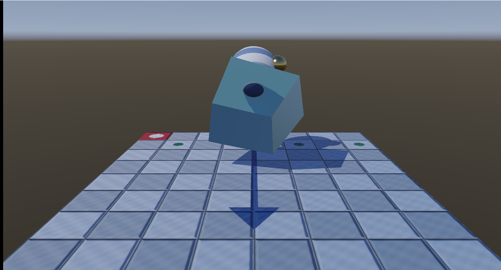
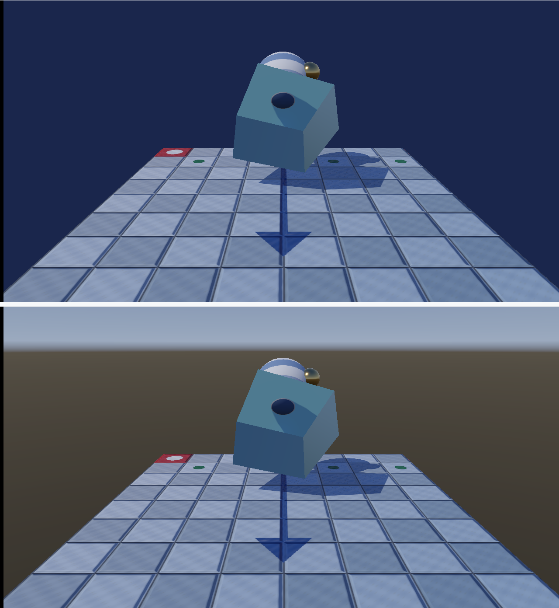

# 23. スカイボックス — 背景に環境マップを出す

[21 章](21_IBL_環境マップ.md)で金属に空が映り込むようになりました。
でも、その空は**画面のどこにも映っていません**でした。

映り込んでいるものが見えないのは落ち着かないので、背景に出します。



---

## 1. 頂点バッファを使わずに画面を覆う

背景を描くのに立方体も球も要りません。
**画面いっぱいの三角形 1 枚**で足ります。

しかもその三角形は、頂点バッファに置く必要すらありません。
頂点シェーダーは自分が何番目の頂点かを `SV_VertexID` で知れるので、
そこから座標を作れます。

```hlsl
VSOutput VSMain(uint vertexId : SV_VertexID)
{
    float2 corner = float2((vertexId == 2) ? 3.0f : -1.0f,
                           (vertexId == 1) ? 3.0f : -1.0f);
    ...
}
```

3 頂点が `(-1,-1)`, `(-1,3)`, `(3,-1)` に置かれます。
画面（`-1〜1`）より大きくはみ出しますが、余りはラスタライザが切り落とします。

> **四角形（三角形 2 枚）にしないのはなぜか。**
> 四角形だと対角線上のピクセルが 2 度処理されます。
> 三角形 1 枚なら重なりが出ません。

C++ 側は、頂点バッファを結び付けずに 3 頂点を描くだけです。

```cpp
commandList->IASetVertexBuffers(0, 0, nullptr);
commandList->IASetIndexBuffer(nullptr);
commandList->DrawInstanced(kFullScreenTriangleVertexCount, 1, 0, 0);
```

PSO の入力レイアウトも空にします。

```cpp
psoDesc.InputLayout.pInputElementDescs = nullptr;
psoDesc.InputLayout.NumElements        = 0;
```

---

## 2. 深度の扱い — ここが一番間違えやすい

背景は**いちばん奥**です。そこで頂点シェーダーは `z = w = 1` を出します。
透視除算のあと深度が `1.0` になり、深度バッファのクリア値と同じになります。

```hlsl
output.position = float4(corner, 1.0f, 1.0f);
```

すると、深度テストの設定でこうなります。

| `DepthFunc` | 結果 |
|-------------|------|
| `LESS` | 「1.0 < 1.0」は偽 → **1 ピクセルも描かれない** |
| `LESS_EQUAL` | 「1.0 ≦ 1.0」は真 → 何も描かれていない所だけ通る |

```cpp
depthStencilDesc.DepthFunc      = D3D12_COMPARISON_FUNC_LESS_EQUAL;
depthStencilDesc.DepthWriteMask = D3D12_DEPTH_WRITE_MASK_ZERO;
```

深度は**書きません**。背景より奥に来るものは無いので、書く意味がありません。

さらに、深度クリップも切ります。

```cpp
rasterizerDesc.DepthClipEnable = FALSE;
```

`z = 1.0` ちょうどの面は、計算の丸め次第で「視錐台の外」と判定され得ます。
切っておけば消えません。

### 物体より「あと」に描く

背景は最後に描きます。先に物体を描いておけば、
**隠れる部分は深度テストで落ち**、ピクセルシェーダーが動きません。

先に背景を描くと、そのあと物体で塗り潰される部分まで
環境マップを読むことになります（オーバードロー）。

---

## 3. 画面の位置から視線の向きを求める

ピクセルごとに「この向きの空は何色か」を知りたいので、
画面上の位置を**ワールド空間の向き**へ直します。

カメラの 3 軸と画角があれば、足し算だけで書けます。

```hlsl
float3 direction = normalize(
      g_cameraForward.xyz
    + g_cameraRight.xyz * (input.screenPosition.x * tanHalfFov * aspect)
    + g_cameraUp.xyz    * (input.screenPosition.y * tanHalfFov));
```

画面の端は、前方から「画角の半分」だけ傾いた向きになります。
横は縦横比のぶんだけ広がります。

C++ 側は 3 軸を作って渡すだけです。

```cpp
const XMVECTOR forward = XMVector3Normalize(XMVectorSubtract(target, eye));

// 左手座標系では cross(上, 前) が右になる。順序を逆にすると左右が反転する。
const XMVECTOR right = XMVector3Normalize(XMVector3Cross(worldUp, forward));
const XMVECTOR up    = XMVector3Cross(forward, right);
```

### 視点の位置は渡さない

背景は「無限に遠い」ものとして描きます。
だから使うのは**向きだけ**で、視点の位置は使いません。

位置を混ぜると、カメラを平行移動したときに背景が流れてしまいます。

> **ビュー射影行列の逆行列を使う書き方もあります。**
> そちらのほうが一般的ですが、行ベクトル規約・列優先パッキング・
> 透視除算が絡み、どこで間違えたのか分かりにくくなります。
> 本プロジェクトでは、式を読めば意味が分かるほうを選びました。

---

## 4. 明るさの扱いを物体と揃える

背景も、物体の環境光と**同じ倍率・同じトーンマッピング**を通します。

```hlsl
return float4(ToneMap(color * g_skyboxParams.z), 1.0f);
```

片方だけ変えると、金属に映り込んだ空と背景の空で明るさが食い違い、
物体だけが浮いて見えます。

`kWhitePoint` も `Mesh.hlsl` と同じ値にしてあります。

---

## 5. シェーダーのコンパイルを共通化した

`MeshPipeline` が持っていた `CompileShader` を
[`ShaderCompiler.h`](../../src/Graphics/ShaderCompiler.h) へ切り出しました。
背景のパイプラインでも同じ手順が要るためです。

```cpp
shader::Bytecode vertexShader =
    shader::Compile(shaderPath, L"VSMain", shader::kVertexShaderTarget);
```

`UploadHelper` を切り出したときと同じ考え方です
（[設計](../design/クラス設計.md)）。

---

## 6. 途中で見つけた別の不具合

背景を出したら、**画面いっぱいが地面**になりました。
最初は変換の間違いを疑いましたが、原因は違いました。

初期の仰角が**2 か所に書かれていた**のです。

```cpp
// CameraController.h
float m_pitch = 0.42f;      // ← 起動直後はこちらが効く

// CameraController.cpp
constexpr float kInitialPitch = 0.30f;   // ← Reset() のときだけ効く
```

`.cpp` の定数を直しても、起動直後の見え方は変わりません。
仰角 0.42 rad（24.1 度）に対して垂直画角の半分は 22.5 度なので、
**画面の上端が地平線より 1.6 度下**にあり、空が 1 ピクセルも入らなかった、
というのが真相でした。

コンストラクタから `Reset()` を呼ぶ形に変え、初期値を 1 か所にまとめました。

```cpp
CameraController::CameraController()
{
    Reset();
}
```

> **「変換が壊れている」と決めつける前に、入力の値を疑う。**
> シェーダーに `direction.y > 0 ? 緑 : 赤` を出させて画面全体が赤になったとき、
> 変換ではなく**カメラの向きそのもの**が想定と違っていました。

---

## 7. 測って確かめる

回転を 2.0 rad で止めて撮り比べました。



### (1) 背景の色を式から予測して比べる

画面の位置 → 視線の向き → 正距円筒図法の UV → 事前フィルタ済み画像を
線形補間 → 環境光の倍率 → トーンマッピング → sRGB 記録、までを
CPU で追いかけ、実測と比べました。

| 画面の位置 | 予測 RGB | 実測 RGB | 誤差 |
|-----------|---------|---------|------|
| (200, 20) | (144, 160, 185) | (144, 160, 185) | **0** |
| (640, 12) | (141, 158, 184) | (141, 158, 184) | **0** |
| (1100, 40) | (147, 163, 187) | (147, 163, 186) | 1 |
| (120, 70) | (154, 168, 190) | (153, 168, 190) | 1 |
| (900, 95) | (118, 124, 136) | (121, 128, 140) | **4** |
| (200, 200) | (77, 72, 62) | (77, 71, 62) | 1 |
| (1150, 300) | (71, 65, 56) | (71, 65, 56) | **0** |
| (60, 420) | (65, 60, 52) | (65, 60, 52) | **0** |

**最大誤差 4 / 255。** その 1 点は地平線のすぐ上で、
空と地面の境が 1 テクセルで切り替わる場所です。
線形補間の重みがわずかにずれるだけで数段変わるため、ここだけ差が出ます。
なだらかな場所ではすべて 0〜1 に収まりました。

### (2) `DepthFunc` を `LESS` にすると 1 ピクセルも描けない

| 設定 | 「背景を描かない」場合との差 |
|------|--------------------------|
| `LESS_EQUAL` | 505,286 / 883,200 px（**57.2 %**）|
| `LESS` | **0 / 883,200 px** |

`LESS` では背景が 1 ピクセルも出ませんでした。
深度 1.0 とクリア値 1.0 の比較が偽になるためです。
**エラーも警告も出ません。**ただ背景が消えます。

---

## 8. 単純化したところ

| 項目 | 本実装 | 本来 |
|------|-------|------|
| 形式 | 正距円筒図法の 2D テクスチャ | キューブマップ |
| 明るさ | 8 bit（1.0 で頭打ち）| HDR。太陽が眩しく光る |
| 描く順 | 不透明のあと | 同じ。ただし半透明はさらにあと |
| 空の中身 | コードで作った単純な空 | 撮影した HDRI、または大気散乱の計算 |
| 動き | 静止 | 時刻による変化、雲の流れ |

---

## 9. この章のまとめ

- 背景は **画面いっぱいの三角形 1 枚**でよい。頂点バッファは要らない
- `SV_VertexID` から座標を作れる。入力レイアウトは空でよい
- **`z = w = 1`** で最も奥に置き、**`DepthFunc` は `LESS_EQUAL`**。
  `LESS` だと 1 ピクセルも描かれない
- 深度は**書かない**。`DepthClipEnable` は切る
- **物体のあとに描く**と、隠れる部分の計算が省ける
- 視線は「前方 ＋ 右 × x ＋ 上 × y」で組み立てられる。逆行列は要らない
- **視点の位置は使わない**。背景は無限に遠いものとして扱う
- 明るさの倍率とトーンマッピングは**物体と同じ式**にする
- 測定: 予測との最大誤差 **4 / 255**、`LESS` にすると **0 px**

---

## 10. ここから先へ

| やりたいこと | 必要になるもの |
|------------|--------------|
| 太陽を眩しくする | HDR 環境マップと浮動小数点のレンダーターゲット |
| 空を計算で作る | 大気散乱（Preetham、Hosek-Wilkie など）|
| 雲を出す | ボリュメトリッククラウド（レイマーチング）|
| 歪みを減らす | キューブマップ |
| 遠景をぼかす | 深度に応じたフォグ、ブルーム |

---

## この章で参照した資料

- [SV_VertexID | Microsoft Learn](https://learn.microsoft.com/en-us/windows/win32/direct3dhlsl/sv-vertexid)
- [D3D12_DEPTH_STENCIL_DESC | Microsoft Learn](https://learn.microsoft.com/en-us/windows/win32/api/d3d12/ns-d3d12-d3d12_depth_stencil_desc)
- [D3D12_COMPARISON_FUNC | Microsoft Learn](https://learn.microsoft.com/en-us/windows/win32/api/d3d12/ne-d3d12-d3d12_comparison_func)
- [D3D12_RASTERIZER_DESC（DepthClipEnable）| Microsoft Learn](https://learn.microsoft.com/en-us/windows/win32/api/d3d12/ns-d3d12-d3d12_rasterizer_desc)
- [ID3D12GraphicsCommandList::DrawInstanced | Microsoft Learn](https://learn.microsoft.com/en-us/windows/win32/api/d3d12/nf-d3d12-id3d12graphicscommandlist-drawinstanced)
- Real-Time Rendering (4th Edition) — 第 13 章「スカイボックスと環境マッピング」

スクリーンショットは本プログラムの実行結果です（[../assets/](../assets/)）。
