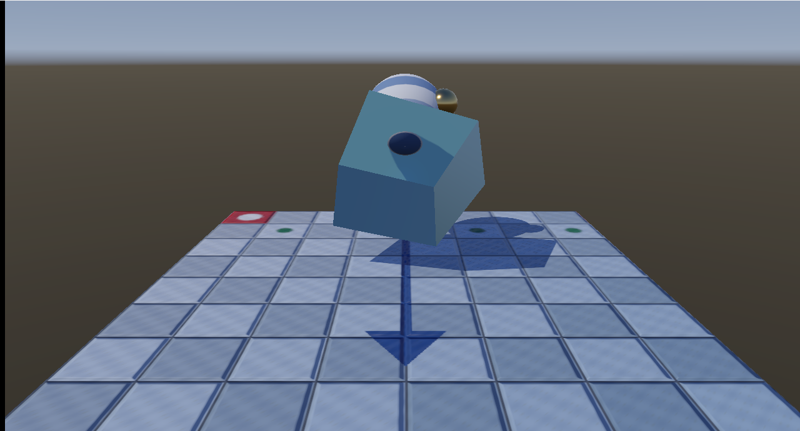
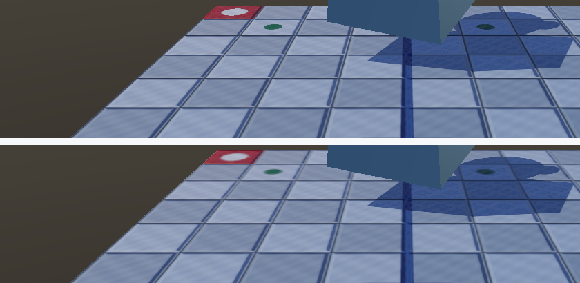

# 24. ミップマップ — 縮小したときのざらつきを消す

[22 章](22_法線マップ.md)の最後に、こう書いて残していました。

> 遠くの床がちらちらする … 法線マップにミップマップがありません

その宿題を片付けます。



---

## 1. なぜ縮小するとざらつくのか

512×512 のテクスチャを、画面上の 4×4 ピクセルに描くとします。
1 ピクセルが担当するテクセルは 128×128 = 約 16,000 個です。

ところがサンプラーは、既定では**その中の 1 点（周囲 4 テクセルの補間）**しか
読みません。残りの 16,000 個近くは無視されます。

つまり「たまたま拾った 1 点」で色が決まります。カメラが少し動くと
拾う点が変わり、色が飛びます。これが**ちらつき**の正体です。

もとの模様より細かい変化を、粗い格子で表そうとして失敗している
——**エイリアシング**です。

---

## 2. 先に平均しておく

答えは単純です。**縮小した画像をあらかじめ作っておく**。

- 512×512 → 256×256 → 128×128 → … → 1×1

この列を**ミップマップ**（ミップ列）と呼びます。
GPU は「1 ピクセルがテクスチャ上でどれだけの広さを覆うか」を
自分で見積もり、ちょうど合う段を選んで読みます。

段の選び方は自動なので、`Sample` を呼ぶだけです。
[21 章](21_IBL_環境マップ.md)で `SampleLevel` を使ったのは、
粗さから段を**指定したかった**からで、こちらは逆に任せます。

容量は元の 1/3 増えるだけです（1 + 1/4 + 1/16 + … = 4/3）。

### 転送の仕組みは 21 章と同じ

`Texture2D` にはミップ列を受け取る口が既にあります。
配置は `GetCopyableFootprints` に聞き、段の数だけ
`CopyTextureRegion` を呼びます。

```
[INFO ] ミップ付きテクスチャを生成しました（512 x 512, 10 段）
```

---

## 3. 「平均の取り方」は中身によって変わる

ここがこの章のいちばん大事な点です。
**同じ「4 つの平均」でも、値の意味が違えば正しい手順が違います。**

```cpp
enum class MipFilter
{
    Color,    // 見た目の色。リニアに戻してから平均する
    Linear,   // 粗さや金属らしさ。そのまま平均する
    Normal,   // 接線空間の法線。-1〜1 に戻して平均し、長さを 1 に戻す
};
```

### 色 — リニアに戻してから平均する

sRGB の記録値は明るさそのものではありません
（[19 章](19_色を正しく扱う_sRGB.md)）。
そのまま足すと、**縮小するほど暗くなります**。

### 法線 — 平均したら長さを 1 に戻す

法線はベクトルです。向きの違う 2 本を平均すると、
**長さが 1 より短くなります**。そのまま使うと陰影が弱まります。

```cpp
const float length = std::sqrt(sum[0] * sum[0] + sum[1] * sum[1]
                             + sum[2] * sum[2]);
```

### 粗さ・金属らしさ — そのまま平均する

こちらは最初からリニアな数値なので、素直に足して割ります。

> **正しくは、法線を平均したら粗さも上げるべきです。**
> 向きがばらけた面は「ざらざらした面」と同じ見え方をするからです
> （LEAN マッピング、Toksvig 係数）。本プロジェクトでは省いています。

---

## 4. 異方性フィルタ — 斜めに見た床のために

ミップだけでは、床が**必要以上にぼけます**。

斜めから見た床は、奥行き方向にはきつく縮み、横方向にはあまり縮みません。
GPU は 1 つの段しか選べないので、**きつく縮む向きに合わせて**しまいます。
その結果、横方向の細かさまで一緒に失われます。

**異方性フィルタ**は、縮み方の違いに合わせて細長い範囲を
何点も読むことで、この無駄なぼけを避けます。

```cpp
staticSamplers[0].Filter        = D3D12_FILTER_ANISOTROPIC;
staticSamplers[0].MaxAnisotropy = 8;   // 1 で異方性フィルタ無しと同じ
```

指定するのは 2 行だけです。

---

## 5. 測って確かめる

回転を 2.0 rad で止めて撮り比べました。



### (1) 縮小されている所のざらつきが減る

「隣り合うピクセルの明るさの差」の平均を、ざらつきの目安として使います。

**いちばん奥の床（奥の縁から 25 px の帯、モデルの外）**

| 設定 | 隣との差の平均 |
|------|--------------|
| ミップなし | 1.629 |
| ミップあり | **1.125**（31 % 減）|
| ミップ ＋ 異方性 | 1.557 |

**手前の床（拡大されている範囲）**

| 設定 | 隣との差の平均 |
|------|--------------|
| ミップなし | 1.980 |
| ミップあり | 1.977 |
| ミップ ＋ 異方性 | 1.977 |

手前はほとんど変わりません。**ミップは縮小のときにしか使われない**ので、
これは予想どおりです。画面全体では 101,606 / 883,200 px（11.5 %）が
変化しました。

> **この指標では、異方性フィルタの良し悪しは判定できません。**
> 1.125 → 1.557 と増えていますが、増えたぶんが「戻ってきた細かさ」なのか
> 「ざらつき」なのかを、隣との差だけでは区別できないからです。
> 正しく測るには、高い解像度で描いた絵を正解として比べる必要があります。
> ここでは目視で確認するに留めました。

### (2) 平均をリニアで取ると、明るさが保たれる

`uv-grid.png` を段階的に縮小し、平均の明るさ（リニア）を比べました。

| 段 | 大きさ | リニアで平均 | sRGB のまま平均 | 差 |
|----|-------|------------|---------------|-----|
| 1 | 256×256 | 0.48668 | 0.48607 | +0.12 % |
| 2 | 128×128 | 0.48668 | 0.47915 | +1.55 % |
| 3 | 64×64 | 0.48668 | 0.47481 | +2.44 % |
| 4 | 32×32 | 0.48668 | 0.47112 | +3.20 % |
| 5 | 16×16 | **0.48668** | 0.46814 | **+3.81 %** |

**リニアで平均すると、どの段でも 0.48668 のまま**でした。
平均を取る操作が明るさを変えない、という当然の性質が出ています。

sRGB のまま平均すると、段を下るごとに暗くなり、5 段目で 3.81 % の差に
なりました。遠くの床だけがじわじわ暗くなる、という形で現れます。

### (3) 法線は平均すると長さが 1 でなくなる

`floor-normal.png` を 1 段縮小したときの、平均したベクトルの長さです。

| | 値 |
|---|---|
| 平均 | 0.9905 |
| 最小 | **0.7040** |
| 最大 | 1.0036 |

平らな場所では 1.0 のままですが、**目地の縁のように向きが急に変わる所で
0.70 まで落ちます**。正規化し直さないと、そこだけ陰影が弱まります。

---

## 6. 単純化したところ

| 項目 | 本実装 | 本来 |
|------|-------|------|
| 生成 | CPU、起動時 | コンピュートシェーダー、または事前生成 |
| 縮小の仕方 | 4 テクセルの単純平均（ボックス）| Kaiser、Lanczos などの窓関数 |
| 法線の縮小 | 正規化し直すだけ | 粗さへ合成（LEAN / Toksvig）|
| 保存 | 実行のたびに作る | `.dds` に焼いて配る |
| 奇数サイズ | 切り捨て | 重みを付けて扱う |

**単純平均は、輪郭がわずかに滲みます。** 2 の冪でない画像では
段ごとに半テクセルずれていくため、ずれが積み上がります。

---

## 7. この章のまとめ

- 縮小時のちらつきは**エイリアシング**。1 ピクセルが多数のテクセルを
  覆っているのに、1 点しか読んでいないために起きる
- **先に平均した画像を用意しておく**のがミップマップ。容量は 1/3 増
- 段の選択は GPU が自動で行う。`Sample` を呼ぶだけでよい
- **平均の取り方は中身によって違う**
  - 色 … リニアに戻してから平均（そのままだと暗くなる）
  - 法線 … -1〜1 に戻して平均し、**長さを 1 に戻す**
  - 粗さ・金属らしさ … そのまま平均
- 斜めに見た面は**必要以上にぼける**。異方性フィルタで避けられる
- 測定: 奥の床のざらつきが **1.629 → 1.125（31 % 減）**、
  手前は **1.980 → 1.977** でほぼ不変
- 測定: リニアで平均すると明るさが **0.48668 のまま**、
  sRGB のままだと 5 段目で **3.81 % 暗い**
- 測定: 法線を平均するとベクトルの長さが**最小 0.7040** まで落ちる

---

## 8. ここから先へ

| やりたいこと | 必要になるもの |
|------------|--------------|
| 生成を速くする | コンピュートシェーダー、または `.dds` で事前生成 |
| 縮小の質を上げる | Kaiser / Lanczos などの窓関数 |
| 法線の縮小を正しく | 粗さへの合成（LEAN マッピング、Toksvig）|
| 容量を減らす | BC1 / BC5 などのブロック圧縮 |
| 図形の縁のギザギザを消す | MSAA、FXAA、TAA（これはテクスチャの話ではない）|

最後の 1 つは別の問題です。ミップマップが消せるのは
**テクスチャ由来**のざらつきだけで、多角形の輪郭のギザギザは残ります。

---

## この章で参照した資料

- Lance Williams, "Pyramidal Parametrics", SIGGRAPH 1983 — ミップマップの原典
- [Texture Filtering | Microsoft Learn](https://learn.microsoft.com/en-us/windows/win32/direct3d11/direct3d-11-advanced-stages-texture-filtering)
- [D3D12_FILTER | Microsoft Learn](https://learn.microsoft.com/en-us/windows/win32/api/d3d12/ne-d3d12-d3d12_filter)
- [D3D12_STATIC_SAMPLER_DESC | Microsoft Learn](https://learn.microsoft.com/en-us/windows/win32/api/d3d12/ns-d3d12-d3d12_static_sampler_desc)
- [ID3D12Device::GetCopyableFootprints | Microsoft Learn](https://learn.microsoft.com/en-us/windows/win32/api/d3d12/nf-d3d12-id3d12device-getcopyablefootprints)
- Michael Toksvig, "Mipmapping Normal Maps", NVIDIA 2004
  — 法線を縮小するときに粗さへ合成する話
- Real-Time Rendering (4th Edition) — 第 6 章「テクスチャリング」

スクリーンショットは本プログラムの実行結果です（[../assets/](../assets/)）。
