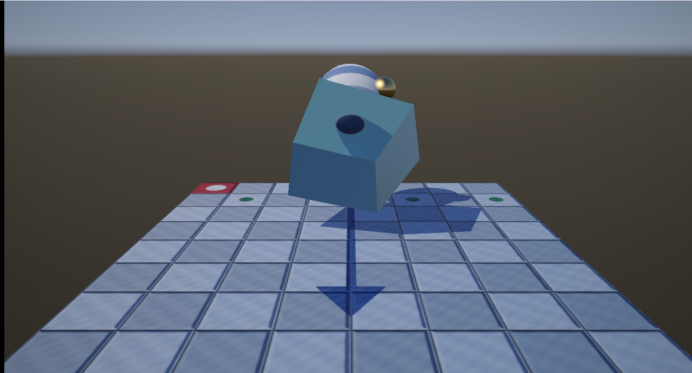
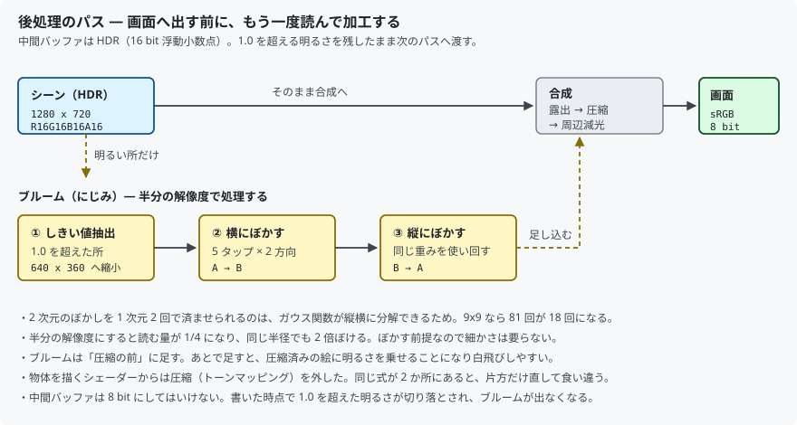
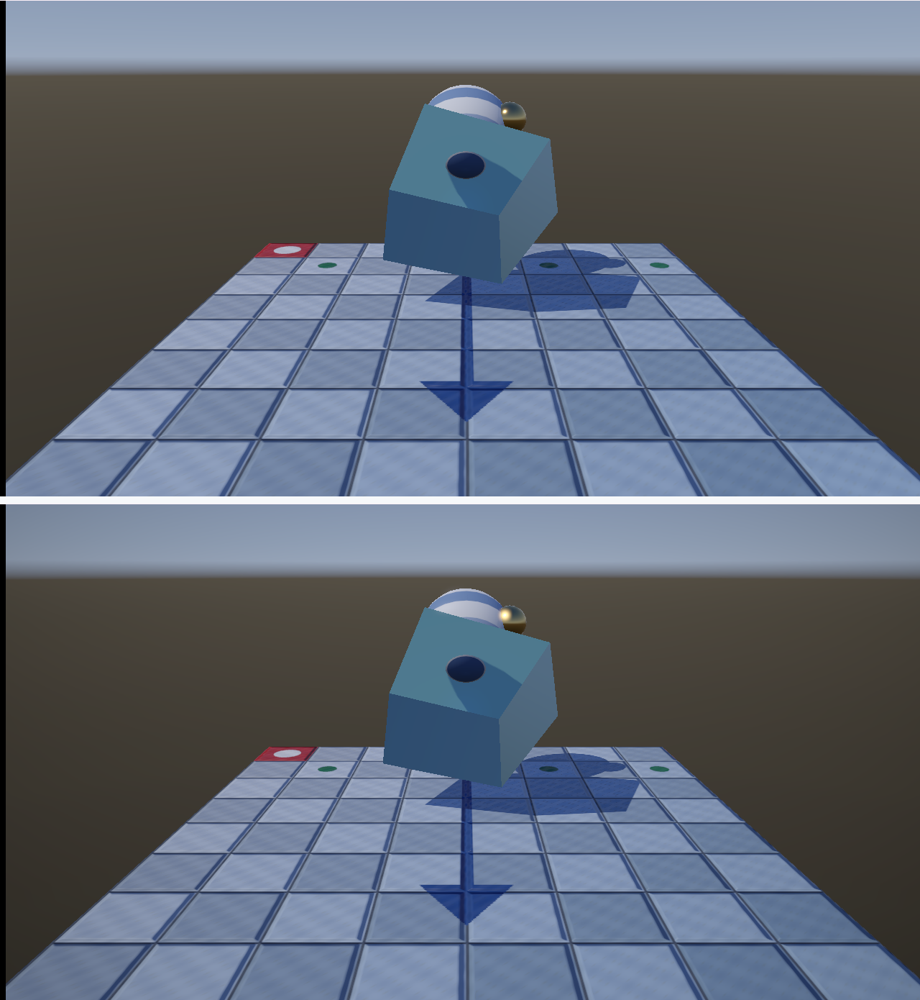
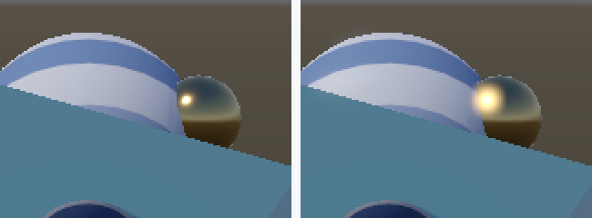

# 25. ポストプロセス — 描き終えた絵をもう一度読む

ここまでは、シェーダーが計算した色をそのまま画面へ書いていました。
この章から、**いったん別の場所へ描き、それを読み直して加工してから**画面へ出します。



金属のハイライトがにじみ、画面の四隅が少し落ちています。

---

## 1. なぜ「もう一度読む」必要があるのか

物体を描くシェーダーは、**そのピクセル 1 点のことしか知りません**。

- 隣のピクセルがどうなっているか
- 画面のどこにいるか
- 画面全体でいちばん明るいのはどこか

こういった「全体を見ないと分からないこと」は、描き終わってからでないと扱えません。
にじみ（ブルーム）も、周辺減光（ビネット）も、そこに入ります。

そこで**中間バッファ**を 1 枚用意し、そこへ描いてから読み直します。



---

## 2. 中間バッファは HDR でなければならない

ここが一番大事な点です。

中間バッファを 8 bit で作ると、**書いた時点で 1.0 を超えた明るさが
切り落とされます**。ハイライトが 5.0 だったのか 1.0 だったのかが
分からなくなり、「明るい所だけを取り出す」ができません。

```cpp
static constexpr DXGI_FORMAT kFormat = DXGI_FORMAT_R16G16B16A16_FLOAT;
```

32 bit にすると容量と帯域が 2 倍になります。明るさの表現には 16 bit で足ります。

### 1 枚に 2 つのビューを付ける

同じリソースに、**書く用の RTV** と**読む用の SRV** を作ります。

```cpp
textureDesc.Flags = D3D12_RESOURCE_FLAG_ALLOW_RENDER_TARGET;
```

このフラグは**生成時にしか指定できません**。あとから付け足せません。

> **RTV はシェーダーから見えないヒープに置く決まりです。**
> SRV のヒープには入れられないので、`RenderTexture` は
> 1 個だけの RTV 専用ヒープを自分で持っています。

### 使うたびに状態を切り替える

「描く」と「読む」では、GPU から見たリソースの扱いが違います。
そのため、**バリア**で切り替えます。

```
PIXEL_SHADER_RESOURCE → RENDER_TARGET   … 描く前
RENDER_TARGET → PIXEL_SHADER_RESOURCE   … 描き終わったあと
```

`BeginRender` / `EndRender` を対で呼ぶ形にして、
戻し忘れが起きにくいようにしています（`ShadowMap` と同じ作りです）。

---

## 3. トーンマッピングを 1 か所へ集める

[19 章](19_色を正しく扱う_sRGB.md)で入れたトーンマッピングは、
`Mesh.hlsl` と `Skybox.hlsl` の**両方**にありました。
同じ式が 2 か所にあると、片方だけ直して食い違います。

後処理を入れたので、両方から外して合成パスへ移しました。

```hlsl
// Mesh.hlsl : 圧縮せず、1.0 を超えたまま書く
return float4(lit, baseColor.a);
```

物体を描くシェーダーは「リニアの明るさを出す」ことだけに専念し、
「画面に出せる範囲へ押し込む」のは後処理の仕事、と役割が分かれます。

---

## 4. ブルーム — 明るい所がにじむ

強い光を見るとまわりがぼんやり光って見えます。
レンズや眼球の中で光が散るためです。それを再現します。

### ① 明るい所だけを取り出す

```hlsl
float brightness = max(color.r, max(color.g, color.b));
float weight = smoothstep(threshold, threshold + softness, brightness);
return float4(color * weight, 1.0f);
```

`if (brightness < threshold) return 0;` と書くと、境目がくっきり出て
不自然になります。`smoothstep` でなだらかに立ち上げます。

明るさの代表値に**最大成分**を使うのは、赤や青だけが強い色も拾うためです。

### ② 半分の解像度でぼかす

読む量が 1/4 になり、同じ半径でも 2 倍ぼけます。
ぼかす前提なので細かさは要りません。

### ③ 横 → 縦の 2 回に分ける

```hlsl
float2 step = g_blurDirection.xy * g_blurDirection.zw;
```

**2 次元のぼかしを 1 次元 2 回で済ませられる**のは、
ガウス関数が縦横に分解できるからです（分離可能）。

| 方法 | 読む回数 |
|------|---------|
| 9×9 を一度に | 81 回 |
| 横 9 → 縦 9 | **18 回** |

### ④ 圧縮の「前」に足す

```hlsl
color += g_bloom.Sample(g_sampler, input.uv).rgb * bloomAmount;
color *= exposure;
color = ToneMap(color, whitePoint);
```

**順序を間違えないでください。** 圧縮のあとに足すと、
すでに 0〜1 に押し込んだ絵へ明るさを乗せることになり、白飛びします。

---

## 5. ビネット — 画面の隅を落とす

```hlsl
float2 centered = input.screenPosition;
centered.x *= g_screenSize.x * g_screenSize.w;   // 幅 / 高さ

float distance = length(centered) * 0.5f;
float falloff  = 1.0f - vignette * saturate(distance * distance);
```

**縦横比を掛けるのを忘れない**でください。掛けないと、
横長の画面では減光の形が楕円になります。

---

## 6. 測って確かめる

回転を 2.0 rad で止めて撮り比べました。



### (1) トーンマッピングを移しても絵は変わらない

いちばん確かめたいのは「**式を移しただけで、見た目は変わっていない**」ことです。
ブルームとビネットを 0 にした状態で、前の版（v0.22.0）と比べました。

| | 結果 |
|---|---|
| 完全に一致したピクセル | **864,253 / 883,200（97.85 %）**|
| 差が 1 だったピクセル | 18,947（2.15 %）|
| 最大の差 | **1 / 255** |

差が出るのは、中間バッファが 16 bit 浮動小数点になったぶんの丸めです。
**2 以上の差は 1 ピクセルもありませんでした。**

### (2) ブルームは明るい所の「まわり」だけを持ち上げる

画面でいちばん明るい画素（金属のハイライト、輝度 255.0）を中心に、
距離ごとの平均輝度を測りました。

| 中心からの距離 | ブルームなし | ブルームあり | 増分 |
|--------------|------------|------------|------|
| 0〜4 px | 180.79 | 247.42 | **+66.63** |
| 5〜10 px | 99.80 | 164.37 | **+64.57** |
| 11〜18 px | 99.25 | 100.13 | +0.88 |
| 19〜28 px | 99.64 | 99.64 | **+0.00** |
| 29〜45 px | 102.12 | 102.12 | +0.00 |

**10 px あたりまで光が広がり、そこから先は届いていません。**
画面全体で見ると差が出たのは 2,241 px（0.3 %）だけです。
しきい値を超えた所しか拾っていないことの裏付けです。



### (3) ビネットは中央を変えず、四隅だけを落とす

| 画面の位置 | なし | あり | 比 |
|-----------|------|------|-----|
| 中央 | 74.1 | 74.1 | **100.0 %** |
| 左上 | 159.3 | 132.5 | 83.2 % |
| 右上 | 159.1 | 133.5 | 83.9 % |
| 左下 | 131.6 | 110.7 | 84.1 % |
| 右下 | 147.5 | 124.8 | 84.6 % |

**中央がぴったり 100.0 %** で、四隅が 83〜85 % に揃いました。
縦横比を掛けているので、左右と上下で偏りが出ていません。

---

## 7. 単純化したところ

| 項目 | 本実装 | 本来 |
|------|-------|------|
| ブルームの段数 | 1 段（1/2 解像度）| 何段も重ねて広い裾を作る |
| ぼかしの幅 | 5 タップ固定 | 段ごとに変える、デュアルフィルタ |
| 露出 | 固定値 | 画面の明るさから自動調整（自動露出）|
| トーンマッピング | 拡張ラインハルト | ACES、AgX など |
| 中間バッファ | 1 枚 | 深度・法線・速度なども持つ（G バッファ）|
| 後処理の種類 | ブルーム・ビネット | 被写界深度、モーションブラー、色調補正 |

**自動露出が無い**ので、暗い場所へ行っても目が慣れません。
1 段だけのブルームは、裾が短く「点光源のまわりだけ光る」見え方になります。

---

## 8. この章のまとめ

- 画面へ直接描かず、**中間バッファへ描いてから読み直す**
- 中間バッファは **HDR（16 bit 浮動小数点）**。8 bit だと
  1.0 を超えた明るさが書いた時点で消える
- 1 枚のリソースに **RTV と SRV の 2 つのビュー**を付ける。
  `ALLOW_RENDER_TARGET` は生成時にしか指定できない
- 「描く」と「読む」は**バリアで切り替える**。対で呼ぶ形にして戻し忘れを防ぐ
- **トーンマッピングは 1 か所へ集める**。同じ式が 2 か所にあると食い違う
- ブルームは **しきい値抽出 → 横ぼかし → 縦ぼかし → 合成**
- 2 次元のぼかしは **1 次元 2 回**で済む（9×9 なら 81 回 → 18 回）
- ブルームは**圧縮の前**に足す。あとだと白飛びする
- ビネットは**縦横比を掛ける**。忘れると楕円になる
- 測定: 移設前後の差は **最大 1 / 255**、97.85 % が完全一致
- 測定: ブルームは **10 px 先まで** 光を広げ、19 px 以遠は **±0.00**
- 測定: ビネットは中央 **100.0 %**、四隅 **83〜85 %**

---

## 9. ここから先へ

| やりたいこと | 必要になるもの |
|------------|--------------|
| 暗い場所で目が慣れる | 自動露出（画面の平均輝度を測る）|
| もっと自然な色に | ACES / AgX のトーンマッピング |
| ピントをぼかす | 被写界深度（深度バッファを読む）|
| 動きをぼかす | モーションブラー（速度バッファ）|
| 輪郭のギザギザを消す | FXAA、SMAA、TAA |
| 陰影を濃くする | SSAO（深度と法線を読む）|

どれも「描き終えた絵と、そのときの深度や法線を読む」形になります。
そのために**複数の中間バッファ**を持つ設計を G バッファと呼びます。

---

## この章で参照した資料

- [D3D12_RESOURCE_FLAGS | Microsoft Learn](https://learn.microsoft.com/en-us/windows/win32/api/d3d12/ne-d3d12-d3d12_resource_flags)
- [Using Resource Barriers to Synchronize Resource States | Microsoft Learn](https://learn.microsoft.com/en-us/windows/win32/direct3d12/using-resource-barriers-to-synchronize-resource-states-in-direct3d-12)
- [D3D12_RENDER_TARGET_VIEW_DESC | Microsoft Learn](https://learn.microsoft.com/en-us/windows/win32/api/d3d12/ns-d3d12-d3d12_render_target_view_desc)
- [smoothstep | Microsoft Learn](https://learn.microsoft.com/en-us/windows/win32/direct3dhlsl/dx-graphics-hlsl-smoothstep)
- Real-Time Rendering (4th Edition) — 第 12 章「画像空間の効果」
- Jorge Jimenez, "Next Generation Post Processing in Call of Duty: Advanced Warfare",
  SIGGRAPH 2014 — 段を重ねるブルームの実装例

スクリーンショットは本プログラムの実行結果です（[../assets/](../assets/)）。
