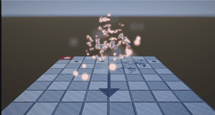
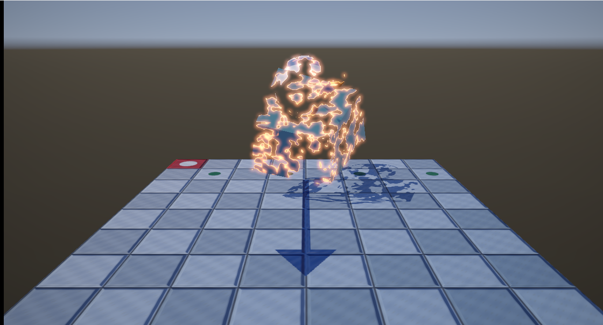
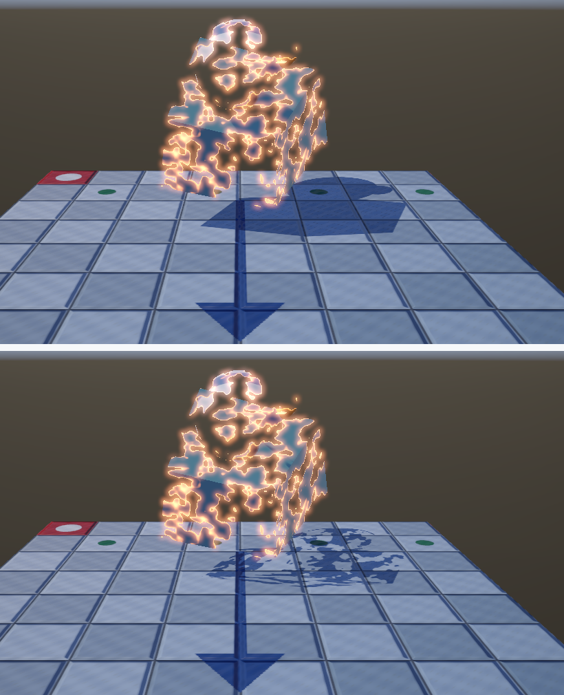

# 26. ディゾルブ — 溶けて消える



VFX の入り口です。ポリゴンは 1 枚も減らしていません。
**ピクセル単位で「描かない」と決めているだけ**です。

`F` キーで動かせます（既定では切ってあります）。

ソース : [`shaders/Mesh.hlsl`](../../shaders/Mesh.hlsl)（`DissolvePattern` と `PSMain`）

---

## 1. `clip` — そのピクセルを捨てる

```hlsl
clip(dissolveNoise - threshold);
```

`clip(x)` は「**x が負なら、このピクセルの処理をここで打ち切る**」命令です。
色も深度も書き込まれません。

- ノイズの値がしきい値より大きい → 残る
- 小さい → 消える

しきい値を 0 から 1 へ動かせば、模様の形に沿って穴が広がっていきます。

### 置く場所が大事

```hlsl
float4 PSMain(VSOutput input) : SV_TARGET
{
    // --- ディゾルブ : 描くかどうかをいちばん最初に決める ---
    clip(dissolveNoise - threshold);

    // ここから下は、残るピクセルだけが通る
    ...
}
```

**捨てるピクセルは、以降の計算をまったくしません。**
PBR も IBL も影の判定も走らないので、`clip` は早いほど得です。

> **`clip` は早期深度テストを無効にします。**
> GPU は通常、ピクセルシェーダーの前に深度テストを済ませます。
> ところが `clip` があると「シェーダーを走らせてみないと
> 深度を書くか分からない」ため、その最適化が効きません。
>
> 使わないオブジェクトにまで `clip` 入りのシェーダーを適用しないよう、
> 本実装では `dissolveAmount > 0` のときだけ `clip` へ入るようにしています。

---

## 2. 模様は 3 次元で作る

```hlsl
float DissolvePattern(float3 worldPosition, float scale)
{
    return DissolveNoise(worldPosition * scale) * 0.65f
         + DissolveNoise(worldPosition * scale * 2.7f) * 0.35f;
}
```

入力は **UV ではなくワールド座標**です。理由は 2 つあります。

| 入力 | 起きること |
|------|-----------|
| UV | UV の継ぎ目で模様が途切れる。UV が無い面では使えない |
| **ワールド座標** | 継ぎ目が出ない。複数のオブジェクトで模様が繋がる |

大小 2 段のノイズを重ねているのは、
**大きな塊が崩れつつ、縁が細かくちぎれる**ようにするためです。
1 段だけだと、丸い穴が広がるだけの単調な絵になります。

ノイズの中身は[習作 04](../shader-lab/04_ノイズ.md)の 3 次元版で、
ハッシュは[習作 15](../shader-lab/15_ハッシュの精度.md)の桁が溢れない書き方を使っています。

---

## 3. 燃え際 — しきい値の「近く」を光らせる



```hlsl
float edge = 1.0f - saturate((dissolveNoise - threshold) / dissolveEdge);
edge = pow(edge, 2.2f);

lit += g_dissolveEdgeColor.rgb * edge;
```

しきい値ちょうどで 1、そこから離れるほど 0 になる値を作り、色を足します。

`pow(edge, 2.2)` で縁を鋭くしています。
そのまま使うと、広い範囲がぼんやり明るくなって「燃えている」感じが出ません。

### 色は 1 を超える値にする

```cpp
constexpr float kDissolveEdgeColor[3] = { 6.2f, 1.6f, 0.35f };
```

**ここが [25 章](25_ポストプロセス.md)との繋がりです。**

1 を超える明るさで書くと、後処理のブルームがしきい値で拾い、
燃え際が**にじんで光ります**。1 以下にすると、ただの明るいオレンジ線です。

中間バッファを HDR にしておいたおかげで、
「明るさを 1 より上に置ける」ことがそのまま表現に使えます。

---

## 4. 影も欠けさせる

**いちばん忘れやすい点です。**

影は別のパスで描くので、そちらでも同じ判定をしないと
**本体は消えたのに影だけ残ります**。

```hlsl
// 影のパス用のピクセルシェーダー。色は要らないので、clip するためだけに置く。
void PSShadow(ShadowVSOutput input)
{
    if (g_dissolveParams.x > 0.0f)
    {
        float threshold = ...;
        clip(DissolvePattern(input.worldPosition, g_dissolveParams.z) - threshold);
    }
}
```

これまで影のパスには**ピクセルシェーダーがありませんでした**
（[13 章](13_影を落とす_シャドウマップ.md)）。深度だけ書けばよかったからです。
今回はじめて必要になりました。色は書かないので、
レンダーターゲットは 0 枚のままです。

### ルートシグネチャの可視性

影のパスのルートシグネチャは、`DENY_PIXEL_SHADER_ROOT_ACCESS` で
ピクセルシェーダーからの参照を閉じていました。開ける必要があります。

そして**画面を描く側でも**、オブジェクト定数（`b1`）の可視性を
`VERTEX` から `ALL` へ広げる必要があります。
ディゾルブのパラメータをピクセルシェーダーが読むためです。

> **これを忘れると、エラーも出さずに起動直後に落ちます。**
> PSO の生成に失敗するのですが、その理由はデバッグ出力にしか出ません。
> 実際にこの状態で 10 分ほど悩みました。

---

## 5. 測って確かめる

回転を止め、ディゾルブの進み具合を 0.55 に固定して比べました。

### (1) 影のパスで `clip` しないと、影だけ残る



床の一部（480 × 180 = 86,400 px）で、影になっている画素を数えました。

| 設定 | 影の画素 | 平均輝度 |
|------|---------|---------|
| 影のパスで `clip` する（正しい）| 19,046（22.0 %）| 124.6 |
| 影のパスで `clip` しない | **26,593（30.8 %）** | 118.7 |

**`clip` しないと影が 1.4 倍残ります。**
本体には穴が開いているのに、その穴から光が漏れてきません。

### (2) 燃え際を 1 以下にすると、光がにじまない

燃え際の色を `(6.2, 1.6, 0.35)` から 1/10 の `(0.62, 0.16, 0.035)` に
下げて比べました。

いちばん明るい燃え際（輝度 254.6）を中心に、距離ごとの平均輝度です。

| 中心からの距離 | 燃え際 0.62 | 燃え際 6.2 | 増分 |
|--------------|-----------|----------|------|
| 0〜3 px | 191.88 | 248.28 | +56.41 |
| 4〜8 px | 142.35 | 199.09 | +56.74 |
| 9〜15 px | 121.83 | 151.82 | +29.99 |
| 16〜24 px | 120.82 | 142.72 | +21.90 |
| 25〜40 px | 91.53 | 120.38 | +28.85 |

画面全体では 51,279 px（5.8 %）が変化し、最大の差は 216 でした。
**燃え際そのものより、はるかに広い範囲が明るくなっています。**
ブルームが光を運んでいるためです。

> **この測り方では「縁が明るいぶん」と「にじんだぶん」を分けられません。**
> 縁の明るさを揃えたうえでブルームだけを切る、という比較が必要です。
> ここでは目視と合わせて「広い範囲に効いている」ことの確認に留めます。

---

## 6. 単純化したところ

| 項目 | 本実装 | 本来 |
|------|-------|------|
| 模様 | シェーダー内で計算 | テクスチャを引く（軽い・美術が調整できる）|
| 進み方 | 全体で一様 | 高さや距離で偏らせる（下から溶ける等）|
| 燃え際の色 | 単色 | 温度のグラデーション（[習作 17](../shader-lab/17_炎.md)）|
| 断面 | 描かない | 内側の面を別の色で描く |
| 破片 | 出ない | パーティクルを飛ばす |

**断面が描かれない**のがいちばん目につきます。
穴の向こうに裏側の面が見えるべきですが、背面カリングで消えています。
`CullMode` を切り、裏面のときだけ別の色にすると解決します。

---

## 7. この章のまとめ

- ディゾルブは **`clip` でピクセルを捨てる**だけ。ポリゴンは減らない
- `clip` は**早い位置に置く**。捨てるピクセルの計算をすべて省ける
- ただし `clip` は**早期深度テストを無効にする**。使う場面を絞る
- 模様は **UV ではなくワールド座標**で作る。継ぎ目が出ない
- 燃え際は「しきい値の近く」を光らせる。**1 を超える色**にすると
  ブルームがにじませる
- **影のパスでも同じ判定をする**。忘れると影だけ残る
- そのために、影のパスにピクセルシェーダーが必要になり、
  ルートシグネチャの可視性も広げる必要がある
- 測定: 影の `clip` を外すと影が **1.4 倍**残る
- 測定: 燃え際を 1/10 にすると、画面の **5.8 %** が変わる

---

## 8. ここから先へ

| やりたいこと | 必要になるもの |
|------------|--------------|
| 破片が飛び散る | パーティクル（インスタンシング）|
| 半透明で消える | **アルファブレンド**（[27 章](27_半透明とブレンディング.md)）|
| 断面を見せる | 両面描画と `SV_IsFrontFace` |
| 下から溶ける | しきい値にワールド Y を混ぜる |
| ワイプ・転送 | 模様を平面や球にする |

次の章では、VFX に欠かせない**半透明とブレンディング**を入れます。
ここまでのパイプラインは、すべて `BlendEnable = FALSE` でした。

---

## この章で参照した資料

- [clip | Microsoft Learn](https://learn.microsoft.com/en-us/windows/win32/direct3dhlsl/dx-graphics-hlsl-clip)
- [D3D12_ROOT_SIGNATURE_FLAGS | Microsoft Learn](https://learn.microsoft.com/en-us/windows/win32/api/d3d12/ne-d3d12-d3d12_root_signature_flags)
- [Early Depth-Stencil | Microsoft Learn](https://learn.microsoft.com/en-us/windows/win32/direct3d11/d3d10-graphics-programming-guide-output-merger-stage#early-depth-stencil)
- Real-Time Rendering (4th Edition) — 第 5 章「シェーディングの基本」
- [習作 04 ノイズ](../shader-lab/04_ノイズ.md) / [習作 15 ハッシュの精度](../shader-lab/15_ハッシュの精度.md)

GIF とスクリーンショットは本プログラムの実行結果です
（[../assets/](../assets/)、撮影は `tools/capture-gif.ps1`）。
