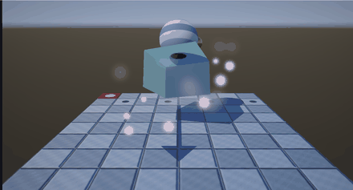
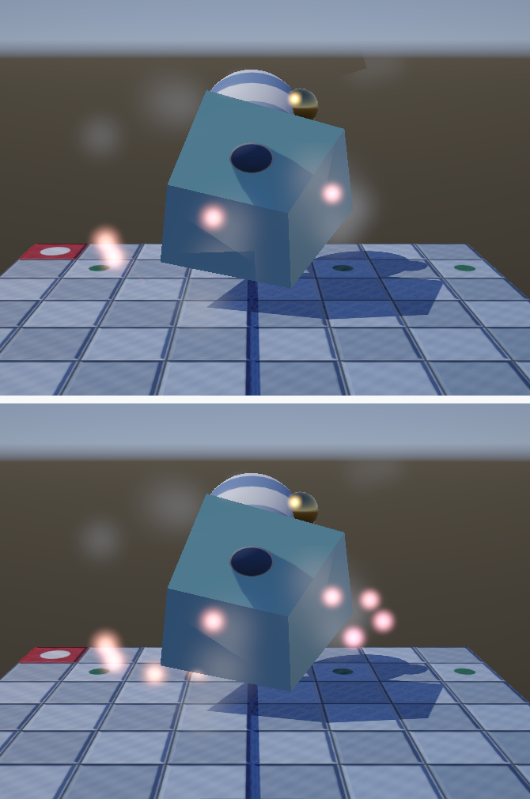
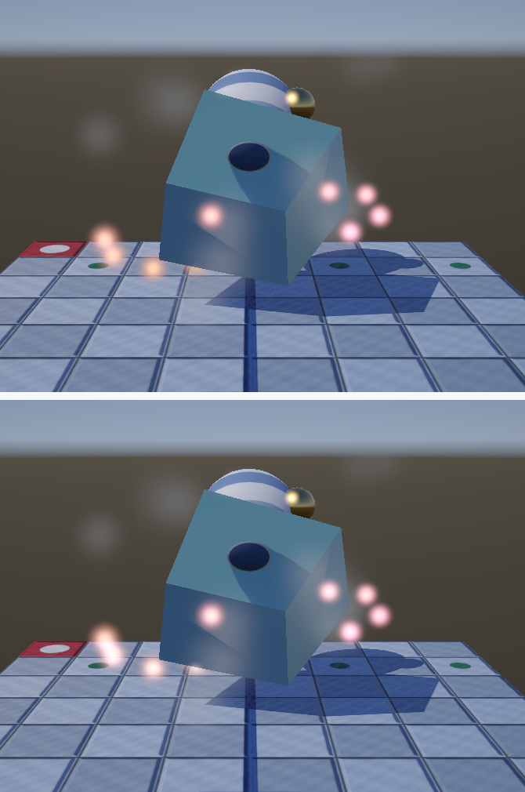
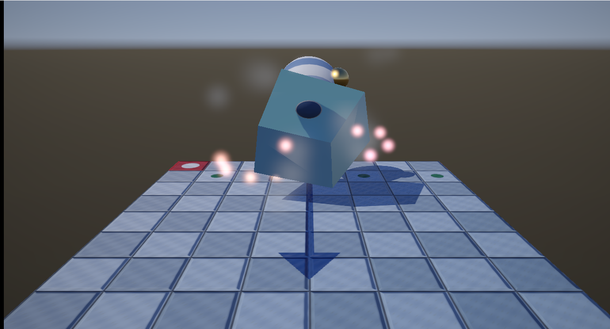

# 27. 半透明とブレンディング — VFX の土台



ここまでのパイプラインは、**すべて `BlendEnable = FALSE`** でした。
つまり「描いた色でそのまま塗り替える」ことしかできませんでした。

半透明が扱えないと、パーティクルもトレイルも煙も書けません。
VFX の土台をここで入れます。

`V` キーで入り切り、`B` キーで並べ替えの入り切りができます。

ソース : [`VfxPipeline.h`](../../src/Graphics/VfxPipeline.h) /
[`Vfx.hlsl`](../../shaders/Vfx.hlsl)

---

## 1. ブレンドの式

出力マージャは、シェーダーが出した色（前景）と、
すでに書かれている色（背景）を、次の式で混ぜます。

```
結果 = 前景 × SrcBlend  (BlendOp)  背景 × DestBlend
```

この 3 つを選ぶだけで、いろいろな合成が作れます。

| 合成 | SrcBlend | DestBlend | 式 | 用途 |
|------|----------|-----------|-----|------|
| 不透明 | — | — | `前景` | 通常の物体 |
| アルファ | `SRC_ALPHA` | `INV_SRC_ALPHA` | `前景 α + 背景 (1-α)` | 煙・ガラス |
| **加算** | `ONE` | `ONE` | `前景 + 背景` | **光・炎** |
| 乗算 | `ZERO` | `SRC_COLOR` | `前景 × 背景` | 影・汚れ |

### 加算合成は「暗くならない」

足すだけなので、重ねるほど明るくなります。
光や炎は「そこに光が足される」ものなので、これが物理的にも正しい形です。

しかも**順番を選びません**。足し算は交換法則が成り立つからです。
これは実装上とても楽です（後述）。

---

## 2. 乗算済みアルファ

本実装では、シェーダーが**色にアルファを掛けてから**出しています。

```hlsl
float3 color = input.color.rgb * input.color.a * alpha;
return float4(color, input.color.a * alpha);
```

こうすると `SrcBlend` はどちらも `ONE` で済み、
**違いは `DestBlend` だけ**になります。

```cpp
target.SrcBlend  = D3D12_BLEND_ONE;
target.DestBlend = (mode == BlendMode::Alpha) ? D3D12_BLEND_INV_SRC_ALPHA
                                              : D3D12_BLEND_ONE;
```

| | 式 |
|---|---|
| アルファ | `前景 + 背景 × (1 - α)` |
| 加算 | `前景 + 背景` |

同じシェーダー・同じ頂点のまま、**PSO のブレンド設定だけ**で
2 つの合成を切り替えられます。

> **乗算済みアルファには、もう 1 つ利点があります。**
> アルファが 0 の透明な部分でも色が 0 になるので、
> テクスチャを補間したときに「透明なのに色がにじむ」問題が起きません。

---

## 3. 深度は「テストするが書かない」

**半透明でいちばん大事な設定です。**

```cpp
depthStencilDesc.DepthEnable    = TRUE;                        // テストはする
depthStencilDesc.DepthWriteMask = D3D12_DEPTH_WRITE_MASK_ZERO; // 書かない
```

- **テストする** … 手前にある不透明な物には隠れてほしい
- **書かない** … 半透明どうしが互いを消し合わないように

深度を書いてしまうと、先に描いた半透明が「壁」になり、
**あとから描いた半透明が消えます**。半透明は光を通すのだから、
深度を占有してはいけません。

---

## 4. 描く順番

```
不透明な物 → 背景 → 半透明 → 後処理
```

半透明は深度を書かないので、**不透明な物をすべて描き終えてから**描きます。
先に描くと、あとから来た不透明な物に塗り潰されます。

### アルファ合成は並べ替えが要る

アルファ合成は「掛け算」なので、**順番を変えると結果が変わります**。

```cpp
std::sort(m_alphaParticles.begin(), m_alphaParticles.end(),
          [&eyePosition](const VfxParticle& a, const VfxParticle& b)
          {
              return 視点からの距離の2乗(a) > 視点からの距離の2乗(b);  // 遠い順
          });
```

視点から**遠い順**（奥から手前へ）に並べ替えます。

### 加算合成は要らない

足し算なので順番によらず結果が同じです。
だから本実装では、**煙（アルファ）を先に、光（加算）を最後に**描いています。

> **並べ替えは根本的な解決ではありません。**
> 板どうしが交差していると、どう並べても正しくなりません。
> 順序に依存しない手法（OIT: Order-Independent Transparency）が要ります。

---

## 5. ビルボード — 頂点バッファを持たない

板は常にカメラを向く必要があります。
モデル行列で回すのではなく、**頂点の位置をその場で作ります**。

```hlsl
float3 worldPosition = particle.positionSize.xyz
                     + g_cameraRight.xyz * rotated.x * particle.positionSize.w
                     + g_cameraUp.xyz    * rotated.y * particle.positionSize.w;
```

カメラの右方向と上方向で板を張れば、それだけでカメラを向きます。

頂点は `SV_VertexID` から、板の情報は `SV_InstanceID` から取ります
（[23 章](23_スカイボックス.md)の全画面三角形と同じ考え方）。

```cpp
// 1 回の呼び出しで count 枚ぶんを描く（インスタンシング）
commandList->DrawInstanced(kVerticesPerQuad, count, 0, 0);
```

板ごとに `DrawInstanced` を呼ぶより、**命令の数が圧倒的に少なくなります**。

### カリングを切る

```cpp
rasterizerDesc.CullMode = D3D12_CULL_MODE_NONE;
```

ビルボードは視点によって巻き順が裏返ることがあります。
カリングしていると、そのとき突然消えます。

---

## 6. 測って確かめる

回転と時間を止めて比べました。モデル周辺の 670 × 500 px で、
輝度 205 を超える（＝光っている）画素を数えています。

### (1) 深度を書くと、光が半分近く消える



| 設定 | 光っている画素 |
|------|--------------|
| 深度を書かない（正しい）| **2,284** |
| 深度を書いてしまう | 1,352 |

**932 px（41 %）の光が消えました。**
上の画像では、先に描かれた板が壁になり、
あとから描いた光がいくつも見えなくなっています。

画面全体では 14,194 px（1.6 %）が変化し、最大の差は 189 でした。

### (2) 加算をアルファにすると、光らなくなる



| 合成 | 光っている画素 |
|------|--------------|
| 加算（正しい）| **2,284** |
| アルファ | 1,467 |

**817 px（36 %）減りました。**

アルファ合成は「背景を隠して自分の色に置き換える」ので、
どれだけ重ねても**元の色より明るくなりません**。
光の表現には加算が要ります。

画面全体では 12,254 px（1.4 %）が変化しました。

### (3) 加算合成 ＋ HDR ＋ ブルーム



板の色を **1 を超える値**にしてあります。
加算合成なので中間バッファ（HDR）でそのまま足され、
[25 章](25_ポストプロセス.md)のブルームが拾ってにじみます。

中間バッファが 8 bit だったら、足した時点で 1.0 に張り付いて
にじみが出ませんでした。ここまでの積み重ねが効いています。

---

## 7. 単純化したところ

| 項目 | 本実装 | 本来 |
|------|-------|------|
| 板の数 | 定数バッファで 64 枚まで | 構造化バッファで数万枚 |
| 板の動き | CPU で毎フレーム計算 | GPU（コンピュートシェーダー）|
| 模様 | 計算で作る丸 | テクスチャ、アニメーションするシート |
| 並べ替え | CPU で毎フレーム全体を | 距離で大まかに、または OIT |
| 交差 | 正しく描けない | ソフトパーティクル、OIT |
| 影 | 落とさない・受けない | ボリュメトリックな近似 |

**ソフトパーティクル**が無いのがいちばん目につきます。
板が床を突き抜けると、そこに硬い直線が出ます。
深度バッファを読んで、近いほど薄くすれば消えます。

---

## 8. この章のまとめ

- ブレンドは `結果 = 前景 × SrcBlend (op) 背景 × DestBlend`
- **加算は暗くならず、順番も選ばない**。光・炎に向く
- **乗算済みアルファ**にすると、`DestBlend` だけで両方を切り替えられる
- 半透明は **深度テストはする / 深度は書かない**
- 描く順は **不透明 → 背景 → 半透明 → 後処理**
- **アルファ合成は奥から手前へ並べ替える**。加算は要らない
- ビルボードは**カメラの右と上で板を張る**。カリングは切る
- `SV_InstanceID` で 1 回の呼び出しに何枚もまとめる
- 測定: 深度を書くと光の **41 %** が消える
- 測定: 加算をアルファにすると光る画素が **36 %** 減る

---

## 9. ここから先へ

| やりたいこと | 必要になるもの |
|------------|--------------|
| 数万個のパーティクル | 構造化バッファ、GPU での更新 |
| 床を突き抜けない | ソフトパーティクル（深度バッファを読む）|
| 交差しても正しく | OIT（順序非依存透明）|
| 軌跡・トレイル | 頂点を動的に生成する |
| 屈折・歪み | 背景をテクスチャとして読み、UV をずらす |

---

## この章で参照した資料

- [D3D12_BLEND_DESC | Microsoft Learn](https://learn.microsoft.com/en-us/windows/win32/api/d3d12/ns-d3d12-d3d12_blend_desc)
- [D3D12_BLEND | Microsoft Learn](https://learn.microsoft.com/en-us/windows/win32/api/d3d12/ne-d3d12-d3d12_blend)
- [Output-Merger Stage | Microsoft Learn](https://learn.microsoft.com/en-us/windows/win32/direct3d11/d3d10-graphics-programming-guide-output-merger-stage)
- Tom Forsyth, ["Premultiplied alpha"](https://tomforsyth1000.github.io/blog.wiki.html)
- Morgan McGuire & Louis Bavoil, "Weighted Blended Order-Independent
  Transparency", JCGT 2013
- Real-Time Rendering (4th Edition) — 第 5.5 節「透明」

GIF とスクリーンショットは本プログラムの実行結果です
（[../assets/](../assets/)、撮影は `tools/capture-gif.ps1`）。
