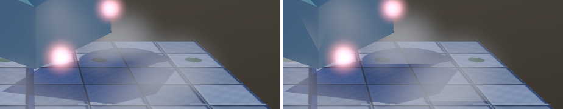
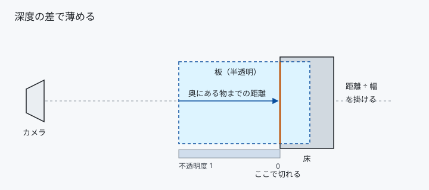
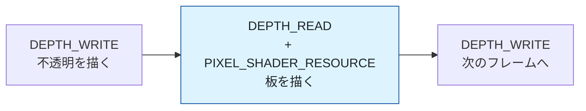
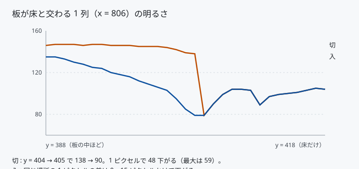
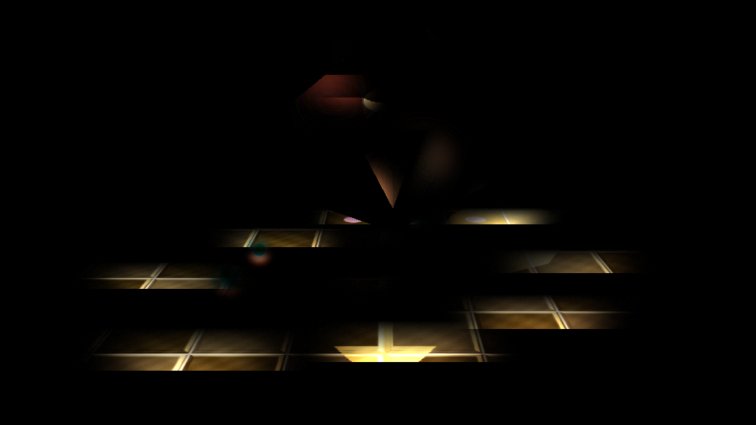

# 28. ソフトパーティクル — 板が床を貫いた線を消す

[27 章](27_半透明とブレンディング.md)の板は、常にカメラを向きます。
そのため床すれすれに置くと、**必ず床を貫きます**。
貫いたところは深度テストで切られ、そこに直線の切り口が出ます。

これを消すには、**板の後ろにある物との距離で不透明度を下げます**。



左が有効、右が無効です。右では霧が床で直線に切れています。

---

## 1. 何をするか



```hlsl
float fade = saturate((奥にある物までの距離 - 板までの距離) / 消し始める距離);
alpha *= fade;
```

板がぴったり床に接するところで `fade` が 0 になり、
離れるにつれて 1 へ戻ります。

たったこれだけです。難しいのは式ではなく、
**いま描いている深度バッファを、同時に読む**という段取りのほうです。

---

## 2. 深度バッファを読めるようにする

深度バッファはこれまで「書くだけ」のリソースでした。
シェーダーから読むには 3 つ直します。

### (1) 形式を TYPELESS にする

```cpp
static constexpr DXGI_FORMAT kResourceFormat = DXGI_FORMAT_R32_TYPELESS;
static constexpr DXGI_FORMAT kFormat = DXGI_FORMAT_D32_FLOAT;              // DSV
static constexpr DXGI_FORMAT kShaderResourceViewFormat = DXGI_FORMAT_R32_FLOAT;
```

`D32_FLOAT` で作ったリソースには SRV を作れません。
型を決めずに作り、**ビューごとに違う型で解釈します**。
シャドウマップ（[13 章](13_影を落とす_シャドウマップ.md)）と同じ手です。

### (2) 書き込みを禁じた DSV を、もう 1 個作る

```cpp
dsvDesc.Flags = D3D12_DSV_FLAG_READ_ONLY_DEPTH;
device->CreateDepthStencilView(m_depthBuffer.Get(), &dsvDesc, readOnly);
```

**同じリソースを、深度テストとテクスチャ読みに同時に使うため**の仕掛けです。
書き込みができる状態のままでは、シェーダーから読むことは許されません。

DSV は 2 個になるので、ヒープの `NumDescriptors` も 2 にします。

### (3) 状態を移す

```cpp
RecordResourceBarrier(commandList, m_depthBuffer.Resource(),
    D3D12_RESOURCE_STATE_DEPTH_WRITE,
    D3D12_RESOURCE_STATE_DEPTH_READ |
        D3D12_RESOURCE_STATE_PIXEL_SHADER_RESOURCE);
```

**2 つの状態を同時に立てます。** これができるのは、
どちらも「読むだけ」の状態だからです。
`DEPTH_WRITE` は他のどの状態とも同時に立てられません。

描き終わったら `DEPTH_WRITE` へ戻します。



---

## 3. 深度値を距離へ戻す

深度バッファに入っているのは 0〜1 の値で、**距離ではありません**。
射影行列で歪めた値なので、そのまま引き算しても意味がありません。

射影行列は、次の関係を作ります。

```
z_ndc = _33 + _43 / z_view
```

これを `z_view` について解くだけです。

```hlsl
float ViewDepth(float ndcDepth)
{
    return g_depthParams.y / (ndcDepth - g_depthParams.x);   // _43 / (d - _33)
}
```

必要なのは射影行列の 2 要素だけなので、定数バッファへ 2 個渡します。
逆行列を送る必要はありません。

> **何も描かれていないところ（深度 1.0）は、そのまま遠クリップ面の距離になります。**
> 場合分けは要りません。式が自然にそう振る舞います。

### ピクセルの読み方

```hlsl
float sceneNdcDepth = g_sceneDepth.Load(int3((int2)input.position.xy, 0));
```

`SV_POSITION.xy` はピクセル座標そのものなので、そのまま添字に使えます。
`Load` は**サンプラーを通さず 1 テクセルを整数座標で読む**関数です。
画面と深度バッファは同じ解像度なので、補間は不要です。

`SV_POSITION.z` には、いま塗っている板の深度が入っています。
こちらも同じ関数で距離へ戻し、引き算します。

---

## 4. 測る

### 同じ瞬間で比べる

最初は `N` キーで切り替えながら 2 枚撮りましたが、
**時間が進んだぶんの違い**が差に混ざって比較になりませんでした。
「有効のときだけ出る段差」と「無効のときだけ出る段差」が
ほぼ同数（1081 対 1028 ピクセル）という、意味のない結果でした。

そこで `P` キーで動きを止められるようにしました。
止めてから撮り直すと、差はきれいに分かれました。

### 明るさの断面



板が床と交わる列（x = 806）を縦にたどった明るさです。

| | 交差点での 1 ピクセルの落差 | 落ちきるまで |
|---|---|---|
| 無効 | **48**（最大 59）| 1 ピクセル |
| 有効 | **0** | 15 ピクセル |

交差点より下（床だけの領域）は、2 枚がまったく同じ値でした。
薄めているのは板のあるところだけだと確かめられます。

### 変わった範囲



2 枚の差を 5 倍に強調したものです。
明るいところが変わった場所で、全体の **7.05%** でした。

**床と接する帯と、立方体の根元にだけ**変化が出ています。
空や、物から離れた板は 1 も変わっていません。式のとおりです。

---

## 5. つまずきやすい点

### 消し始める距離をどう決めるか

```cpp
constexpr float kSoftParticleFadeDistance = 0.55f;
```

**板の半径と同じくらい**が目安です。

| 値 | 見え方 |
|----|--------|
| 小さい（0.1）| 切り口が細く残る。効果がほとんど見えない |
| ちょうど（0.5）| 自然に消える |
| 大きい（2.0）| 板全体が薄くなり、霧が消えてしまう |

固定値ではなく板の大きさに比例させるのが本来です。
ここでは 1 つの値で足りたので、単純なままにしています。

### 深度を書いてしまうと成立しない

`DepthWriteMask` は `ZERO` である必要があります。
書き込み可の PSO と読み取り専用の DSV を組み合わせると、
デバッグレイヤーが弾きます。

もっとも、半透明は最初から深度を書きません（[27 章](27_半透明とブレンディング.md)）。
矛盾しない組み合わせになっています。

### MSAA を使うと読み方が変わる

`Texture2D<float>` ではなく `Texture2DMS<float>` になり、
サンプルごとに深度が違うため、どのサンプルを使うかを決める必要があります。
このプロジェクトは MSAA を使っていないので、その分岐はありません。

### 半解像度で描くと粗が出る

パーティクルを半分の解像度で描くと安くなりますが、
そのときは深度も半分にする必要があり、
**縮小のしかたを間違えると輪郭に階段が出ます**（最小値を採るのが定石）。
ここでは同じ解像度で描いています。

---

## 6. ここから先へ

| やりたいこと | 要るもの |
|------------|---------|
| 半解像度で描く | 深度の縮小（最小値）と、合成時の縁の補正 |
| 板ごとに幅を変える | `params` に消し始める距離を持たせる |
| 厚みのある煙 | 板の前後 2 面ぶんの距離を使う |
| GPU パーティクル | 構造化バッファとコンピュートシェーダー |

---

## 参照

- [27 半透明とブレンディング](27_半透明とブレンディング.md) — 板の描き方
- [13 影を落とす（シャドウマップ）](13_影を落とす_シャドウマップ.md) — TYPELESS と SRV
- [D3D12_DSV_FLAGS | Microsoft Learn](https://learn.microsoft.com/en-us/windows/win32/api/d3d12/ne-d3d12-d3d12_dsv_flags)
- [D3D12_RESOURCE_STATES | Microsoft Learn](https://learn.microsoft.com/en-us/windows/win32/api/d3d12/ne-d3d12-d3d12_resource_states)
- [Soft Particles | NVIDIA](https://developer.download.nvidia.com/whitepapers/2007/SDK10/SoftParticles_hi.pdf)
