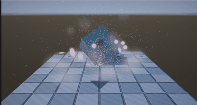
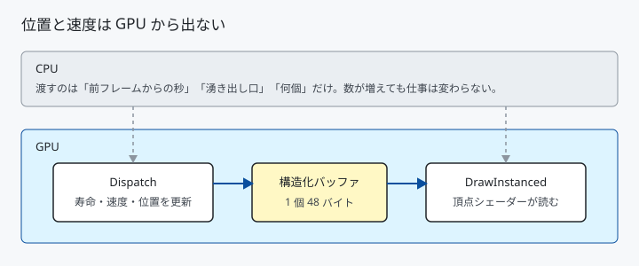
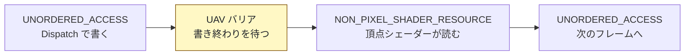
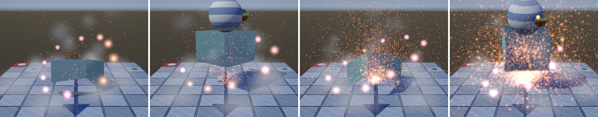

# 29. GPU パーティクル — 位置を CPU へ戻さない

[27 章](27_半透明とブレンディング.md)の板は CPU が 1 個ずつ位置を計算し、
定数バッファへ詰めて送っていました。定数バッファは 64 KB までなので、
その作りでは **64 個**が上限でした。

計算も置き場も GPU へ移すと、上限が消えます。



---

## 1. 何が変わるか



| | 27 章の板 | GPU パーティクル |
|---|---|---|
| 位置を持つ場所 | CPU のメモリ | GPU の構造化バッファ |
| 1 フレームの計算 | CPU のループ | `Dispatch` 1 回 |
| CPU が渡すもの | 全個体の位置と色 | 経過秒・湧き出し口・個数 |
| 個数の上限 | 64（定数バッファ 64 KB）| メモリが許すだけ |

**位置と速度は、一度も CPU へ戻りません。**
CPU が知っているのは「何個いるか」だけです。

---

## 2. 構造化バッファ

```cpp
bufferDesc.Dimension = D3D12_RESOURCE_DIMENSION_BUFFER;
bufferDesc.Width     = sizeof(GpuParticle) * kMaxParticles;
bufferDesc.Format    = DXGI_FORMAT_UNKNOWN;   // バッファは形式を持たない
bufferDesc.Layout    = D3D12_TEXTURE_LAYOUT_ROW_MAJOR;
bufferDesc.Flags     = D3D12_RESOURCE_FLAG_ALLOW_UNORDERED_ACCESS;
```

テクスチャではなく**ただの配列**です。
`Format` は `UNKNOWN`、要素の大きさは**ビュー**のほうで指定します。

```cpp
uavDesc.Buffer.NumElements         = kMaxParticles;
uavDesc.Buffer.StructureByteStride = sizeof(GpuParticle);
```

`StructureByteStride` を入れると「構造化バッファ」、
0 のままだと「型なしバッファ」になります。

### 同じバッファに 2 つのビュー

| ビュー | 使う場面 | HLSL |
|--------|---------|------|
| UAV (`u0`) | 更新（書き込む）| `RWStructuredBuffer<GpuParticle>` |
| SRV (`t0`) | 描画（読むだけ）| `StructuredBuffer<GpuParticle>` |

深度バッファ（[28 章](28_ソフトパーティクル.md)）と同じ考え方です。
**リソースは 1 つ、見方が 2 つ**です。

### 初期化は要らない

```cpp
DX_CHECK(device->CreateCommittedResource(..., D3D12_RESOURCE_STATE_UNORDERED_ACCESS,
                                         nullptr, IID_PPV_ARGS(&m_particleBuffer)));
```

**`CreateCommittedResource` で作ったリソースの中身は 0 で埋められています。**
寿命が 0 になるので、最初の更新で全部が湧き出し口から生まれ直します。
アップロード用のバッファも転送コマンドも書かずに済みました。

---

## 3. コンピュートシェーダー

```hlsl
#define THREAD_GROUP_SIZE 64

[numthreads(THREAD_GROUP_SIZE, 1, 1)]
void CSMain(uint3 dispatchThreadId : SV_DispatchThreadID)
{
    uint index = dispatchThreadId.x;

    if (index >= (uint)g_timing.z) { return; }
    ...
}
```

`SV_DispatchThreadID` が「自分は何番目か」です。
そのまま配列の添字に使えます。

### スレッド数とグループ数

```cpp
const uint32_t groupCount = (count + kThreadGroupSize - 1) / kThreadGroupSize;
commandList->Dispatch(groupCount, 1, 1);
```

`Dispatch` が指定するのは**グループの数**で、スレッドの数ではありません。
1 グループのスレッド数はシェーダー側の `numthreads` が決めます。

64 にしているのは、ハードウェアが 32 か 64 単位で動くからです。
**半端な数にすると、余ったレーンが何もせずに待ちます。**

切り上げたぶん、最後のグループには「いない番号」が混じります。
`if (index >= 総数) return;` を必ず書きます。**これが無いと、
確保していない領域へ書き込みます。**

### CPU から渡すのは 3 つだけ

```cpp
updateConstants.timing  = { deltaTime, time, (float)count, 0.0f };
updateConstants.emitter = { emitter.x, emitter.y, emitter.z, kInitialSpeed };
updateConstants.gravity = { 0.0f, kGravity, 0.0f, kFloorLevel };
```

個数が 1024 でも 262144 でも、この 3 行は変わりません。

---

## 4. 順番を守らせる

`Dispatch` と、その後の描画は**自動では順番が守られません**。

```cpp
D3D12_RESOURCE_BARRIER uavBarrier = {};
uavBarrier.Type          = D3D12_RESOURCE_BARRIER_TYPE_UAV;
uavBarrier.UAV.pResource = m_particleBuffer.Get();
commandList->ResourceBarrier(1, &uavBarrier);
```

**UAV バリア**は状態を変えません。
「書き終わってから次を始めろ」とだけ伝えます。

そのうえで、読める状態へ移します。



`NON_PIXEL_SHADER_RESOURCE` なのは、**頂点**シェーダーが読むからです。
ピクセルシェーダーが読むなら `PIXEL_SHADER_RESOURCE` になります。

---

## 5. 描くのは 1 命令

```cpp
commandList->IASetVertexBuffers(0, 0, nullptr);
commandList->DrawInstanced(kVerticesPerQuad, count, 0, 0);
```

頂点バッファは使いません。
頂点シェーダーが `SV_InstanceID` で構造化バッファを引きます。

```hlsl
StructuredBuffer<GpuParticle> g_particles : register(t0);

VSOutput VSMain(uint vertexId : SV_VertexID, uint instanceId : SV_InstanceID)
{
    GpuParticle particle = g_particles[instanceId];
    ...
}
```

**何個でも命令は 1 つ**です。ここが定数バッファ方式との決定的な差です。

---

## 6. 測る



左から 4096・16384・65536・262144 個です。

垂直同期を切って（`T` キー）、`H` キーで個数を変えながら 8 秒ずつ測りました。
中央値です。

| 個数 | 大きい粒 | 小さい粒 |
|------|---------|---------|
| 切 | 0.34 ms | 0.22 ms |
| 1024 | — | 0.26 ms |
| 4096 | 0.28 ms | 0.30 ms |
| 16384 | 0.34 ms | 0.24 ms |
| 65536 | 0.49 ms | 0.29 ms |
| 262144 | 0.92 ms | 0.54 ms |

### 分かったこと 1 : 6 万個までは、測っても差が出ない

65536 個まではフレーム間のばらつき（±0.05 ms）に埋もれました。
**262144 個で初めてはっきり測れました。**

「GPU パーティクルは速い」ではなく、
**この規模では数がボトルネックにならない**というのが正確な言い方です。

### 分かったこと 2 : 効くのは個数ではなく、塗る面積

2 つの列は、粒の半径だけが違います（0.035〜0.080 と 0.013〜0.033）。
**計算の量はまったく同じ**です。

差を「切」の値からの増分で見ると、こうなります。

| 個数 | 大きい粒 | 小さい粒 |
|------|---------|---------|
| 65536 | +0.15 ms | +0.07 ms |
| 262144 | +0.58 ms | +0.32 ms |

半径をおよそ半分（面積で 1/4）にすると、増分もおよそ半分になりました。
**コストは更新ではなく、加算合成で塗るピクセルの数**にあります。

粒を小さくするか、重なりを減らすほうが、
更新の最適化よりずっと効くということです。

---

## 7. つまずきやすい点

### `SetComputeRootSignature` と `SetGraphicsRootSignature` は別物

```cpp
commandList->SetComputeRootSignature(m_computeRootSignature.Get());
commandList->SetComputeRootConstantBufferView(0, ...);
```

グラフィックス用と取り違えても**警告なく通り、値だけが届きません**。
`Compute` が付くほうを使います。

`SetPipelineState` は共通ですが、コンピュート PSO を設定した時点で
グラフィックスの PSO は外れます。描画の前に設定し直します。

### 頂点シェーダーが読むなら `SHADER_VISIBILITY_VERTEX`

```cpp
graphicsParameters[1].ShaderVisibility = D3D12_SHADER_VISIBILITY_VERTEX;
```

`PIXEL` にすると **PSO の生成が黙って失敗**します。
[26 章](26_ディゾルブ.md)でも同じ場所で嵌まりました。

### `deltaTime` に上限を付ける

```cpp
const float clampedDelta = (deltaTime > 0.05f) ? 0.05f : deltaTime;
```

ウィンドウを動かした直後などに 1 フレームで数秒進むと、
パーティクルが一斉に画面外へ飛びます。
**時間で動く仕組みは、必ず上限を付けます。**

### 乱数の種に添字だけを使わない

```hlsl
float seed = (float)index * 1.618f + floor(time * 60.0f) * 0.017f;
```

添字だけだと、何度生き返っても毎回まったく同じ軌道になります。
時刻を混ぜると、生まれるたびに別の方向へ飛びます。

---

## 8. ここから先へ

| やりたいこと | 要るもの |
|------------|---------|
| 湧く数を制御する | `AppendStructuredBuffer` とカウンタ |
| 奥から手前へ並べ替える | GPU 上のソート（バイトニックソート）|
| 描く数を GPU が決める | `ExecuteIndirect` と引数バッファ |
| 他の物とぶつける | 深度バッファを読んで衝突判定 |
| 見えないものを描かない | コンピュートで視錐台カリング |

---

## 参照

- [27 半透明とブレンディング](27_半透明とブレンディング.md) — 定数バッファ方式の板
- [28 ソフトパーティクル](28_ソフトパーティクル.md) — 深度の読み方
- [ID3D12GraphicsCommandList::Dispatch | Microsoft Learn](https://learn.microsoft.com/en-us/windows/win32/api/d3d12/nf-d3d12-id3d12graphicscommandlist-dispatch)
- [D3D12_RESOURCE_BARRIER_TYPE | Microsoft Learn](https://learn.microsoft.com/en-us/windows/win32/api/d3d12/ne-d3d12-d3d12_resource_barrier_type)
- [構造化バッファ | Microsoft Learn](https://learn.microsoft.com/en-us/windows/win32/direct3d11/direct3d-11-advanced-stages-cs-resources)
