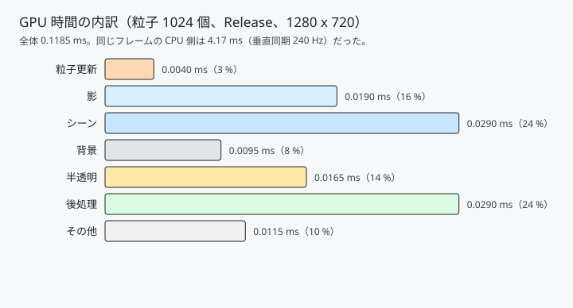
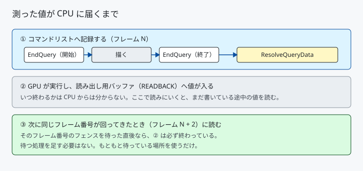

# 30. GPU の時間を測る — タイムスタンプクエリ

[29 章](29_GPUパーティクル.md)で、パーティクルの数を変えても
フレーム時間がほとんど動かない、という結果になりました。

原因は「速かったから」ではなく、**測っていたものが違ったから**です。
CPU 側のフレーム時間には、GPU の待ち時間も垂直同期も表示の間隔も入っています。
その中に埋もれた 0.02 ミリ秒は、見えるはずがありません。

GPU の中の時間は、GPU に聞きます。

---

## 1. どれくらい違うのか

同じフレームを両側から測ると、こうなります。

| 測ったもの | 値 |
|---|---|
| CPU のフレーム時間（垂直同期あり、240 Hz）| **4.17 ms** |
| GPU が実際に動いた時間 | **0.1185 ms** |

**35 倍の開きがあります。** 残りは待ち時間です。
フレーム時間を見ている限り、GPU 側の変化は 1 % 未満の揺らぎにしか見えません。



パスごとに分けると、シーンと後処理がそれぞれ 4 分の 1 ずつを占めていました。
**後処理がシーン描画と同じくらい重い**のは、測るまで分かりませんでした。

「その他」はパスの合計と全体の差で、パスに挟まれたバリアや
描画先の切り替えに使われた時間です。

---

## 2. タイムスタンプクエリ

```cpp
commandList->EndQuery(m_queryHeap.Get(), D3D12_QUERY_TYPE_TIMESTAMP, index);
```

「この位置を GPU が通過した時刻を、クエリヒープの `index` 番へ書け」
という命令です。前後 2 か所で打ち、その差が経過時間になります。

> **`BeginQuery` はありません。開始も終了も `EndQuery` で打ちます。**
> オクルージョンクエリのような「区間を囲む」種類とは違い、
> タイムスタンプは**その一点の時刻を書く 1 回きりの命令**だからです。
> `BeginQuery` を呼ぶとデバッグレイヤーに叱られます。

### 刻みを秒に直す

```cpp
commandQueue->GetTimestampFrequency(&m_ticksPerSecond);
```

タイムスタンプの単位は「刻み」で、1 秒が何刻みかは**キューごとに違います**。
この値で割って初めて秒になります。手元の環境では約 1 GHz でした。

コピーキューは別扱いで、対応しているかを
`D3D12_FEATURE_D3D12_OPTIONS3` で確かめる必要があります。

---

## 3. 値が CPU に届くまで



### Resolve を忘れない

```cpp
commandList->ResolveQueryData(
    m_queryHeap.Get(), D3D12_QUERY_TYPE_TIMESTAMP,
    startIndex, kQueriesPerFrame,
    m_readbackBuffer.Get(), sizeof(uint64_t) * startIndex);
```

クエリヒープは CPU から直接読めません。
**この命令でバッファへ移して初めて読めます。**
打ちっぱなしにすると、クエリは正しく動いているのに何も読めません。

移し先は `D3D12_HEAP_TYPE_READBACK` のバッファです。
アップロード用ヒープ（CPU が書き、GPU が読む）のちょうど逆で、
GPU が書き、CPU が読みます。状態は `COPY_DEST` のまま変わりません。

### いつ読むか

```cpp
m_commandQueue.WaitForFenceValue(m_frameFenceValues[frameIndex]);
...
m_gpuTimer.Collect(frameIndex);   // ★ 待ったあと
```

**そのフレーム番号のフェンスを待った直後**に読みます。
このプロジェクトはバックバッファが 2 枚なので、
読めるのは 2 フレーム前の値です。

待つ処理を新しく足す必要はありません。
[05 章](05_GPUへの命令と同期.md)で入れた「アロケータが空くのを待つ」処理が、
そのまま「値が書き終わるのを待つ」処理を兼ねています。

**専用に待つと計測が計測を壊します。** GPU が終わるまで CPU を止めるので、
本来あるはずの並行動作が消えてしまいます。

### 読む範囲を渡す

```cpp
const D3D12_RANGE readRange  = { begin, end };
const D3D12_RANGE writeRange = { 0, 0 };   // CPU からは何も書かない

m_readbackBuffer->Map(0, &readRange, &mapped);
...
m_readbackBuffer->Unmap(0, &writeRange);
```

`Map` に「ここしか読まない」、`Unmap` に「どこも書いていない」と伝えます。
これを守ると、ドライバは余計な同期やキャッシュの掃除を省けます。

---

## 4. 29 章の測定をやり直す

垂直同期を切り、`H` キーで粒子の数を変えながら 8 秒ずつ測りました。中央値です。

| 個数 | 更新（コンピュート）| 描画（半透明パス）| GPU 全体 |
|------|------|------|------|
| 切 | 0.0040 ms | 0.0070 ms | 0.0750 ms |
| 1024 | 0.0040 | 0.0160 | 0.1160 |
| 4096 | 0.0040 | 0.0170 | 0.1050 |
| 16384 | 0.0050 | 0.0410 | 0.1510 |
| 65536 | 0.0095 | 0.0845 | 0.2040 |
| 262144 | **0.0660** | **0.2270** | 0.3840 |

### 分かったこと 1 : 見えなかったものが見える

29 章では 65536 個までフレーム時間の揺らぎに埋もれていました。
GPU 時間で見ると、**16384 個の時点で半透明パスが 6 倍**（0.007 → 0.041 ms）に
なっているのがはっきり出ます。

数値が小さくて役に立たない、という話ではありません。
**16384 個を 4 回描けば 0.16 ms** で、60 Hz の予算 16.7 ms の 1 % です。
積み上がる前に気付けるかどうかが違います。

### 分かったこと 2 : 描画が更新より 3.4 倍重い

262144 個で、更新 0.066 ms に対して描画 0.227 ms。
29 章では「粒を小さくしたら増分も半分になった」という**間接的な証拠**から
塗る面積が効いていると推測しましたが、今度は直接読めます。

**最適化するなら描画側です。** 更新を半分にしても全体は 1 割も縮みません。

### 分かったこと 3 : コンピュートは途中まで数に比例しない

更新の時間は 1024 個から 16384 個までほぼ横ばい（0.004 → 0.005 ms）で、
65536 個から急に伸びます。

**少ないうちは、起動の手間だけで時間が決まっている**からです。
64 スレッドのグループを 16 個走らせても 256 個走らせても、
GPU の演算器は埋まりきりません。

---

## 5. つまずきやすい点

### フレーム全体を測ると、パスの合計と合わない

内訳の「その他」9.7 % がそれです。
バリア、描画先の切り替え、クエリ自身の書き込みが入ります。

**合わないのが正常**です。合うように調整しようとすると、
測っていない区間を無いことにしてしまいます。

### 打っていない区間は 0 になる

パーティクルを切ると、更新の区間は `EndQuery` が 1 度も打たれません。
読み出し用バッファの中身は前回の値のままか 0 のままです。

```cpp
if (endTick <= startTick)
{
    m_milliseconds[i] = 0.0;
    continue;
}
```

引き算が破綻しないよう弾き、表示からも外しています。

### 毎フレーム表示すると、表示が計測を歪める

ログ出力は `OutputDebugStringW` を通るので、決して軽くありません。
FPS と同じ 1 秒間隔でのみ出しています。

```cpp
if (m_frameTimer.ReportedThisFrame())
{
    Log(m_gpuTimer.Format());
}
```

### GPU の時計は途中で変わりうる

省電力のためクロックが変動する環境では、刻みの速さも動きます。
厳密に比べたい場合は
`ID3D12Device::SetStablePowerState` で固定できますが、
**開発者モードでしか呼べず、性能も落ちます。**
ここでは中央値を採ることで対処しました。

---

## 6. ここから先へ

| やりたいこと | 要るもの |
|------------|---------|
| 画面に出す | 文字の描画（テクスチャアトラスか ImGui）|
| 履歴をグラフにする | 直近 N フレームを溜めて折れ線で描く |
| もっと細かく測る | パスの中をさらに区切る。ただし刻み自体に費用がある |
| CPU 側も測る | 記録にかかった時間を `QueryPerformanceCounter` で |
| 本格的に調べる | PIX on Windows。1 描画命令ごとの内訳まで見える |

---

## 参照

- [05 GPU への命令と同期](05_GPUへの命令と同期.md) — フェンスと待ちの仕組み
- [29 GPU パーティクル](29_GPUパーティクル.md) — 測り直した対象
- [ID3D12GraphicsCommandList::EndQuery | Microsoft Learn](https://learn.microsoft.com/en-us/windows/win32/api/d3d12/nf-d3d12-id3d12graphicscommandlist-endquery)
- [ID3D12CommandQueue::GetTimestampFrequency | Microsoft Learn](https://learn.microsoft.com/en-us/windows/win32/api/d3d12/nf-d3d12-id3d12commandqueue-gettimestampfrequency)
- [Queries | Microsoft Learn](https://learn.microsoft.com/en-us/windows/win32/direct3d12/queries)
