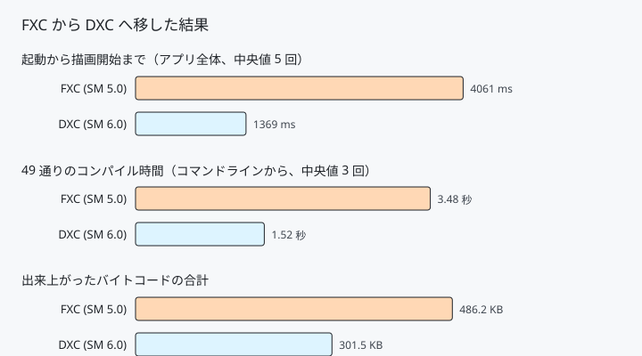

# 31. DXC とシェーダーモデル 6 — コンパイラを載せ替える

ここまで、HLSL は `D3DCompileFromFile`（FXC）でコンパイルしていました。
**FXC はシェーダーモデル 5.1 で止まっています。**
Wave 命令もビンドレスもメッシュシェーダーも、この先はすべて
シェーダーモデル 6 以降で、DXC でしか通りません。

コンパイラを DXC へ載せ替えます。

---

## 1. 何が変わるか

| | FXC | DXC |
|---|---|---|
| 出力 | DXBC | **DXIL**（LLVM 由来の中間表現）|
| シェーダーモデル | 〜 5.1 | **6.0 〜** |
| 設定の渡し方 | フラグの数値 | **コマンドラインの文字列** |
| ファイルを開く | コンパイラがやる | **呼び出し側がやる** |
| 配布 | Windows に同梱 | **DLL を 2 つ持ち歩く** |



起動が **4061 ms → 1369 ms** になりました。**2.7 秒の短縮**です。
このプロジェクトは 51 本のシェーダーを起動時にコンパイルするので、
そのぶんがそのまま効きます。

---

## 2. 呼び出し方

```cpp
DX_CHECK(::DxcCreateInstance(CLSID_DxcUtils,    IID_PPV_ARGS(&utils)));
DX_CHECK(::DxcCreateInstance(CLSID_DxcCompiler, IID_PPV_ARGS(&compiler)));
DX_CHECK(utils->CreateDefaultIncludeHandler(&includeHandler));
```

`DxcCreateInstance` は COM の `CoCreateInstance` に似ていますが別物で、
`dxcompiler.dll` が公開している独自の生成関数です。

> **この 3 つは 1 度だけ作って使い回します。**
> 生成は安くありません。51 本ぶん作り直すと、その回数だけ損をします。

### ファイルは自分で読む

```cpp
ComPtr<IDxcBlobEncoding> source;
utils->LoadFile(filePath.c_str(), nullptr, &source);

DxcBuffer sourceBuffer = {};
sourceBuffer.Ptr      = source->GetBufferPointer();
sourceBuffer.Size     = source->GetBufferSize();
sourceBuffer.Encoding = DXC_CP_ACP;   // 先頭の BOM から自動判別
```

FXC の `D3DCompileFromFile` はパスを渡せば開いてくれました。
DXC は「メモリ上のバイト列」を受け取る作りなので、
読み込みは呼び出し側の仕事です。

### 設定はコマンドライン

```cpp
arguments.push_back(L"-E");  arguments.push_back(entryPoint);
arguments.push_back(L"-T");  arguments.push_back(target);
arguments.push_back(DXC_ARG_WARNINGS_ARE_ERRORS);     // -WX
```

`dxc.exe` に打つのと同じ文字列を、そのまま配列で渡します。
**手元で `dxc.exe` を叩いて確かめた設定が、そのままコードに移せます。**
今回の移行でも、まず `dxc.exe` で 49 通り全部を試してから実装しました。

> **行列の並びは指定しません。** HLSL の既定は列優先で、FXC も同じです。
> C++ 側が `XMMatrixTranspose` してから渡しているのは、その前提に合わせるためです。
> ここで `-Zpr`（行優先）を足すと**同じ行列が転置されて解釈されます**。
> 詳しくは 5 節の「移行でつまずいた点」を参照してください。

### 成否は戻り値ではなく結果に聞く

```cpp
compiler->Compile(...);   // ★ これは失敗しても S_OK を返す

HRESULT status = S_OK;
result->GetStatus(&status);
if (FAILED(status)) { /* コンパイルエラー */ }
```

**`Compile` の戻り値だけ見ていると、文法エラーを見逃します。**
戻り値は「コンパイラを呼べたか」であって「通ったか」ではありません。

---

## 3. DLL を 2 つ持ち歩く

`dxcompiler.dll` と `dxil.dll` は Windows に入っていません。
Windows SDK の `bin\<版>\x64` から exe の隣へコピーします。

```xml
<PostBuildEvent>
  <Command>xcopy /D /Y "$(WindowsSdkDir)bin\$(TargetPlatformVersion)\x64\dxcompiler.dll" "$(OutDir)"
xcopy /D /Y "$(WindowsSdkDir)bin\$(TargetPlatformVersion)\x64\dxil.dll" "$(OutDir)"</Command>
</PostBuildEvent>
```

`dxil.dll` は**署名**に使います。DXIL には署名が要り、
未署名のシェーダーは D3D12 が受け取りません
（開発者モードなら通りますが、配布物では通りません）。
`dxcompiler.dll` は隣に `dxil.dll` があれば自動で署名します。

---

## 4. GPU が対応しているか確かめる

```cpp
D3D12_FEATURE_DATA_SHADER_MODEL data = {};
data.HighestShaderModel = D3D_SHADER_MODEL_6_7;

device->CheckFeatureSupport(D3D12_FEATURE_SHADER_MODEL, &data, sizeof(data));
```

**高いほうから順に聞き、成功するまで下げます。**
対応していない値を渡すと `E_INVALIDARG` が返ります。
ランタイムが知らない新しい値でも同じく失敗するので、この形になります。

返ってくる `HighestShaderModel` は「実際に使える最大値」で、
渡した値とは限りません。手元の RTX 4070 Ti では 6.7 でした。

このプロジェクトは **6.0** を使います。DXIL の最初の版で、
DirectX 12 対応の GPU なら広く通ります。

---

## 5. 移行でつまずいた点

### HLSL 2021 で `?:` の意味が変わった

移行して最初に出たエラーがこれでした。

```hlsl
// FXC では通る。DXC（HLSL 2021）ではエラー。
return (color <= 0.04045f) ? (color / 12.92f)
                           : pow((color + 0.055f) / 1.055f, 2.4f);
```

```
error: condition for short-circuiting ternary operator must be scalar,
       for non-scalar types use 'select'
```

`color` は `float3` なので、条件もベクトルです。
**「短絡評価される演算子なのに、成分ごとに違う枝を通る」という矛盾**を
抱えていたため、HLSL 2021 で明示的な関数へ分けられました。

```hlsl
return select(color <= 0.04045f,
              color / 12.92f,
              pow((color + 0.055f) / 1.055f, 2.4f));
```

`select` は 3 つとも必ず評価します。短絡はしません。
`-HV 2018` を渡せば古い意味のままにもできますが、
新しい書き方へ寄せるほうが先々で楽です。

この 1 か所を直すだけで、習作 33 本すべてが通りました。

### `-Zpr` を足して、絵を静かに壊した

**最初の版はこれを取り込んだまま公開してしまいました。**

移行のとき「FXC と揃えるつもり」で `-Zpr`（行優先の行列）を渡しました。
これが誤りでした。FXC の既定も**列優先**で、C++ 側は
`XMMatrixTranspose` してから渡しています。行優先に変えると、
同じ行列が転置されて解釈されます。

厄介なのは、**それでも絵は出る**ことです。

| | 見え方 |
|---|---|
| 正しい | 床の格子を上から見下ろし、立方体と球が中央に立つ |
| `-Zpr` あり | カメラが地面すれすれ。床は横倒し、物体は平たく潰れる |

「カメラの初期位置を変えたかな」で済ませてしまえる程度には、
それらしい絵が出ます。落ちもせず、警告も出ません。

#### なぜ確認をすり抜けたか

6 節で「絵は変わったか」を 1 ピクセルずつ比べ、
最大の差が 1/255 であることを確かめました。**その確認は無意味でした。**

比べたのは習作 01 番です。習作は画面いっぱいの三角形 1 枚で、
**行列を 1 つも使いません**。行列の壊れようがない絵を選んで、
「絵は変わっていない」と結論していました。

比べやすいものを選んだ結果、**壊れた場所だけが比較から漏れていました**。
確認は「変わらないはずのもの」ではなく、
**「変わったら困るもの」**に対して行う必要があります。


**これがいちばん時間を使いました。**

シェーダーが 1 本も通らないのに、ログには何も出ず、
終了コードも取れないまま落ちる。原因はコンパイラではなく、
**エラーメッセージの出し方**でした。

このアプリは `main` で `_setmode(_fileno(stdout), _O_U8TEXT)` を呼び、
標準出力をワイド文字専用にしています。そこへ `printf`（ナロー）を
混ぜると不正パラメータとして扱われ、**何も表示せずにプロセスが終わります**。

コンパイルエラーがいちばん知りたい場面で、それが起きていました。

```cpp
// 直す前
::printf("%s\n", errors->GetStringPointer());

// 直したあと（UTF-8 → ワイドへ変換してから既存のログへ）
LogError(ToWide(errors->GetStringPointer()));
```

いまはファイル名と行と列まで出ます。

```
[ERROR] ...\shaders\lab\01_uv.hlsl:83:25: error: use of undeclared identifier 'notdefined'
```

FXC 時代から同じコードでしたが、**エラーが起きなくなって久しかったため
気付きませんでした**。失敗の道は、たまに通らないと錆びます。

---

## 6. 測る

### 速さと大きさ

49 通りのシェーダーを、コマンドラインから 3 回ずつコンパイルした中央値です。

| | 時間 | バイトコード合計 |
|---|---|---|
| FXC (SM 5.0) | 3.48 秒 | 486.2 KB |
| DXC (SM 6.0) | **1.52 秒** | **301.5 KB** |

**2.3 倍速く、38 % 小さく**なりました。
ただしこれは 49 回のプロセス起動を含む値で、起動の手間も入っています。

アプリの中で測ると、51 本を **607 ms** でコンパイルしていました。
道具を作り直さずに使い回しているぶん、こちらのほうが速く出ます。

### 絵は変わったか

コンパイラを替えると、最適化のしかたが変わり、
浮動小数の丸めも変わりえます。**変わっていないか確かめます。**

時間に依存しない習作（01 番）を両方のビルドで撮り、
1 ピクセルずつ比べました。

| | 結果 |
|---|---|
| 最大の差 | **1 / 255** |
| 差のあるピクセル | 246 / 883,200（**0.028 %**）|

**最下位ビットの丸めだけ**で、目で見て分かる違いはありません。
今回書き換えた `SrgbToLinear` を通る絵なので、
`select` への置き換えが結果を変えていないことも同時に確かめられます。

> **この確認だけでは足りませんでした。** 習作は行列を使わないため、
> 行列の設定を間違えても差が出ません。実際にそれで
> `-Zpr` の誤りを見逃しています（5 節）。
> **3D のシーンそのものを比べる必要がありました。**

> **時間で動く習作では比べられません。** 02 番で比べたら 1.3 % の
> ピクセルに差が出ましたが、これはアニメーションの位相差です。
> 比較には**時間に依存しないもの**を選ぶ必要があります。

---

## 7. ここから先へ

シェーダーモデル 6 に上がったことで、次のものが視野に入ります。

| やりたいこと | 要るもの |
|------------|---------|
| Wave 命令（`WaveActiveSum` など）| SM 6.0。同じ波の中で値をまとめる |
| 16 bit 浮動小数（`half`）| SM 6.2 と `-enable-16bit-types` |
| ビンドレス（`ResourceDescriptorHeap`）| SM 6.6 |
| メッシュシェーダー | SM 6.5 |
| レイトレーシング | SM 6.3 と DXR |
| 事前コンパイル（`.cso` を配る）| ビルド時に `dxc.exe` を呼ぶ |

---

## 参照

- [06 三角形を描く](06_三角形を描く.md) — FXC 時代のコンパイル
- [DirectXShaderCompiler | GitHub](https://github.com/microsoft/DirectXShaderCompiler)
- [HLSL 2021 の変更点 | GitHub](https://github.com/microsoft/DirectXShaderCompiler/wiki/HLSL-2021)
- [Using dxc.exe and dxcompiler.dll | GitHub](https://github.com/microsoft/DirectXShaderCompiler/wiki/Using-dxc.exe-and-dxcompiler.dll)
- [D3D12_FEATURE_DATA_SHADER_MODEL | Microsoft Learn](https://learn.microsoft.com/en-us/windows/win32/api/d3d12/ns-d3d12-d3d12_feature_data_shader_model)
