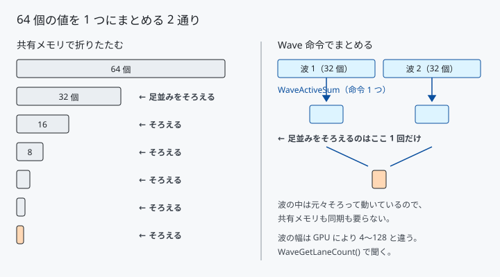
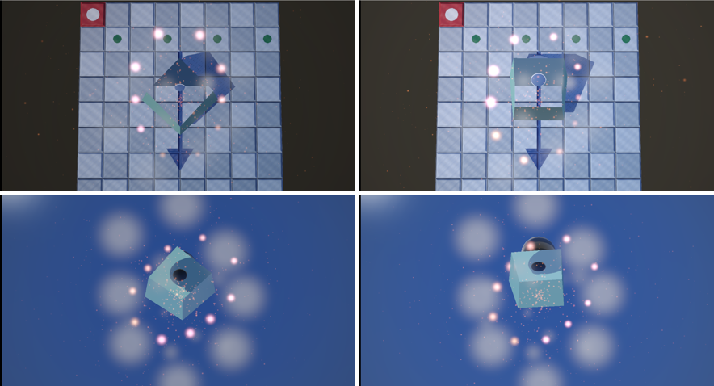

# 32. 自動露出と Wave 命令 — 何万ピクセルを 1 つの値にまとめる

[25 章](25_ポストプロセス.md)の露出は手で決めた固定値でした。

```cpp
constexpr float kExposure = 1.0f;
```

場面の明るさが変われば、この値も変える必要があります。
**画面を測って自動で決めます。**

測るには「何万ピクセルの平均」を求めなければなりません。
これが**並列リダクション**で、[31 章](31_DXCとシェーダーモデル6.md)で
使えるようになった**シェーダーモデル 6 の Wave 命令**が効く場面です。

---

## 1. 露出を GPU の中だけで決める


**露出の値は CPU へ戻りません。** GPU が測り、GPU が使います。
CPU へ読み戻すと、少なくとも 1 フレーム待つことになります。

---

## 2. なぜ対数で平均するか

```hlsl
float ToLogLuminance(float3 color)
{
    const float luminance = max(Luminance(color), 1e-5f);
    return clamp(log2(luminance), g_range.x, g_range.y);
}
```

明るさは桁で効きます。線形のまま平均すると、
**画面のごく一部の強い光に全体が引きずられます**。

これは後で実測でも確認できました（6 節）。

---

## 3. 整数でしか足せない

```hlsl
g_state.InterlockedAdd(0, ToFixedPoint(groupSum / THREADS) * THREADS, ignored);
```

`InterlockedAdd` は**整数にしか使えません**。
対数輝度（−10 〜 +6）を 256 倍して整数にしてから足します。

> **桁あふれに注意します。** 1 点あたり最大 (6 + 10) × 256 = 4096。
> 1280 × 720 を全部測ると 921,600 点で、最悪 37.7 億。
> `uint` の上限 42.9 億のすぐ手前です。倍率を上げると溢れます。

足し込むのは**グループの代表 1 スレッドだけ**です。
全スレッドでやると、衝突が 64 倍になります。

---

## 4. 64 個を 1 つにまとめる 2 通り



### 共有メモリで折りたたむ（従来）

```hlsl
for (uint stride = THREADS / 2; stride > 0; stride >>= 1)
{
    if (groupIndex < stride)
    {
        g_treeSums[groupIndex] += g_treeSums[groupIndex + stride];
    }

    GroupMemoryBarrierWithGroupSync();
}
```

64 → 32 → 16 → … → 1。**毎段で全員の足並みをそろえます。**
64 スレッドなら 6 回です。

### Wave 命令（シェーダーモデル 6）

```hlsl
const float waveSum = WaveActiveSum(logLuminance);

if (WaveIsFirstLane())
{
    g_partialSums[waveIndex] = waveSum;
}

GroupMemoryBarrierWithGroupSync();
```

**波の中は命令 1 つで合計できます。** 共有メモリも同期も要りません。
波の中は元々そろって動いているからです。

残るのは「波ごとの合計」を集める 1 回だけです。

> **波の幅は GPU により 4 〜 128 と違います。**
> 決め打ちにせず `WaveGetLaneCount()` で聞きます。
> 共有メモリの配列は、いちばん狭い 4 でも足りる数を取っておきます。

### 早期 return を挟んではいけない

```hlsl
// ★ これをやると壊れる
if (dispatchThreadId.x >= width) { return; }
```

Wave 命令も `GroupMemoryBarrierWithGroupSync` も、
**全員が到達すること**が前提です。範囲外のスレッドを先に帰すと、
残ったスレッドが永久に待つか、GPU により結果が変わります。

範囲外は「0 を足す」ことにして、最後まで一緒に進ませます。

---

## 5. 同じソースから 2 通りを作る

```cpp
const wchar_t* const kWaveDefine[] = { L"-D", L"USE_WAVE_INTRINSICS=1" };

shader::Bytecode waveShader =
    shader::Compile(shaderPath, L"CSAccumulate", target, kWaveDefine, 2);

shader::Bytecode sharedShader =
    shader::Compile(shaderPath, L"CSAccumulate", target);
```

[31 章](31_DXCとシェーダーモデル6.md)で見たとおり、DXC の設定は
コマンドライン文字列です。`-D` をそのまま渡せば、
**1 本のソースから 2 つの PSO** が作れます。

比べる 2 つが同じファイルにあるので、片方だけ直し忘れる事故が起きません。

---

## 6. 測る

### Wave 命令はどれだけ効くか

垂直同期を切り、動きを止めて、露出パスの GPU 時間を測りました
（[30 章](30_GPUの時間を測る.md)のタイマー、7 秒ずつ、中央値、2 回とも同じ）。

| 測る点 | Wave | 共有メモリ | 差 |
|---|---|---|---|
| 320 × 180（57,600 点）| 0.0060 ms | 0.0060 ms | **なし** |
| 640 × 360（230,400 点）| 0.0070 | 0.0070 | **なし** |
| 1280 × 720（921,600 点）| **0.0110** | **0.0130** | **−15 %** |

**6 万点や 23 万点では差が出ません。** 92 万点で初めて 15 % 縮みました
（この段では 2 回とも範囲が重ならず、Wave 0.0100〜0.0110 に対し
共有メモリ 0.0120〜0.0130）。

差が小さいのには理由があります。1 グループは 8 × 8 = 64 スレッドで、
波の幅が 32 なら**波は 2 つしかありません**。
共有メモリ版の 6 回の同期が 1 回に減るだけです。

グループを 256 スレッドにすれば波は 8 つになり、
8 回の同期が 1 回になるので、差はもっと開きます。
**「Wave 命令は速い」ではなく、「同期の回数が減るぶんだけ速い」**が正確です。

### 自動で決めた露出は妥当か

通常の場面で、手で決めた `kExposure = 1.0f` と比べました。

| | 画面の平均輝度 |
|---|---|
| 固定 1.0 | 101.8 |
| 自動 | 107.1 |

**露出にしておよそ 1.1 倍**です。
手で調整した値と自動で求めた値がほぼ一致しました。

### 見る方向を変える



上が空を見たとき、下が床を見たとき。左が固定 1.0、右が自動です。

| | 固定 1.0 | 自動 |
|---|---|---|
| 空を見る | 89.2 | **112.0** |
| 床を見る | 88.2 | **99.1** |

固定露出では、どちらを向いても同じ露出なので画面の明るさもほぼ同じ
（89.2 と 88.2）です。自動では**向きに応じて別の露出**が選ばれます。

### 対数平均は小さな強い光に動かない

粒を 1024 個から 262,144 個へ増やしても、露出はほとんど変わりませんでした。

| | 平均輝度 | 白飛びした画素 |
|---|---|---|
| 固定 1.0 | 117.0 | 1.99 % |
| 自動 | 117.2 | 2.77 % |

**これは意図どおりです。** 対数平均は、小さく明るい点が大量にあっても
引きずられません（2 節）。線形平均なら、火花が増えるたびに画面全体が
暗くなり、見ていられない絵になります。

裏を返すと、**「まぶしいものが出たから暗くする」用途には向きません**。
それをやりたければ、上位の明るさを見るヒストグラムが要ります。

---

## 7. つまずきやすい点

### バッファの状態を毎フレーム戻す

集計は `UNORDERED_ACCESS`、後処理から読むときは
`PIXEL_SHADER_RESOURCE`。**次のフレームの頭で書ける状態へ戻します。**

初回だけは生成直後の `UNORDERED_ACCESS` なので、戻す必要がありません。
`m_recorded` で見分けています。

### いきなり切り替えない

```hlsl
const float blend = 1.0f - exp(-deltaTime * speed);
const float exposure = lerp(previous, target, blend);
```

目標へ直接飛ばすと、明るい物が横切るたびに画面全体がちらつきます。

`1 - exp(-dt * speed)` は**フレーム時間に依らない補間の割合**です。
`lerp(previous, target, 0.1f)` のような固定値だと、
フレームレートが変わるだけで追従の速さが変わってしまいます。

### 露出に上限と下限を置く

真っ暗な場面では、平均輝度が 0 に近づき、露出が発散します。
`clamp(target, 0.25f, 6.0f)` で止めています。

---

## 8. ここから先へ

| やりたいこと | 要るもの |
|------------|---------|
| まぶしさに反応させる | 輝度ヒストグラム（`InterlockedAdd` を階級ごとに）|
| 差をもっと出す | 1 グループを 256 スレッドにする |
| 目が慣れる表現 | 明→暗と暗→明で追従の速さを変える |
| 露出計を画面に出す | 集計結果を文字か図で描く |
| 波の幅に合わせて最適化 | `WaveGetLaneCount()` で分岐する PSO を用意 |

---

## 参照

- [25 ポストプロセス](25_ポストプロセス.md) — 固定露出とトーンマッピング
- [30 GPU の時間を測る](30_GPUの時間を測る.md) — 測り方
- [31 DXC とシェーダーモデル 6](31_DXCとシェーダーモデル6.md) — Wave 命令が使えるようになった経緯
- [Wave 命令 | Microsoft Learn](https://learn.microsoft.com/en-us/windows/win32/direct3dhlsl/hlsl-shader-model-6-0-features-for-direct3d-12)
- [InterlockedAdd | Microsoft Learn](https://learn.microsoft.com/en-us/windows/win32/direct3dhlsl/interlockedadd)
