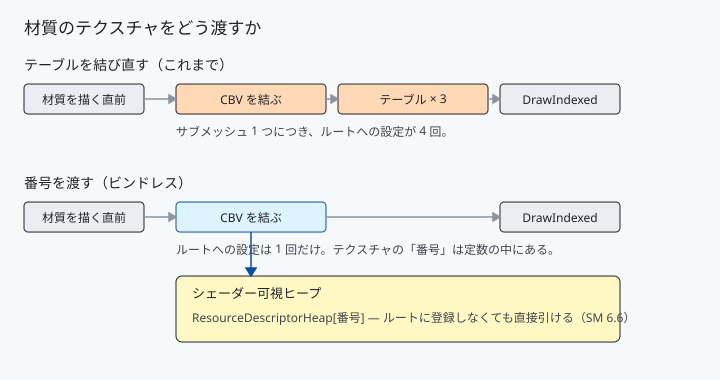

# 33. ビンドレス — テクスチャを「番号」で渡す

材質を描く直前に、こう結び付けていました。

```cpp
commandList->SetGraphicsRootConstantBufferView(kMaterialConstants, address);
commandList->SetGraphicsRootDescriptorTable(kTexture,           textureView);
commandList->SetGraphicsRootDescriptorTable(kMetallicRoughness, metallicView);
commandList->SetGraphicsRootDescriptorTable(kNormalMap,         normalView);
```

**サブメッシュ 1 つにつき 4 回**です。材質が増えるほど、
テクスチャの種類が増えるほど、この行が増えます。

シェーダーモデル 6.6 の**ビンドレス**は、これを 1 回にします。

---

## 1. 何が変わるか



テクスチャの**場所**（ディスクリプタハンドル）を渡す代わりに、
**番号**（ヒープの何番目か）を定数として渡します。

```hlsl
Texture2D MaterialTexture(uint index)
{
    return ResourceDescriptorHeap[NonUniformResourceIndex(index)];
}
```

`ResourceDescriptorHeap` は、いま `SetDescriptorHeaps` で設定している
シェーダー可視ヒープそのものです。**ルートシグネチャに登録しなくても、
番号だけで直接引けます。**

---

## 2. 3 つの手当て

### (1) ルートシグネチャで許可する

```cpp
rootSignatureDesc.Flags =
    D3D12_ROOT_SIGNATURE_FLAG_ALLOW_INPUT_ASSEMBLER_INPUT_LAYOUT |
    D3D12_ROOT_SIGNATURE_FLAG_CBV_SRV_UAV_HEAP_DIRECTLY_INDEXED;
```

このフラグが無いと、番号で引いた時点で不正になります。
**ルートパラメータは 9 個から 6 個へ減りました。**

### (2) 番号を定数に入れる

```cpp
constants.textureIndices[0] = m_textures[baseColor]->DescriptorIndex();
constants.textureIndices[1] = m_textures[metallicRoughness]->DescriptorIndex();
constants.textureIndices[2] = m_textures[normalMap]->DescriptorIndex();
```

`DescriptorHeap::Allocate()` が返していた番号を、
`Texture2D` が覚えておくようにしました。今まで捨てていた値です。

材質の定数は**読み込み後に書き換わらない**ので、この代入も 1 回だけです。

### (3) シェーダーモデルを 6.6 にする

```cpp
constexpr const wchar_t* kBindlessPixelShaderTarget = L"ps_6_6";
```

6.0 では `ResourceDescriptorHeap` という名前自体が通りません。

---

## 3. `NonUniformResourceIndex` を忘れない

```hlsl
return ResourceDescriptorHeap[NonUniformResourceIndex(index)];
```

「**この番号は波の中でそろっていないかもしれない**」と伝える印です。

GPU は 32 個前後のピクセルを 1 つの波としてまとめて処理します。
その波が 2 つの材質にまたがっていると、番号が 2 種類混ざります。
印が無いと、GPU は「全部同じ番号だろう」と決めつけて 1 つだけを読み、
**片方の材質が別のテクスチャで描かれます**。

付けると少し遅くなりますが、**間違った絵より遥かにましです**。
番号が確実にそろっている場面（フレームに 1 つしかない値など）でだけ外します。

---

## 4. 何をビンドレスにしないか

シャドウマップ・環境マップ・積分済み環境光は、**テーブルのまま**残しました。

| | 結び直す頻度 | 扱い |
|---|---|---|
| 材質のテクスチャ | **描くたび** | ビンドレス |
| シャドウマップ・環境マップ | フレームに 1 回 | テーブル |

ビンドレスが効くのは「描くたびに変わる」ものです。
フレームに 1 回しか結ばないものを移しても、減る呼び出しは 1 回です。

**全部をビンドレスにするのが目的ではありません。**

---

## 5. 測る

### ルートへの設定回数

サブメッシュは床 1 個 ＋ モデル 3 個の計 4 個です。

| | 1 サブメッシュあたり | 1 フレーム |
|---|---|---|
| テーブル | 4 回 | 18 回 |
| ビンドレス | **1 回** | **6 回** |

（1 フレームは、オブジェクト定数 2 回 ＋ サブメッシュ 4 個ぶん）

### 記録に掛かる CPU 時間

同じシーンを何回ぶん記録するかを変えて、
`RecordMeshDrawCommands` に掛かる時間を測りました（垂直同期を切り、
動きを止め、7 秒ずつの中央値）。

| 記録の回数 | テーブル | ビンドレス | 削減 |
|---|---|---|---|
| 1 回 | 1.4 us | 1.2 us | 14 % |
| 16 回 | 6.1 us | 4.4 us | **28 %** |
| 256 回 | 74.0 us | 47.6 us | **36 %** |

256 回では、ルートへの設定が 4,608 回から 1,536 回へ減り、
**26.4 マイクロ秒**縮みました。1 回あたりおよそ 9 ナノ秒です。

> **通常のシーン（1 回）では 0.2 マイクロ秒しか変わりません。**
> このシーンはサブメッシュが 4 個しかないので当然です。
> 効いてくるのは、材質が数百・数千に増えたときです。

### 絵は変わっていないか

[31 章](31_DXCとシェーダーモデル6.md)の失敗を踏まえ、
**3D シーンそのもの**を基準画像と比べました。

```
平均差 1.43 / 最大差 143（許容 6.0）
見た目は基準どおりです。
```

`tools/check-render.ps1` が通りました。
テクスチャの渡し方を根本から変えても、出てくる絵は同じです。

---

## 6. つまずきやすい点

### GPU が対応しているか確かめる

```cpp
if (data.HighestShaderModel < D3D_SHADER_MODEL_6_6)
{
    LogError(L"シェーダーモデル 6.6 に対応していません。");
}
```

対応していないと、PSO の生成ではなく**シェーダーのコンパイル**で落ちます。
起動時に分かるようにしておきます。

あわせて `ResourceBindingTier` も出しています。**Tier 3** だと、
ヒープに置けるディスクリプタの数が実質メモリ次第になります。
何千枚ものテクスチャを扱うにはこの段階が要ります。
（手元の RTX 4070 Ti はシェーダーモデル 6.7 / Tier 3）

### 番号は「ヒープの中の位置」

`DescriptorIndex()` が返すのは、**そのヒープの先頭から数えた番号**です。
別のヒープに切り替えたら意味が変わります。
`SetDescriptorHeaps` で設定しているヒープと、
番号を採ったヒープが同じであることが前提です。

### ルートシグネチャが小さくなる利点

ルートシグネチャには大きさの上限（64 DWORD）があります。
ディスクリプタテーブル 1 個で 1 DWORD、ルート定数は 1 個で 1 DWORD。
**テーブルを 3 つ減らせば、その枠を他に回せます。**

速さより、この「枠が空く」ことのほうが実務では効きます。

---

## 7. ここから先へ

| やりたいこと | 要るもの |
|------------|---------|
| 頂点バッファもビンドレスに | `ResourceDescriptorHeap` から `ByteAddressBuffer` を引く |
| 材質をまとめて 1 本の構造化バッファに | 材質番号だけをルート定数で渡す |
| 描画命令を GPU が組み立てる | `ExecuteIndirect` とビンドレスの組み合わせ |
| サンプラーも番号で | `SamplerDescriptorHeap`（同じく SM 6.6）|

---

## 参照

- [09 テクスチャを貼る](09_テクスチャを貼る.md) — ディスクリプタテーブルの基本
- [31 DXC とシェーダーモデル 6](31_DXCとシェーダーモデル6.md) — 6.6 を使えるようにした経緯
- [Dynamic Resources | Microsoft Learn](https://learn.microsoft.com/en-us/windows/win32/direct3d12/dynamic-resources)
- [NonUniformResourceIndex | Microsoft Learn](https://learn.microsoft.com/en-us/windows/win32/direct3dhlsl/nonuniformresourceindex)
- [D3D12_ROOT_SIGNATURE_FLAGS | Microsoft Learn](https://learn.microsoft.com/en-us/windows/win32/api/d3d12/ne-d3d12-d3d12_root_signature_flags)
