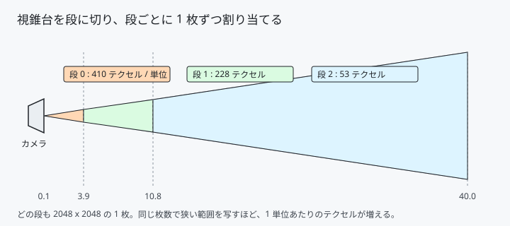
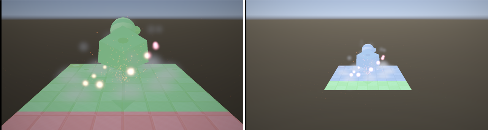

# 34. カスケードシャドウマップ — 手前を細かく、奥を広く

[13 章](13_影を落とす_シャドウマップ.md)の影は、原点を中心とした
**半径 3.6 の球**の中だけに出ていました。

```cpp
constexpr float kSceneRadius = 3.6f;
```

範囲を広げれば遠くまで影が出ますが、同じ 2048 × 2048 で広い範囲を写すので、
**手前の影が粗くなります**。1 枚では、細かさと広さを両立できません。

視錐台を段に切り、段ごとに 1 枚ずつ割り当てます。

---

## 1. 段の切り方



```cpp
const float logarithmic = nearPlane * std::pow(farPlane / nearPlane, ratio);
const float uniform     = nearPlane + (farPlane - nearPlane) * ratio;

m_cascadeSplits[cascade] = uniform + kSplitBlend * (logarithmic - uniform);
```

**等間隔だと手前がすかすかで、対数分割だと手前へ寄りすぎます。**
両者を混ぜるのが定石で、ここでは対数寄りの 0.75 にしました。

手元の設定（近 0.1 / 影の距離 40 / 3 段）で、こうなります。

| 段 | 受け持つ距離 | 包む球の半径 | 1 単位あたりのテクセル |
|---|---|---|---|
| 0 | 0.10 〜 3.90 | 3.81 | **269** |
| 1 | 3.90 〜 10.75 | 9.75 | 105 |
| 2 | 10.75 〜 40.00 | 36.88 | 28 |

> **この表は 1 度書き直しています。** 最初は半径 2.50 / 410 テクセルと
> 書いていましたが、包む球の求め方に誤りがあり、球が視錐台より小さく
> なっていました（8 節）。

---

## 2. 球で包む

段ごとに、その部分の視錐台を包む**球**を求めます。

```cpp
// 8 隅の平均を中心にし、最も遠い隅までを半径にする。
XMVECTOR center = /* 8 隅の平均 */;

for (const XMVECTOR& corner : corners)
{
    radius = std::max(radius, Length(corner - center));
}
```

**箱ではなく球なのが要点です。**
箱で包むと、カメラを回しただけで箱の大きさが変わり、
**影の解像度が変わってちらつきます**。球は回しても大きさが変わりません。

### テクセルの格子に合わせる

```cpp
XMVECTOR shadowOrigin = XMVector3TransformCoord(XMVectorZero(), viewProjection);
shadowOrigin = XMVectorScale(shadowOrigin, m_size * 0.5f);

const XMVECTOR rounded = XMVectorRound(shadowOrigin);
XMVECTOR offset = XMVectorScale(XMVectorSubtract(rounded, shadowOrigin),
                                2.0f / m_size);

projection.r[3] = XMVectorAdd(projection.r[3], /* offset の xy */);
```

カメラが少し動くと、影の格子が「1 テクセルに満たないぶん」ずれます。
そのずれが**影の縁を沸き立たせます**。光源空間で丸めて消します。

---

## 3. テクスチャ配列にする

```cpp
resourceDesc.DepthOrArraySize = static_cast<UINT16>(kCascadeCount);
```

1 枚のテクスチャ配列にして、段の数だけ「層」を持ちます。

| ビュー | 数 | 見方 |
|---|---|---|
| DSV | **段の数** | `TEXTURE2DARRAY` ＋ `FirstArraySlice` で 1 層を指す |
| SRV | **1 個** | `TEXTURE2DARRAY` で配列まるごと |

書くときは層を 1 つずつ指し、読むときは 1 個の SRV から番号で選びます。

```hlsl
Texture2DArray g_shadowMap : register(t1);

lit += g_shadowMap.SampleCmpLevelZero(
    g_shadowSampler, float3(uv + offset, cascade), projected.z);
```

第 1 引数の `z` が「配列の何層目か」です。

---

## 4. どの段を使うか

```hlsl
uint SelectCascade(float3 worldPosition)
{
    float viewDepth = dot(worldPosition - g_cameraPosition.xyz, g_cameraForward.xyz);

    [unroll]
    for (uint i = 0; i < kCascadeCount - 1; ++i)
    {
        if (viewDepth < g_cascadeSplits[i]) { return i; }
    }

    return kCascadeCount - 1;
}
```

カメラの前方向へ測った距離で決めます。
視錐台の切り方と一致するので、無駄が出ません。

### 描くときは段の番号をルート定数で

影のパスは段の数だけシーンを描き直します。
「いま何段目か」を渡すのに、定数バッファを作るのは大げさです。

```cpp
commandList->SetGraphicsRoot32BitConstant(
    kCascadeIndexRootParameterIndex, cascadeIndex, 0);
```

**ルート定数**は 32 ビットの値を直に置きます。値 1 個ならこれがいちばん安く、
[33 章](33_ビンドレス.md)でテーブルを 3 つ減らして空いた枠に収まりました。

---

## 5. 見えないと確かめられない



`C` キーで、使った段を色で塗ります。赤 = 手前、緑 = 中間、青 = 奥。

左が通常の距離、右が引いたところです。
**カメラが動くと段の境目も一緒に動く**ことが見て取れます。

段の切り替わりは、色を塗らないとまず気付けません。
正しく切れているかを確かめる手段を先に用意しておくと、
「なぜか奥だけ影が出ない」といった詰まり方をしなくなります。

---

## 6. 測る

### 手前はどれだけ細かくなったか

比べるべきは、**同じ距離を 1 枚で覆った場合**です。

| | 影の届く距離 | 手前のテクセル / 単位 |
|---|---|---|
| 1 枚で 40 まで覆う | 40 | 28 |
| 3 段に分ける | 40 | **269** |

同じ範囲を同じ大きさの 2048 × 2048 で覆うのに、
**手前の細かさが 9.6 倍**違います。これがカスケードの主張です。


左が 1 段、右が 3 段です。同じ場面・同じ視点で、影の輪郭の締まり方が違います。

> **かつての 1 枚（原点中心・半径 3.6）とは比べません。**
> あれは狭い範囲だけを写して 284 テクセル / 単位を出していました。
> 段 0 の 269 とほぼ同じですが、**カバーする範囲がまるで違います**。
> 数字だけを並べると、あたかも悪くなったように見えてしまいます。

### 影の届く範囲

| | 範囲 |
|---|---|
| これまで | 原点を中心とした半径 3.6 の球（**固定**）|
| いま | カメラの前方 40 まで（**カメラに追従**）|

これまではカメラが原点から離れると影が消えていました。

### 費用

影のパスの GPU 時間です（垂直同期を切り、動きを止めて 7 秒、中央値）。

| | 三角形 1,052 の頃 | 三角形 22,500（[35 章](35_広い場面を作る.md)以降）|
|---|---|---|
| 1 段 | 0.0130 ms | 0.0400 ms |
| 3 段 | 0.0140 ms | **0.0920 ms** |
| 倍率 | +8 % | **2.3 倍** |

三角形が少ないうちは、パス 1 回あたりの固定費（描画先の切り替えとクリア）が
大半を占めるので、段を増やしてもほとんど変わりませんでした。

**場面を広げて三角形を 21 倍にすると、素直に段の数に近づきます。**
「3 倍にはならない」は、あくまで小さすぎた場面での話でした。

### 絵は変わっていないか

```
平均差 1.02 / 最大差 69（許容 6.0）
見た目は基準どおりです。
```

既定のカメラ位置では、影はほぼ段 0 だけで足りるので、絵は変わりません。
[31 章](31_DXCとシェーダーモデル6.md)の失敗以来、
**この確認を通してから次へ進む**ようにしています。

---

## 7. 場面が小さいと効果は出ない

**この章を書いた時点では、効果を絵で示せませんでした。**

床は 5 × 5 しかなく、1 枚の 2048 × 2048 でもう十分だったからです。
引いて撮り比べても、目で分かる差は出ませんでした。

そこで [35 章](35_広い場面を作る.md)で地形と柱を足し、
**効果が現れる場面のほうを用意しました**。上の比較画像と測定値は、
すべてその場面で撮り直したものです。

**仕組みを入れたことと、効果が出ることは別**です。
効果を確かめられない場面しか無いなら、場面のほうを作る必要があります。

---

## 8. つまずきやすい点

### 段の境目が見える

段が変わると解像度が変わるので、境目に線が出ることがあります。
2 つの段の結果を混ぜる（境目付近でブレンドする）と目立たなくなります。
このプロジェクトでは、まず切り替わりが見えるほうを優先しました。

### バリアは段ごとではない

```cpp
m_shadowMap.BeginShadowPass(commandList);   // バリアはここで 1 回
for (cascade...) { m_shadowMap.BeginRender(commandList, cascade); ... }
```

配列まるごと（`ALL_SUBRESOURCES`）を一度に移します。
段ごとに張ると、無駄な待ちが段の数だけ増えます。

### 包む球の中心を、対角 2 隅の中点で求めてはいけない

**最初の実装がこれで、静かに壊れていました。**

```cpp
// ★ 誤り。斜めにずれた球になる。
const XMVECTOR center = (nearCorner + farCorner) * 0.5f;
```

`nearCorner` と `farCorner` は同じ対角線上の隅なので、
その中点は**視錐台の中心軸から外れます**。球が斜めにずれ、
視錐台の一部がはみ出します。

はみ出した所は、**影が落ちなくなるだけ**です。
落ちるべき影が無くても、絵としては成立してしまいます。
1 段だけにして比べたとき、「段数を増やしたほうが影が消える」という
おかしな結果になって、ようやく気付きました。

8 隅を全部作り、その平均を中心にします。

### `kSceneRadius` を消し忘れない

1 枚だった頃の「影を落とす範囲の半径」は、もう意味を持ちません。
`kShadowDistance`（影の届く最大距離）に置き換えました。
名前が残っていると、次に読む人が混乱します。

---

## 9. ここから先へ

| やりたいこと | 要るもの |
|------------|---------|
| 境目を目立たなくする | 2 段の結果を混ぜる |
| 段の数を増やす | `kCascadeCount` と `Mesh.hlsl` の両方を変える |
| 動かない物を描き直さない | 段ごとにキャッシュし、変化した段だけ描く |
| 遠くの影をぼかす | 段ごとに PCF の広さを変える |

---

## 参照

- [13 影を落とす（シャドウマップ）](13_影を落とす_シャドウマップ.md) — 1 枚だった頃
- [33 ビンドレス](33_ビンドレス.md) — ルート定数の枠が空いた経緯
- [Cascaded Shadow Maps | Microsoft Learn](https://learn.microsoft.com/en-us/windows/win32/dxtecharts/cascaded-shadow-maps)
- [D3D12_DSV_DIMENSION | Microsoft Learn](https://learn.microsoft.com/en-us/windows/win32/api/d3d12/ne-d3d12-d3d12_dsv_dimension)
