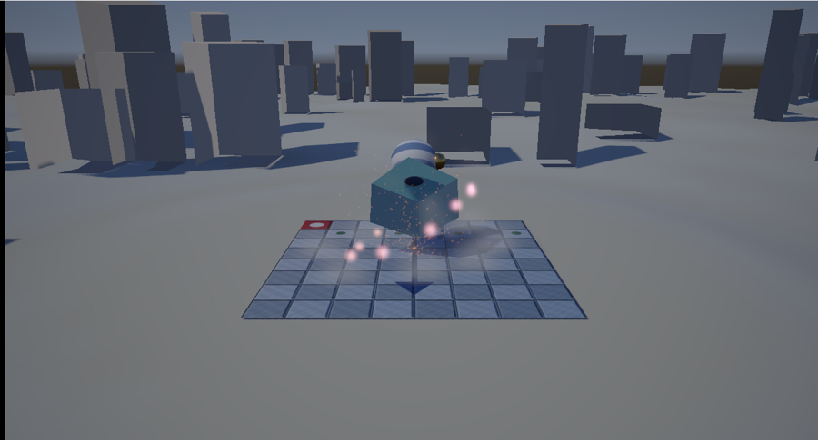
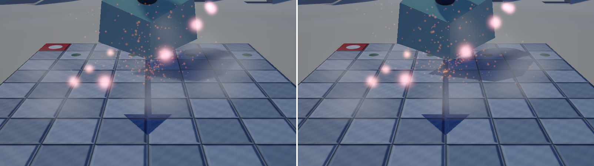

# 35. 広い場面を作る — 効果を確かめられる場を用意する

[34 章](34_カスケードシャドウマップ.md)でカスケードシャドウマップを入れましたが、
**効果を絵で示せませんでした**。

床は 5 × 5 しかなく、1 枚の 2048 × 2048 でもう十分だったからです。
引いて撮り比べても差は出ず、章には「このシーンは小さすぎる」と書いて終わりました。

**仕組みではなく、場面のほうを作ります。**



---

## 1. 何を足したか

| | 三角形 | 役割 |
|---|---|---|
| 地形（120 × 120）| 18,432 | 影を受ける広い地面 |
| 柱 255 本 | 3,060 | 遠くまで影を落とす物 |
| （これまでの床とモデル）| 1,052 | 近景の細かさを見る場所 |
| **合計** | **22,544** | 1,052 の **21 倍** |

**これまでの床とモデルは残しました。**
既存の章の図と地続きにしておかないと、読み比べたときに混乱します。
近くを見れば今までどおり、引けば広がりが見えます。

---

## 2. 地形の高さは 1 か所で決める

```cpp
float TerrainHeight(float x, float z);
```

**地形と柱の両方から呼びます。** 別々の式で高さを求めると、
柱が地面から浮いたり埋まったりします。

```cpp
if (distance <= kFlatRadius)
{
    return kGroundOffset;   // 原点まわりは平ら
}
```

原点のまわりは平らにしてあります。既存の床（5 × 5）と段差を作らないためです。
そこから外へ向けて `smoothstep` でなめらかに起伏へ移します。

高さそのものは fBm（[習作 05](../shader-lab/05_fBmと雲.md)）です。
シェーダーでやっていることを、そのまま C++ で書いただけです。

### ハッシュは CPU 側でも同じ問題を持つ

```cpp
float Hash(float x, float y)
{
    float px = std::fmod(x * 0.1031f, 1.0f);
    ...
}
```

`sin` を使う古い書き方は、値が大きくなると桁が溢れて縞が出ます
（[習作 15](../shader-lab/15_ハッシュの精度.md)）。
これは GPU 特有の話ではありません。同じ考え方を C++ でも使います。

---

## 3. 法線は隣の高さから

```cpp
const float dx = TerrainHeight(x - step, z) - TerrainHeight(x + step, z);
const float dz = TerrainHeight(x, z - step) - TerrainHeight(x, z + step);

vertex.normal[0] = dx / length;
vertex.normal[1] = (2.0f * step) / length;
vertex.normal[2] = dz / length;
```

面ごとに法線を求めて平均するより安く、格子状の地形ではこれで十分です。

Y 成分が `2 * step` なのは、X 方向に `2 * step` 進む間に高さが `dx` 変わる、
という傾きをそのままベクトルにしているからです。

---

## 4. 柱は 1 つのメッシュにまとめる

```cpp
MeshData CreatePillarField(float halfExtent, uint32_t count, float clearRadius);
```

255 本を**別々に描くのではなく、1 つの形状データにまとめます**。

影のパスは段の数だけ描き直すので、
**描画命令の数がそのまま 3 倍になって効いてきます**。
まとめておけば、3 段でも命令は 3 回です。

同じものを何度も描くならインスタンシングですが、
柱は大きさも高さも違うので、まとめるほうが単純でした。

---

## 5. つまずいた点

### 巻き順を間違えて、地形が丸ごと消えた

```cpp
// ★ 誤り。裏面として捨てられる。
mesh.indices.push_back(topLeft);
mesh.indices.push_back(topRight);
mesh.indices.push_back(bottomRight);
```

床と逆向きに並べてしまい、**地形が 1 枚も描かれませんでした**。

厄介なのは、**それでも「地面らしきもの」が見えている**ことです。
背景（スカイボックス）の地面部分が、ちょうど同じような茶色だったので、
「地形は出ているが、暗くて起伏が見えない」と思い込みました。

柱は正しく描かれていて、その上に立っているように見えます。
消えているのが地形だけだと気付くまで、明るさの調整を何度か試しました。

**何も描かれていないことと、暗く描かれていることは、見た目で区別できません。**

### 暗い地面には影が落ちても分からない

最初は地形の頂点色を暗くしていました（明度 0.34 〜 0.64）。
起伏を目立たせるつもりでしたが、**影が落ちても見えません**。

影を見せるための地面なので、床と同じくらい明るくしました（0.58 〜 0.79）。

### 索引は 16 ビット

```cpp
std::vector<uint16_t> indices;
```

地形の分割数は、頂点が 65,536 個を超えない範囲でしか上げられません。
一辺 255 分割が上限です。ここでは 96 分割（9,409 頂点）にしました。

---

## 6. 34 章の測定をやり直す

場面が広がったので、[34 章](34_カスケードシャドウマップ.md)の数値を
すべて取り直しました。

### 影のパスの費用

| | 三角形 1,052 | 三角形 22,544 |
|---|---|---|
| 1 段 | 0.0130 ms | 0.0400 ms |
| 3 段 | 0.0140 ms | **0.0920 ms** |
| 倍率 | +8 % | **2.3 倍** |

34 章では「3 倍にはならない、+8 % だ」と書きました。
**それは場面が小さすぎたからでした。**
三角形を 21 倍にすると、素直に段の数に近づきます。

### 影の細かさ



左が 1 段、右が 3 段。同じ視点で、影の輪郭の締まり方が違います。
**ようやく絵で示せました。**

---

## 7. 見つけた不具合

場面を広げたことで、34 章に入り込んでいた**誤りが 1 つ見つかりました**。

段ごとの視錐台を包む球で、中心を「対角にある 2 隅の中点」で求めていました。
その点は視錐台の中心軸から外れるので、球が斜めにずれ、
**視錐台の一部がはみ出していました**。

はみ出した所には影が落ちません。ところが、
**影が無いことは絵として成立してしまいます**。

気付いたのは、1 段だけにして撮り比べたときです。
「段数を減らしたほうが影がはっきり出る」という、
起こるはずのない結果になりました。

| | 修正前（誤り）| 修正後 |
|---|---|---|
| 段 0 の半径 | 2.50 | **3.81** |
| 段 0 のテクセル / 単位 | 410 | **269** |

34 章の表も書き直しました。
**効果を確かめられる場面が無いと、間違いにも気付けません。**

---

## 8. ここから先へ

| やりたいこと | 要るもの |
|------------|---------|
| 見えない物を描かない | 視錐台カリング（境界球と 6 平面の判定）|
| 遠くを粗く描く | LOD（距離に応じてメッシュを切り替える）|
| 地形を細かくする | 索引を 32 ビットにするか、区画に分ける |
| 柱を動かす | インスタンシング（[29 章](29_GPUパーティクル.md)と同じ考え方）|
| 地形にテクスチャを貼る | 高さと傾きで混ぜる（スプラットマップ）|

---

## 参照

- [34 カスケードシャドウマップ](34_カスケードシャドウマップ.md) — この場面で測り直した章
- [05 fBm と雲](../shader-lab/05_fBmと雲.md) — 高さに使ったノイズ
- [15 ハッシュの精度](../shader-lab/15_ハッシュの精度.md) — `sin` を使わない理由
- [12 複数のモデルを描く](12_複数のモデルを描く.md) — オブジェクトごとの定数
