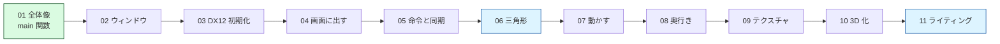

# 解説

DirectX 12 のプログラムが「起動してから画面に絵が出るまで」に
何をしているのかを、最初から順番に説明します。

## この解説の読者

- C++ の基礎（クラス、ポインタ、参照、`std::vector` くらい）が分かる
- Unity など、ゲームエンジンでの開発経験がある
- **エンジンが裏で何をしているのかは知らない**

Unity で `GameObject` にマテリアルを付ければ絵が出ますが、
その裏では「デバイスを作り、コマンドを記録し、GPU に投げ、
描き終わるのを待って画面に出す」という処理が毎フレーム走っています。
この解説は、その中身を自分の手で書くとどうなるかを追いかけるものです。

## 読む順番

番号順に読んでください。前の章の内容を前提にしています。

| # | ページ | 内容 |
|---|--------|------|
| 01 | [プログラムの全体像と main 関数](01_プログラムの全体像とmain関数.md) | 何が起きているかの俯瞰。ゲームループとは何か |
| 02 | [ウィンドウを作る](02_ウィンドウを作る.md) | Win32 のウィンドウ、メッセージループ |
| 03 | [DirectX 12 の初期化](03_DirectX12の初期化.md) | デバイス、GPU の選択、デバッグレイヤー |
| 04 | [画面に出す仕組み](04_画面に出す仕組み.md) | スワップチェーン、レンダーターゲット |
| 05 | [GPU への命令と同期](05_GPUへの命令と同期.md) | コマンドリスト、コマンドキュー、フェンス |
| 06 | [三角形を描く](06_三角形を描く.md) | 頂点バッファ、シェーダー、PSO |
| 07 | [動かす：定数バッファと行列](07_動かす_定数バッファと行列.md) | 座標変換、回転 |
| 08 | [奥行きを正しくする：深度バッファ](08_奥行きを正しくする.md) | 深度テスト |
| 09 | [テクスチャを貼る](09_テクスチャを貼る.md) | SRV、サンプラー、GPU への転送 |
| 10 | [3D にする：カメラと透視投影](10_3Dにする_カメラと透視投影.md) | ビュー行列、射影行列、立方体、インデックスバッファ |
| 11 | [陰影を付ける：法線とライティング](11_陰影を付ける_法線とライティング.md) | 法線、拡散反射、鏡面反射、定数バッファのパッキング |

## 関連する資料

- 用語だけ引きたいとき → [DirectX 12 用語集](../misc/DirectX12用語集.md)
- 動かないとき → [症状別の原因逆引き](../misc/troubleshooting/症状別の原因逆引き.md)
- クラス構成を知りたいとき → [設計](../design/)
- 出典 → [参考文献](../misc/参考文献.md)
